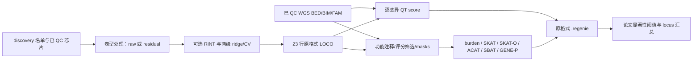

# WGS：PyTorch GPU discovery 关联分析

`torchwgs` 实现连续脑影像单表型的两级 ridge/LOCO、single-variant 与 gene-based discovery 分析。基因型投影、得分与协方差、ridge、特征值、NNLS 和正态正交概率积分由 PyTorch 执行，支持 CUDA。运行时不调用 REGENIE、PLINK 或其他遗传关联软件。

默认统计参数按研究 Methods 和冻结 REGENIE 3.4.1 核对；参数通过 Python dataclass 开放。定量性状是本版本范围。二分类、生存、多表型联合检验不在本版本范围。



## 安装

```bash
conda env create -f environment.yml
conda activate torchwgs
python -m unittest discover -s tests -v
```

已在 PyTorch 2.0.0/CUDA 11.8（A100）、PyTorch 2.4.1 环境测试。GPU完整运行使用Linux/CUDA和Triton。需要 GPU 的运行默认 `device="cuda"`；小规模数值审查也支持 CPU。Step1和single的大矩阵默认float32/TF32；gene的投影与小矩阵推断保持float64以匹配原计算。Step1/single也可设float64；不使用float16。

## Python 调用

下面的路径表示本地输入文件位置，替换成自己的数据即可。`discovery_samples` 必须明确指定；不同染色体的样本顺序通过 FID/IID 对齐。

```python
from dataclasses import replace
from torchwgs import WGSConfig, DiscoveryInputs, GeneAnalysis, run_discovery

configuration = WGSConfig.paper(apply_rint=True)  # False 可统一关闭 RINT
configuration.step1 = replace(configuration.step1, block_size=1000, folds=5)
configuration.single_variant.maf_min = 0.001      # 严格 MAF > 0.001
configuration.single_variant.min_mac = 20        # 与 MAF 独立
configuration.gene_based.aaf_bins = (0.01,)
configuration.gene_based.vc_max_aaf = 0.01

discovery_inputs = DiscoveryInputs(
    array_prefix="/data/array/ukb_array",           # .bed/.bim/.fam 前缀
    array_variant_include="/data/array/qc.snplist",
    phenotype_file="/data/phenotype_residuals.txt",
    phenotype_column="24485-2.0",
    discovery_samples="/data/discovery.keep",
    sample_remove="/data/sample_exclude.txt",
    wgs_prefixes={str(chromosome): f"/data/wgs/chr{chromosome}"
                  for chromosome in range(1, 23)},
    gene_analyses={"5": [GeneAnalysis(
        name="PTV",
        annotation_file="/data/annotation/chr5_PTV.txt",
        setlist_file="/data/annotation/chr5_PTV.setlist",
        mask_definition_file="/data/annotation/Mask_PTV.txt",
    ), GeneAnalysis(
        name="Missense_REVEL50",
        annotation_file="/data/annotation/chr5_Missense.txt",
        setlist_file="/data/annotation/chr5_Missense.setlist",
        mask_definition_file="/data/annotation/Mask_Missense.txt",
        variant_whitelist_file="/data/annotation/chr5_REVEL50.txt",
    )]},
)

run_metadata = run_discovery(
    discovery_inputs, config=configuration,
    output_dir="/results/discovery_24485", resume=True,
)
```

`gene_analyses` 按染色体列出要分析的 Main/Sub 组合；上例只演示 chr5 两种组合。分析全部 Main/Sub 时，填入对应的全部文件，不把未提供的 mask 当成已运行。更换表型列可复用相同入口；新的表型会重拟合自己的 Step1。

若要使用 float64：

```python
configuration.step1 = replace(configuration.step1, dtype="float64", tf32=False)
configuration.single_variant.dtype = "float64"
configuration.single_variant.tf32 = False
```

单独调用的接口：`prepare_phenotype()`、`fit_null()`、`create_test_context()`、`test_single_variant()`、`test_gene_based()`、`summarize_results()`。示例和逐参数解释见 [接口文档](docs/API.md)。

## 命令行

```bash
torchwgs --inputs discovery_inputs.json --config analysis_config.json --out /results/discovery
torchwgs --inputs discovery_inputs.json --out /results/discovery_no_rint --no-rint
torchwgs --inputs discovery_inputs.json --out /results/discovery_single --single-only
```

JSON 文件分别对应 `DiscoveryInputs` 和 `WGSConfig.to_dict()`；`gene_analyses` 中每条为 `GeneAnalysis` 的字段。配置文件可省略，使用论文默认值。`--no-rint` 统一关闭三个关联阶段和 raw 输入的分位数正态化；Python 可分别设置这些选项。

已有研究`Anno_New`布局时，可生成全部22条常染色体、11 Main和12 Sub的配置；注释、setlist、mask和评分白名单会逐一检查：

```bash
python examples/configure_discovery.py \
  --array-prefix /data/array/ukb_array --array-variant-include /data/array/qc.snplist \
  --phenotype-file /data/phenotype_residuals.txt --phenotype-column 24485-2.0 \
  --discovery-samples /data/discovery.keep --sample-remove /data/sample_exclude.txt \
  --wgs-prefix-template '/data/wgs/Image_Q3_c{chromosome}' \
  --annotation-root /data/Anno_New --json-directory /results/config \
  --write-masks
torchwgs --inputs /results/config/discovery_inputs.json \
  --config /results/config/analysis_config.json --out /results/discovery_24485
```

配置生成器也支持`--no-rint`和`--float64`。可直接编辑JSON修改其他参数。压缩`.bed.gz`在独立输入缓存中展开，不覆盖原文件；默认每条染色体完成后清理展开的BED，所需磁盘空间会先检查。

## 原格式输出

Step1 使用 `discovery_1.loco` 和 `discovery_pred.list`。LOCO 按原格式写 `FID_IID` 首行、chr1–23、6 位有效数字和行末空格；常染色体训练时 chr23 为全基因组预测。

Step2 默认为 `输出前缀_表型名.regenie` 和对应 `.regenie.ids`；gene 保留原 `##MASKS` 标头。结果使用空格分隔，列顺序为：

```text
CHROM GENPOS ID ALLELE0 ALLELE1 A1FREQ N TEST BETA SE CHISQ LOG10P EXTRA
```

数值写 6 位有效数字；缺失为 `NA`；保留原 mask ID、TEST 和 `DF`/`STRONGEST_MASK` 字段。`gzip_output=True` 写 `.regenie.gz`；`split_by_pheno=False` 写 `.regenie` 和 `.regenie.Ydict`。`write_masks=True` 另写原 `_masks.bed/.bim/.fam/.snplist` 文件。日志记录实际 PyTorch 执行信息；软件标识和耗时不会伪装成 REGENIE。补充参数/数值诊断放独立 JSON，不添加原结果列。

文件格式兼容不意味着任意精度模式下所有统计值逐字相同。float32/TF32 的误差和 gene 数值后端区别见 [真实数据验证](docs/VALIDATION.md)。

## 默认发现参数

| 项目 | 默认值与来源 |
|---|---|
| Step1 | 5-fold、block 1000、两级 h=(.01,.25,.5,.75,.99)，冻结原实现 |
| RINT | 开启；可改 `apply_rint=False` |
| Single | 加性 QT score；正文 MAF>0.001；初始 minMAC20 来自研究运行脚本 |
| Gene | AAF bins=.01+singleton，VC最大AAF=.01，mask minMAC1，VC低计数折叠≤10 |
| Gene统计 | burden、SKAT、SKAT-O、SKAT-O-ACAT、ACAT-V、ACAT-O、跨mask ACAT、SBAT、GENE-P |
| Single显著性 | 5e−9/831.50=6.0132291040e−12 |
| Gene显著性 | .05/(831.50×17863)=3.3663041505e−9 |
| Locus | ±500kb递归选择lead，再按选出lead的≤1Mb距离归并 |

原始 WGS calling、VEP 注释和全研究的有效表型数计算属于输入来源；本包读取这些已完成 QC 的资源。annotation 的 C/R/UR 标签按文件保留，也允许显式频率域定义，不从字母猜测含义。

## 数值后端与参考

SKAT-O 使用 rho 搜索积分，和 SKAT-O-ACAT 分别输出。默认兼容冻结3.4.1的`.999`端点：独立实现正系数中心χ²特例的Davies AS155，GPU执行Fourier求和；失败或强尾时依次走Kuonen、更严格Davies和Liu回退。误差界和迭代预算由CPU标量控制器规划，参与者矩阵留在GPU。`tail_method="exact"`提供另一个带收敛检查的积分后端，必要时用SciPy标量积分；默认后端不调用该回退。极小P保留LOG10P，不截成1e−300。诊断JSON记录各路径次数和标量控制器/回退耗时。

SBAT实现正/负NNLS和chi-bar权重；GPU上的独立Triton范数kernel复现冻结Eigen/SSE2的累加顺序，以兼容共线mask选列。高维正态正交概率与chi-bar权重使用数值近似，精度边界见验证记录。没有搬运上游原软件源码。

- [REGENIE 3.4.1 源码](https://github.com/rgcgithub/regenie/tree/v3.4.1)
- [REGENIE 方法与输出说明](https://rgcgithub.github.io/regenie/overview/)
- [研究公开脚本](https://github.com/cjfei18/BrainImage_WGS/tree/4d0b8b3b25332fe43cdd726573f5483952c6823f)
- Mbatchou et al. Computationally efficient whole-genome regression for quantitative and binary traits. Nature Genetics 53, 1097–1103 (2021). DOI: 10.1038/s41588-021-00870-7.
- Wu et al. Rare-variant association testing for sequencing data with the sequence kernel association test. AJHG 89, 82–93 (2011). DOI: 10.1016/j.ajhg.2011.05.029.
- Lee et al. Optimal unified approach for rare-variant association testing with application to small-sample case-control whole-exome sequencing studies. AJHG 91, 224–237 (2012). DOI: 10.1016/j.ajhg.2012.06.007.
- Liu et al. ACAT: a fast and powerful P value combination method for rare-variant analysis in sequencing studies. AJHG 104, 410–421 (2019). DOI: 10.1016/j.ajhg.2019.01.002.
- Davies. Algorithm AS 155: The Distribution of a Linear Combination of chi-squared Random Variables. Applied Statistics 29, 323–333 (1980). DOI: 10.2307/2346911.

私有基因型、表型、样本 ID、原服务器脚本、参考软件二进制不随本仓库发布。
