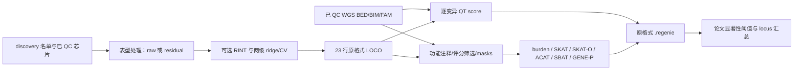

# WGS：PyTorch GPU discovery 关联分析

`torchwgs` 实现连续单表型的两级 ridge/LOCO、single-variant 与 gene-based discovery 分析。基因型投影、得分与协方差、ridge、特征值、NNLS 和正态正交概率积分由 PyTorch 执行，支持 CUDA。运行时不调用 REGENIE、PLINK 或其他遗传关联软件。

默认统计参数按研究 Methods 和冻结 REGENIE 3.4.1 核对；参数通过 Python dataclass 开放。`WGSConfig.paper()`默认启用GPU packed解码、稀疏VC交叉乘积、大矩阵的秩一特征值更新，以及原高维SBAT的有放回子集抽样。定量性状是本版本范围。二分类、生存、多表型联合检验不在本版本范围。



## 安装

```bash
conda env create -f environment.yml
conda activate torchwgs
python -m unittest discover -s tests/regenie_gpu -v
```

需要 Linux、CUDA GPU 和 Triton，完整运行使用 `device="cuda"`。真实验证采用 PyTorch 2.0.0/CUDA 11.8（A100）；Conda 示例安装 PyTorch 2.4。Step1和single的大矩阵默认float32/TF32；gene的投影、协方差与推断保持float64以匹配原计算。gene的大VC协方差也保持float64。Step1/single也可设float64，或关闭TF32使用普通float32；不使用float16。原REGENIE 3.4.1核心计算为double，没有float32运行开关，对照精度见[验证记录](VALIDATION.md)。

## Python 调用

下面的路径表示本地输入文件位置，替换成自己的数据即可。`discovery_samples` 必须明确指定；不同染色体的样本顺序通过 FID/IID 对齐。

```python
from dataclasses import replace
from torchwgs import WGSConfig, DiscoveryInputs, ExecutionConfig, study_gene_analyses, run_discovery

configuration = WGSConfig.paper(apply_rint=True)  # False 可统一关闭 RINT
configuration.step1 = replace(configuration.step1, block_size=1000, folds=5)
configuration.single_variant.maf_min = 0.0        # 原始结果保留所有满足 MAC20 的变异
configuration.single_variant.min_mac = 20
configuration.single_variant.genotype_reader = "cuda_packed"  # 原始 BED 字节送入 GPU 解码
configuration.significance.single_frequency_min = 0.001  # 汇总阶段筛选频率
configuration.significance.single_frequency_field = "maf"  # 论文的 minor allele frequency；a1freq 对应研究源汇总代码
configuration.significance.excluded_locus_regions = ((6, 25000000, 34000000),)  # 研究源脚本的 lead 候选排除；()可关闭
configuration.execution = ExecutionConfig(parallel_level="serial", workers=1, max_gpu_gb=20.)
configuration.gene_based.aaf_bins = (0.01,)
configuration.gene_based.vc_max_aaf = 0.01

discovery_inputs = DiscoveryInputs(
    array_prefix="/data/array/genotype_array",           # .bed/.bim/.fam 前缀
    array_variant_include="/data/array/qc.snplist",
    phenotype_file="/data/phenotype_residuals.txt",
    phenotype_column="trait_01",
    discovery_samples="/data/discovery.keep",
    sample_remove="/data/sample_exclude.txt",
    wgs_prefixes={str(chromosome): f"/data/wgs/chr{chromosome}"
                  for chromosome in range(1, 23)},
    gene_analyses=study_gene_analyses("/data/annotation", chromosomes=range(1, 23)),
)

run_metadata = run_discovery(
    discovery_inputs, config=configuration,
    output_dir="/results/discovery_trait_01", resume=True,
)
```

`gene_analyses` 按染色体列出完整 26 个 Main/Sub 组合，上例读取 22 条常染色体的全部文件。`study_gene_analyses()`会检查 annotation、setlist、mask 和 Sub 白名单。更换表型列使用同一入口，新的表型会拟合自己的 Step1；只验证 chr21 时将两处染色体范围均设为 `[21]`。

若要使用 float64：

```python
configuration.step1 = replace(configuration.step1, dtype="float64", tf32=False)
configuration.single_variant.dtype = "float64"
configuration.single_variant.tf32 = False
```

单独调用的接口：`prepare_phenotype()`、`fit_null()`、`create_test_context()`、`test_single_variant()`、`test_gene_based()`、`summarize_results()`。示例和逐参数解释见 [接口文档](API.md)。

## 命令行

```bash
torchwgs --inputs discovery_inputs.json --config analysis_config.json --out /results/discovery
torchwgs --inputs discovery_inputs.json --out /results/discovery_no_rint --no-rint
```

JSON 文件分别对应 `DiscoveryInputs` 和 `WGSConfig.to_dict()`；`gene_analyses` 中每条为 `GeneAnalysis` 的字段。配置文件可省略，使用论文默认值。`--no-rint` 统一关闭三个关联阶段和 raw 输入的分位数正态化；Python 可分别设置这些选项。

命令行执行完整 single、gene 与汇总。默认核对缓存后复用兼容阶段，`--no-resume`强制重算。未安装CLI时可使用`python -m torchwgs.cli`加相同参数。

已有研究注释文件布局时，可生成全部22条常染色体、14 Main和12 Sub的配置；注释、setlist、mask和评分白名单会逐一检查：

```bash
python examples/configure_discovery.py \
  --array-prefix /data/array/genotype_array --array-variant-include /data/array/qc.snplist \
  --phenotype-file /data/phenotype_residuals.txt --phenotype-column trait_01 \
  --discovery-samples /data/discovery.keep --sample-remove /data/sample_exclude.txt \
  --wgs-prefix-template '/data/wgs/chr{chromosome}' \
  --annotation-root /data/annotation --json-directory /results/config \
  --max-gpu-gb 20
torchwgs --inputs /results/config/discovery_inputs.json \
  --config /results/config/analysis_config.json --out /results/discovery_trait_01
```

配置生成器也支持`--chromosomes 21`、`--imported-loco /results/Step1/discovery_pred.list`、`--max-gpu-gb 20`、`--no-rint`和`--float64`。生成配置固定采用 CUDA 串行执行，保留完整 26 组和全部 42 个基础 mask 定义，默认导出 mask 文件。其他统计参数和 `write_masks` 可通过 Python 或生成的 JSON 修改。压缩`.bed.gz`在独立输入缓存中展开，不覆盖原文件；默认每条染色体完成后清理展开的BED，所需磁盘空间会先检查。

## 完整 mask 和 GPU 执行

| 完整入口 | 基础 mask 数 |
|---|---:|
| PTV Main | 1 |
| Missense Main | 1 |
| Splice Main | 1 |
| Inframe Main | 1 |
| Synonymous Main | 1 |
| Intron Main | 1 |
| UTR_5 Main | 1 |
| UTR_3 Main | 1 |
| Upstream Main | 1 |
| Downstream Main | 1 |
| Intergenic Main | 1 |
| Pseudo Main | 8 |
| RNA Main | 10 |
| nctev Main | 1 |
| Intron_GERP2 Sub | 1 |
| Intergenic_GERP2 Sub | 1 |
| UTR_5_GERP2 Sub | 1 |
| UTR_3_GERP2 Sub | 1 |
| Upstream_GERP2 Sub | 1 |
| Downstream_GERP2 Sub | 1 |
| Intron_Gnocchi4 Sub | 1 |
| Intergenic_Gnocchi4 Sub | 1 |
| Splice_splice05 Sub | 1 |
| Missense_REVEL50 Sub | 1 |
| Upstream_JARVIS99 Sub | 1 |
| Downstream_JARVIS99 Sub | 1 |
| 合计 26 组 | 42 |

下表列出 mask 文件中的全部类别映射。Main 的 30 个定义加上 12 个 Sub 的单类别定义，共 42 个；Sub 使用对应 Main 的定义及评分白名单。

| 文件组 | mask 名称 | 注释类别 |
|---|---|---|
| PTV | `Mask1` | `PTV` |
| Missense | `Mask1` | `Missense` |
| Splice | `Mask1` | `Splice` |
| Inframe | `Mask1` | `Inframe` |
| Synonymous | `Mask1` | `Synonymous` |
| Intron | `Mask1` | `Intron` |
| UTR_5 | `Mask1` | `UTR_5` |
| UTR_3 | `Mask1` | `UTR_3` |
| Upstream | `Mask1` | `Upstream` |
| Downstream | `Mask1` | `Downstream` |
| Intergenic | `Mask1` | `Intergenic` |
| Pseudo | `Mask1` | `transcribed_unprocessed_pseudogene` |
| Pseudo | `Mask2` | `processed_pseudogene` |
| Pseudo | `Mask3` | `transcribed_processed_pseudogene` |
| Pseudo | `Mask4` | `unprocessed_pseudogene` |
| Pseudo | `Mask5` | `transcribed_unitary_pseudogene` |
| Pseudo | `Mask6` | `rRNA_pseudogene` |
| Pseudo | `Mask7` | `unitary_pseudogene` |
| Pseudo | `Mask8` | `translated_processed_pseudogene` |
| RNA | `Mask1` | `ribozyme` |
| RNA | `Mask2` | `lncRNA` |
| RNA | `Mask3` | `miRNA` |
| RNA | `Mask4` | `snRNA` |
| RNA | `Mask5` | `misc_RNA` |
| RNA | `Mask6` | `scaRNA` |
| RNA | `Mask7` | `snoRNA` |
| RNA | `Mask8` | `rRNA` |
| RNA | `Mask9` | `mature_miRNA_variant` |
| RNA | `Mask10` | `non_coding_transcript_exon_variant` |
| nctev | `Mask10` | `non_coding_transcript_exon_variant` |

每个源定义继续生成 annotation 中的 domain、overall、singleton 和 AAF=.01 masks。全部定义先读取，再按完整 annotation 与 BIM/全局及评分白名单交集注册表头；输入中没有类别的定义不进入原格式表头，类别注册发生在 setlist、所选 gene、MAC 与 AAF 筛选之前。基因数量和生成 mask 数随输入改变。

`study_gene_analyses()` 读取 14 个 Main 文件：PTV、Missense、Splice、Inframe、Synonymous、Intron、UTR_5、UTR_3、Upstream、Downstream、Intergenic、Pseudo、RNA 和 nctev；再生成原脚本的 12 个 Sub 组合。26 组共包含 42 个基础 mask 定义，其中 Pseudo 的 8 个、RNA 的 10 个源定义全部读取。原格式表头按实际输入注册；chr21的活跃定义共37个，Pseudo为5/8、RNA为8/10。每组继续生成注释中的各个 domain、overall、singleton 和 AAF=.01 masks。Intergenic Main 使用已有的完整注释及 mask 文件补全分析覆盖；原 discovery 提交脚本只有 13 个 Main。

```python
from torchwgs import study_gene_analyses, ExecutionConfig

discovery_inputs.gene_analyses = study_gene_analyses(
    "/data/annotation", chromosomes=[21],  # 每个 annotation/setlist/mask 文件都会检查
)
discovery_inputs.wgs_prefixes = {"21": "/data/wgs/chr21"}
configuration.execution = ExecutionConfig("serial", workers=1, max_gpu_gb=20.)
configuration.gene_based.vc_storage = "sparse"
configuration.gene_based.vc_score_method = "crossproduct"
configuration.gene_based.vc_score_block_size = 256
configuration.gene_based.genotype_reader = "cuda_packed"
configuration.gene_based.sbat_subset_sampling = "with_replacement"
```

执行参数固定为 `parallel_level="serial", workers=1`，按输入顺序在 CUDA GPU 上运行各个完整组。没有 CUDA 或传入 CPU 设备时明确报错。`execution.max_gpu_gb=20`按 GiB 限制当前 GPU 的本进程 PyTorch 分配器；Step1 估计工作区另按十进制 GB 检查。gene 矩阵预算还受 `max_matrix_bytes` 和 1 GiB 预留空间限制，公式见[API](API.md#pipeline和汇总)。CUDA 上下文与其他进程占用另行观测。

稀疏 VC 路径保存折叠后的非零基因型，并通过分块 `G.T @ G - (G.T @ Q) @ (G.T @ Q).T` 计算协方差，减少多个 N×M 投影副本。M×M 协方差和特征值计算仍需要显存，程序在计算前检查每个任务的预算。可用 `vc_storage="dense", vc_score_method="residual"` 选择投影路径进行对照。

`gene_based.eigen_backend="auto"` 在CUDA且VC维数≥4096时，通过特征值交错区间和secular方程计算各rho的秩一更新，减少反复稠密分解和矩阵副本；较小矩阵保持原稠密路径。`"dense"`与`"secular"`可显式选择，求根块大小、迭代次数与切换维数可改。它保留原rho、正特征值筛选和尾概率方法，当前端到端范围和数值验收见[验证记录](VALIDATION.md)。

## 原格式输出

Step1 使用 `discovery_1.loco` 和 `discovery_pred.list`。LOCO 按原格式写 `FID_IID` 首行、chr1–23、6 位有效数字和行末空格；常染色体训练时 chr23 为全基因组预测。

Step2 默认为 `输出前缀_表型名.regenie` 和对应 `.regenie.ids`；ids 首行是 `表型名\tNA`，与原脚本 `--print-pheno` 一致，可设 `print_pheno_name=False` 关闭。gene 保留原 `##MASKS` 标头；按完整注释与BIM/变异白名单的交集注册类别，删除未知类别及全为未知类别的定义。源定义仍全部读取，类别注册不按setlist、所选gene、MAC或AAF筛选。结果使用空格分隔，列顺序为：

```text
CHROM GENPOS ID ALLELE0 ALLELE1 A1FREQ N TEST BETA SE CHISQ LOG10P EXTRA
```

数值写 6 位有效数字；缺失为 `NA`；保留原 mask ID、TEST 和 `DF`/`STRONGEST_MASK` 字段。`gzip_output=True` 写 `.regenie.gz`；`split_by_pheno=False` 写 `.regenie` 和 `.regenie.Ydict`。`WGSConfig.paper()`默认`write_masks=True`，另写原 `_masks.bed/.bim/.fam/.snplist` 文件，可关闭。Step1/Step2的`.log`和主`discovery.log`为可读文本，记录参数、样本/位点/test计数、实际PyTorch引擎和耗时；日志内容不与原REGENIE程序的日志逐字节一致。`Step1/discovery.log`区分拟合、缓存加载和外部预测导入，Elapsed time为本次操作耗时，缓存另标原拟合时间，导入不编造源拟合时间。Step1进度仍记录在主日志，拟合参数与阶段统计另存`null_model.json`。`discovery.events.jsonl`及独立manifest/progress JSON保存结构化事件和审计信息，不添加原结果列。

默认分表型、未压缩的一条chr21输出目录如下；其他染色体和Main/Sub组使用相同命名规则。

```text
discovery_trait_01/
  Step1/discovery_1.loco                 # 拟合时导出的LOCO；导入模型时沿用外部文件
  Step1/discovery_pred.list              # 表型到LOCO路径的对应关系
  Step1/discovery.log                    # 本次拟合/缓存加载/导入的文本日志
  Step1/null_model.pt / null_model.json  # 本包模型缓存与参数/统计
  Step1/cache.json                       # 缓存身份
  Single/discovery_c21_trait_01.regenie
  Single/discovery_c21_trait_01.regenie.ids
  Single/discovery_c21.log / discovery_c21.manifest.json
  Gene/discovery_c21_PTV_trait_01.regenie
  Gene/discovery_c21_PTV_trait_01.regenie.ids
  Gene/discovery_c21_PTV_masks.bed / .bim / .fam / .snplist
  Gene/discovery_c21_PTV.log / .manifest.json / .progress.json
  Summary/single_significant.tsv / gene_significant.tsv / single_loci.tsv
  discovery.log / discovery.events.jsonl / run_manifest.json
```

Gene部分对26组分别输出。导入外部LOCO时不重拟合或另写上述Step1模型与预测文件，只写本次导入日志和来源manifest，继续引用外部LOCO/list。`run_discovery()`返回`run_manifest.json`对应的dict，包含阶段统计、结果路径、汇总计数、数值诊断、总耗时及按设备记录的峰值；`output_files.step1`列出本次使用的预测和日志文件。三个Summary文件为额外汇总，原关联结果不增加列。详细字段与可选文件见[API](API.md#pipeline和汇总)。

文件格式兼容不意味着任意精度模式下所有统计值逐字相同。float32/TF32 的误差和 gene 数值后端区别见 [真实数据验证](VALIDATION.md)。

## 默认发现参数

| 项目 | 默认值与来源 |
|---|---|
| Step1 | 5-fold、block 1000、两级 h=(.01,.25,.5,.75,.99)，冻结原实现 |
| RINT | 开启；可改 `apply_rint=False` |
| Single 原始结果 | 加性 QT score、minMAC20；默认不提前筛除 MAF，保留原 `.regenie` 的完整行 |
| Single 汇总 | `WGSConfig.paper()`按论文筛 MAF>0.001；`single_frequency_field="a1freq"`可按研究源汇总代码筛 A1FREQ>0.001 |
| Gene | AAF bins=.01+singleton，VC最大AAF=.01，mask minMAC1，VC低计数折叠≤10 |
| Gene统计 | burden、SKAT、SKAT-O、SKAT-O-ACAT、ACAT-V、ACAT-O、跨mask ACAT、SBAT、GENE-P |
| Single显著性 | 5e−9/831.50=6.0132291040e−12 |
| Gene显著性 | .05/(831.50×17863)=3.3663041505e−9 |
| Locus | ±500kb递归选择lead，再按选出lead的≤1Mb距离归并 |

原始 WGS calling、VEP 注释和全研究的有效表型数计算属于输入来源；本包读取这些已完成 QC 的资源。annotation 的 C/R/UR 标签按文件保留，也允许显式频率域定义，不从字母猜测含义。

## 当前版本与验证

此次串行入口清理包含 21 个实现模块，仅支持 CUDA 完整 pipeline。本地 111 项串行清理回归全部通过，框架报告耗时 64.704 秒。真实 chr21 的完整 single 已通过格式与五项数值门槛；全 26 组 gene 和汇总仍在验证。既有六组串行测量严格数值为 0/6 组通过，实际时间与精度范围见[验证记录](VALIDATION.md)。本地回归结果不代替新完整端到端实测。

## 数值后端与参考

SKAT-O 使用 rho 搜索积分，和 SKAT-O-ACAT 分别输出。gene默认`skato_integral_backend="adaptive_x"`，使用原χ²坐标及独立PyTorch GK21自适应积分，绝对/相对误差预算为1e−25 / 2⁻¹³、最多1000个区间；参数均可改。可选`adaptive_sqrt`或`segmented`，低层`skato_logp`数学接口仍默认segmented。当前数值验收见[验证记录](VALIDATION.md)，退化 kernel 和下溢规则见[参数](API.md#gene-based)。

默认兼容冻结3.4.1的`.999`端点：独立实现正系数中心χ²特例的Davies AS155，GPU执行Fourier求和；失败或强尾时依次走Kuonen、更严格Davies和Liu回退。误差界和迭代预算由CPU控制器规划，参与者矩阵留在GPU。`davies_controller="auto"`在谱维数≥1024时用NumPy批量计算误差界，保留有序float64累加、积分预算与故障路径；`"scalar"`保留原标量控制器，`"numpy"`可显式选择。`tail_method="exact"`提供另一个带收敛检查的积分后端，必要时用SciPy标量积分；默认后端不调用该回退。强尾使用LOG10P；gene的原生SKAT-O积分目标和最终概率遵循`10*DBL_MIN`地板，条件SF下溢保留原失败及Bonferroni回退规则。低层数学接口可用`native_validity=False`保留日志域行为，具体缺失结果规则见[API](API.md#gene-based)。诊断JSON记录各路径次数和控制器/回退耗时。

SBAT实现正/负NNLS和chi-bar权重；GPU上的独立Triton范数kernel复现冻结Eigen/SSE2的累加顺序，以兼容共线mask选列。高维正态正交概率与chi-bar权重使用数值近似，精度边界见验证记录。没有搬运上游原软件源码。

- [REGENIE 3.4.1 源码](https://github.com/rgcgithub/regenie/tree/v3.4.1)
- [REGENIE 方法与输出说明](https://rgcgithub.github.io/regenie/overview/)
- [研究公开脚本](https://github.com/cjfei18/BrainImage_WGS/tree/4d0b8b3b25332fe43cdd726573f5483952c6823f)
- Mbatchou et al. Computationally efficient whole-genome regression for quantitative and binary traits. Nature Genetics 53, 1097–1103 (2021). DOI: 10.1038/s41588-021-00870-7.
- Wu et al. Rare-variant association testing for sequencing data with the sequence kernel association test. AJHG 89, 82–93 (2011). DOI: 10.1016/j.ajhg.2011.05.029.
- Lee et al. Optimal unified approach for rare-variant association testing with application to small-sample case-control whole-exome sequencing studies. AJHG 91, 224–237 (2012). DOI: 10.1016/j.ajhg.2012.06.007.
- Liu et al. ACAT: a fast and powerful P value combination method for rare-variant analysis in sequencing studies. AJHG 104, 410–421 (2019). DOI: 10.1016/j.ajhg.2019.01.002.
- Davies. Algorithm AS 155: The Distribution of a Linear Combination of chi-squared Random Variables. Applied Statistics 29, 323–333 (1980). DOI: 10.2307/2346911.
- Plackett. A Reduction Formula for Normal Multivariate Integrals. Biometrika 41, 351–360 (1954). DOI: 10.1093/biomet/41.3-4.351. 四维正态正交概率采用该恒等式的数值积分。
- [LAPACK的对角加秩一矩阵secular方程说明](https://www.netlib.org/lapack/explore-html/dd/da1/dlaed4_8f_source.html)。本实现使用该数学问题的独立PyTorch求根，没有复制或调用LAPACK源码。

私有基因型、表型、样本 ID、原服务器脚本、参考软件二进制不随本仓库发布。
