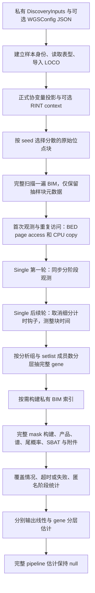

# REGENIE discovery：小范围耗时测量与估计

`torchwgs.runtime_probe` 从实际 discovery 输入中抽取分散的位点块和完整 gene，测量读取、解码、关联统计与输出的耗时。`torchwgs.runtime_estimate` 根据这些观测生成线性或分层估计，并按已测阶段的独占时间列出优化方向。

输入与正常 pipeline 的 `DiscoveryInputs` JSON 相同。样本保持正式分析的完整 cohort；每个抽到的 gene 保留原配置的全部 mask、变异筛选和统计方法。结果是匿名 JSON，包含范围、计时、计数、显存与覆盖情况。正式关联分析及原格式输出使用[discovery 指南](REGENIE.md)中的入口。

默认使用一个串行 CUDA worker，显存预算为 20 GiB。Single 按 paper 配置使用 float32/TF32；gene 的投影、协方差与统计推断保持 float64，TF32 不替代这些 double 运算。RINT 可以配置。该诊断导入已有 LOCO，**不重新拟合 Step1**；完整注释准备、Summary 和完整 pipeline 未测，`whole_pipeline_estimate_seconds` 保持 `null`。

## 测量流程



位点窗口按全染色体的块序号分层，每层随机取一块，块之间不重叠，返回顺序按源 BED/BIM 排列。窗口使用正式 `single_variant.block_size`；末块可以不足一个完整块。窗口覆盖只是抽样范围，不代表整条染色体已经扫描并完成关联。

元数据准备会完整读取一次 BIM，以核对源顺序和 BED 位点数；它只保留抽到窗口的元数据。该扫描的真实成本记录在 `bim_full_scan_and_sample_metadata`，不能将分散抽样描述为只读了几行 BIM。gene 的 setlist 普查保留每层计数和有界 reservoir，优先尝试一个最大成员集合的 gene。抽中的大 gene 不会通过删变异或 mask 来缩短运行。

## 输入文件与格式

将自己的正常 discovery 输入 JSON 保存在私有目录。下面只示意字段结构，路径和名称均为通用占位符；正式测量沿用原分析的完整 `gene_analyses` 列表。

```json
{
  "array_prefix": "/data/array/genotype_array",
  "phenotype_file": "/data/phenotype_residuals.txt",
  "phenotype_column": "trait_01",
  "discovery_samples": "/data/discovery.keep",
  "wgs_prefixes": {"1": "/data/wgs/chr1"},
  "array_variant_include": "/data/array/qc.snplist",
  "sample_remove": null,
  "imported_loco": "/data/predictions/discovery_pred.list",
  "covariates": null,
  "gene_analyses": {
    "1": [{
      "name": "coding_main",
      "annotation_file": "/data/annotation/coding.annotations",
      "setlist_file": "/data/annotation/coding.setlist",
      "mask_definition_file": "/data/annotation/coding.masks",
      "variant_whitelist_file": null
    }]
  }
}
```

| 输入字段 | 意义与格式 |
|---|---|
| `array_prefix` | 已 QC 芯片的未压缩 `.bed/.bim/.fam` 前缀。probe 用它建立原样本身份并对齐表型与 LOCO，不拟合芯片 ridge。 |
| `phenotype_file` | 带表头的空白或制表符分隔文本，至少包含 `FID`、`IID` 和目标连续表型列。重复 FID/IID 会报错；缺失值按正式读取规则处理。 |
| `phenotype_column` | 精确列名，一次测量一个连续表型，例如 `trait_01`。 |
| `discovery_samples` | 必填 discovery 样本名单；支持一列 IID 或两列 FID/IID，按正式 keep 规则筛选。 |
| `wgs_prefixes` | `{染色体字符串: 未压缩BED前缀}`。BED 为 SNP-major 两位硬调用；BIM 六列为染色体、ID、遗传距离、位置、A1、A0；FAM 以 FID/IID 标识样本。`--chromosome` 必须存在于此映射。 |
| `array_variant_include` | 可选芯片 QC ID 白名单，每行首列为 ID。JSON 可与完整 pipeline 共用；本 probe 导入 LOCO，因此不读取它来做 Step1 拟合。 |
| `sample_remove` | 可选排除名单，格式同 keep；在 discovery 名单内进一步排除样本。 |
| `imported_loco` | 必填，已有 REGENIE 格式 `.loco` 或 `_pred.list`。list 每行是表型列名与预测文件路径；相对路径以 list 所在目录为基准。程序按原 FID/IID 和染色体对齐预测。 |
| `covariates` | 可选 `[N,C]` 数值矩阵，N 对应 keep/remove 后的芯片 FAM 顺序。Python 可传 CPU tensor；JSON 可传二维数值数组，转换为 float64。`raw` 模式用于表型预处理，`residual` 模式作为关联协变量。 |
| `gene_analyses` | `{染色体字符串: [GeneAnalysis字段对象,...]}`。抽样按分析组分别进行，组内参数和全部 mask 保持原配置。空列表或 `--single-only` 时跳过 gene。 |

每个 `GeneAnalysis` 的输入含义：

| 字段 | 意义与格式 |
|---|---|
| `name` | 同染色体唯一的分析组名；匿名结果使用组序号分层，不导出实际名称。 |
| `annotation_file` | 三列 `ID gene category` 或四列 `ID gene domain category`，空白分隔。实际抽样读取目标 gene 的注释，仍需遍历对应文本文件。 |
| `setlist_file` | 四列 `gene chromosome position ID1,ID2,...`。成员 ID 去重后用于普查和分层；该计数是候选成员上界，不是 MAC/AAF 筛选及 rare collapse 后的 VC 列数。 |
| `mask_definition_file` | 两列 `mask_name category1,category2,...`，名称唯一。抽中 gene 使用文件中的全部定义，再按正式 domain、singleton、AAF/MAC 和折叠规则构建有效 mask。 |
| `variant_whitelist_file` | 可选评分或 Sub 白名单；每行首列为 ID，与配置中的变异筛选取交集。 |

probe 不展开 `.bed.gz`，不清空系统或 Triton 缓存。需要压缩输入的完整预处理时，先按正式 pipeline 准备输入，并把该准备时间另行测量。样本 ID、表型值、注释 ID 和实际输入路径保留在私有输入及临时目录中。

## 命令行

在已安装项目环境中运行模块入口：

```bash
OMP_NUM_THREADS=4 MKL_NUM_THREADS=4 OPENBLAS_NUM_THREADS=1 \
python -m torchwgs.runtime_probe \
  --inputs /data/private/discovery_inputs.json \
  --chromosome 1 \
  --out /results/runtime_estimate.json \
  --scratch-dir /results/private_runtime_scratch \
  --sample-blocks 8 --io-repeats 2 --single-repeats 2 \
  --genes-per-stratum 1 --gene-seconds 15 \
  --budget-seconds 180 --seed 0 --max-gpu-gb 20
```

先建立有足够空间的私有 `scratch-dir`。`--out` 必须是新报告路径；CLI 拒绝覆盖已有报告。一个命令监督一个串行 worker，父进程到达总预算后终止整个 worker 进程组。普通阶段完成或进入 gene 前会保存匿名进度；硬超时报告保留最后检查点，不能假定尚未落盘的阶段已经完成。

| 参数 | 必填或默认 | 作用 |
|---|---|---|
| `--inputs` | 必填 | 上述私有 `DiscoveryInputs` JSON。 |
| `--config` | 可省略 | `WGSConfig` JSON 参数覆盖；省略时使用 `WGSConfig.paper()`。 |
| `--chromosome` | 必填 | 只抽样这一条输入染色体。 |
| `--out` | 必填 | 新的匿名计时 JSON 路径。 |
| `--scratch-dir` | 系统临时目录 | 临时索引、原格式关联和 mask 附件的父目录；目录应事先存在。正常退出会清理临时文件，硬终止后可能留有私有临时目录。 |
| `--sample-blocks` | `8` | 分散位点块数，正整数；最多取现有块数。 |
| `--io-repeats` | `2` | 相同窗口的 CPU packed 读取轮数；第 0 轮是首次观测，其余轮是重复访问。 |
| `--single-repeats` | `2` | 相同窗口的 Single 轮数；第 0 轮有分阶段钩子，其余轮取消这些钩子。稳态外推只使用完成的后续轮。 |
| `--genes-per-stratum` | `1` | 每个分析组与成员数层抽取的完整 gene 数，正整数。 |
| `--gene-seconds` | `15` | 单个 gene 尝试的协作式时间预算，包含该样本的注释、白名单、查询和统计准备。Python 信号可能要等当前原生/CUDA调用返回后才能处理。 |
| `--budget-seconds` | `180` | 整个 CLI worker 的硬墙钟预算，正数；同时用于函数内检查剩余预算。 |
| `--seed` | `0` | 分散窗口与 gene reservoir 的抽样种子；统计方法自己的 seed 由 `WGSConfig` 控制。 |
| `--max-gpu-gb` | `20` | 每进程 CUDA 分配预算，按 `1024**3` 字节计算，即 GiB；示例保持 20 GiB。实际分配比例还受设备总容量限制。 |
| `--single-only` | 未启用 | 跳过 gene 普查及计算，仍测输入准备、IO和Single。 |
| `--help` | — | 显示命令行帮助。 |

`--_worker` 是监督器内部参数，交给父入口自动添加。probe 没有 `--no-rint` 参数；通过 `--config` 将 `single_variant.apply_rint`、`gene_based.apply_rint` 和 raw 模式的 `phenotype_quantile_normalize` 设为一致的值。probe 共用按 Single 配置建立的 context，不分别测量两种 RINT 设置；`WGSConfig.paper(apply_rint=False)` 可统一关闭。完整配置说明见 [API](API.md)。

## Python 调用

下面复用正常 pipeline 的私有输入 JSON，并保存匿名报告。Python 调用使用协作式预算；需要硬子进程超时时使用上述 CLI。在 Linux 主线程运行，以便处理每个 gene 的信号计时。

```python
import json
from pathlib import Path
from torchwgs import DiscoveryInputs, GeneAnalysis, WGSConfig
from torchwgs.runtime_probe import ProbeConfig, probe_discovery

private_input_path = Path("/data/private/discovery_inputs.json")
serialized_inputs = json.loads(private_input_path.read_text())
serialized_inputs["gene_analyses"] = {
    str(chromosome): [GeneAnalysis(**analysis) for analysis in analyses]
    for chromosome, analyses in serialized_inputs.get("gene_analyses", {}).items()
}
discovery_inputs = DiscoveryInputs(**serialized_inputs)  # 正式输入与样本定义
analysis_configuration = WGSConfig.paper(apply_rint=True)  # False 可统一关闭RINT
probe_configuration = ProbeConfig(
    sample_blocks=8,                 # 分散的原始位点块
    io_repeats=2,                    # 首次观测与重复访问
    single_repeats=2,                # 第一轮细分计时，后续轮无细分钩子
    genes_per_stratum=1,             # 每层抽完整gene，保留原mask
    gene_seconds=15.0,               # 单个gene协作式预算
    budget_seconds=180.0,            # 函数内总预算检查
    seed=0,                         # 抽样种子，不替代统计方法seed
    max_gpu_gb=20.0,                 # 默认20GiB预算
    run_gene=True,                   # False仅测IO和Single
)
scratch_directory = Path("/results/private_runtime_scratch")
scratch_directory.mkdir(parents=True, exist_ok=True, mode=0o700)
anonymous_report_path = Path("/results/runtime_estimate.json")
if anonymous_report_path.exists():
    raise FileExistsError("Choose a fresh anonymous report path")

def save_anonymous_progress(anonymous_report):
    temporary_report_path = anonymous_report_path.with_suffix(".json.partial")
    temporary_report_path.write_text(
        json.dumps(anonymous_report, indent=2, allow_nan=False) + "\n"
    )
    temporary_report_path.replace(anonymous_report_path)

anonymous_report = probe_discovery(
    discovery_inputs,
    chromosome="1",
    configuration=analysis_configuration,
    probe=probe_configuration,
    scratch_dir=scratch_directory,
    progress=save_anonymous_progress,
)
save_anonymous_progress(anonymous_report)
```

`probe_discovery(inputs, chromosome, *, configuration=None, probe=None, scratch_dir=None, progress=None)` 的两个位置参数是正式输入对象和目标染色体。`configuration=None`、`probe=None` 分别使用 paper 参数和 `ProbeConfig` 默认值；`scratch_dir` 指定临时文件父目录；`progress` 接收匿名、JSON兼容的报告，不参与关联计算。函数返回最终匿名报告。

## 匿名报告与计时范围

| 字段 | 含义 |
|---|---|
| `status` / `complete` | 抽样计划的状态与完成标志。`completed` 表示计划样本完成；`samples_incomplete`、`budget_exhausted`、`hard_budget_exhausted` 或 `failed` 表示范围尚未闭合。 |
| `full_chromosome_measured` / `full_pipeline_measured` | 保持 `false`，不把抽样完成解释为整条染色体或pipeline完成。 |
| `cache` | OS缓存未控制、Triton缓存沿用且未清理、Single文件页已经过IO probe访问；没有驱逐系统缓存。 |
| `privacy` / `software_sha256` | 不导出输入路径、标识、输入哈希或关联表；软件模块SHA用于绑定实现版本。 |
| `execution` | 一个串行worker、TF32策略、Single与gene精度、CUDA预算字节。 |
| `device` | 设备与Torch版本、测量前后共享显存、进程峰值分配和保留字节。共享设备已用显存不等于本进程占用。 |
| `gpu_initialization_seconds` | GPU设备选择、分配预算设置与峰值统计初始化的单列耗时；是否为冷初始化取决于该进程此前是否使用过CUDA。 |
| `measured_wall_seconds` | 从GPU初始化前到最后报告检查点的观测墙钟时间，包含准备、抽样与计时接入；临时目录清理后的完整CLI进程时间需另测。 |
| `source` | 源FAM人数、keep/remove后人数、有效分析人数、源位点数、每位点packed stride和全源payload字节；不含实际样本或变异名称。 |
| `fixed_setup_seconds` / `setup_stages` | array/WGS reader、表型、LOCO、对齐、context等实际准备计时；后续setup阶段还包括完整BIM扫描、setlist普查和索引首建。 |
| `io_samples` | 匿名窗口序号、轮数、原始位点数、packed字节及CPU读取时间。测的是mmap页访问与CPU拷贝，不是纯物理磁盘带宽。`process_accounting_delta` 辅助记录Linux进程读取计数、缺页与CPU时间。 |
| `single_samples` | 原始位点数、输出行数、完成标志、整块秒数、是否细分计时、阶段表和读取/解码计数。 |
| `gene_census` / `gene_census_complete` / `gene_samples` | 匿名分析层计数、普查是否完成、抽中gene的候选成员数、统计秒数、准备与文件生命周期秒数、有效mask与VC/SBAT列数、数值诊断和错误类型。普查尚未完成时不把空列表预测为零耗时。实际gene名称及成员不导出。 |
| `sampling_coverage` | `io_plan_complete`、`single_plan_complete`、`gene_plan_complete` 分别表示三种抽样计划是否完成，需与顶层状态一起阅读。 |
| `estimates` | IO首次观测、IO重复访问、Single稳态窗口和gene分层的独立估计；它们具有不同边界，不能直接当作完整流程相加。 |
| `sample_stage_ranking` | 按测得的独占阶段成本排序并提出检查方向；`speedup_claimed=false`。 |
| `unmeasured` / `whole_pipeline_estimate_seconds` | 明确列出未测fresh Step1、完整注释准备、Summary与全流程；完整pipeline估计为 `null`。 |

每个阶段记录 `calls`、`completed_calls`、`failed_calls`、`seconds_inclusive`、`seconds_exclusive`、`first_call_seconds`、`maximum_call_seconds` 与 `cuda_calls`。inclusive包含嵌套子阶段，exclusive扣除这些子阶段；例如`single_score`内部有`covariate_projection`，不能把两者inclusive再次相加。

CUDA阶段在前后同步，所以记录的是含等待、CPU控制与传输的墙钟观测，不是纯kernel时间。第0轮Single用这些钩子定位耗时；后续轮移除细分钩子，仍在整块前后同步，减少打点造成的扰动。IO probe已经访问相同文件页，因此后续Single复测不能称为冷输入。

Single 的整块 `seconds` 包含生成关联行与循环内写入，writer建立和退出关闭位于该计时区间之外。首次细分观测中的writer阶段保留在阶段表；后续无细分钩子的窗口估计只用于这个整块循环范围。CLI退出码也需结合报告的 `complete` 阅读，成功返回报告不保证所有计划样本已完成。

`process_accounting_delta` 中的 `read_bytes`、`rchar`、`syscr` 来自可用的 `/proc/self/io` 计数；`minor_page_faults`、`major_page_faults`、`user_cpu_seconds`、`system_cpu_seconds` 来自进程资源计数。字段可能因系统权限而缺少。这些计数可以辅助检查重复访问与页缓存影响，不能代替文件系统或存储设备层的物理读取测量。

gene 的 `seconds` 来自 `whole_sampled_gene`，包含读取与mask/统计循环。注释/白名单加载、BIM查询、writer建立及循环后的文件关闭另在 `sample_elapsed_seconds` 和 `preparation_and_file_lifecycle_seconds` 中。抽样注释读取与正常整组注释注册范围也不同，因此`gene_stratified`只是抽样统计循环的估计；索引首建和完整注释准备不能从它中消失。临时原格式结果及mask附件用于测量writer成本，正常退出后清理，不作为正式关联交付文件。

## 外推方法

`runtime_estimate`只使用标准库。可直接从实际匿名报告重新计算：

```python
import json
from pathlib import Path
from torchwgs.runtime_estimate import estimate_linear, estimate_gene_strata

anonymous_report = json.loads(Path("/results/runtime_estimate.json").read_text())
steady_single_observations = [
    {"units": observation["raw_sites"], "seconds": observation["seconds"], "complete": True}
    for observation in anonymous_report["single_samples"]
    if observation["repeat"] > 0 and observation["complete"]
]
single_loop_estimate = estimate_linear(
    steady_single_observations,
    total_units=anonymous_report["source"]["variants"],
)
gene_loop_estimate = estimate_gene_strata(
    anonymous_report["gene_census"],
    anonymous_report["gene_samples"],
)
```

**线性估计。** 对完成的观测`units=u_i>0`、`seconds=t_i>=0`与总工作量`U`，使用工作量加权速率：

\[
\widehat r=\frac{\sum_i t_i}{\sum_i u_i},\qquad
\widehat T=U\widehat r.
\]

描述性范围为`U*min(t_i/u_i)`到`U*max(t_i/u_i)`，不是置信区间。IO以packed字节为单位，首次观测和重复访问分别估计。Single以完成的后续轮原始位点数为单位；该值只表示所抽窗口速率按源位点数展开，排除完整BIM扫描与setup。不同区域的MAC保留率、解码宽度、块开销或共享资源负载改变时，速率也会改变；程序同时保留原始位点数和输出行数供检查，尚未自动拟合“原始扫描+保留列计算”的双工作量模型。

**gene分层估计。** 层由分析组序号与setlist去重成员数共同定义，成员区间是`1–100`、`101–1000`、`1001–5000`与`5001以上`。名称例如`a0_0001_0100`是匿名类别。层内实际MAC/AAF筛选、超稀有折叠后的VC列数可能远小于候选成员数，记录在geometry中，不应把候选数当作协方差维数。

层`h`共有`N_h`个gene，完成了`n_h`个，耗时为`t_hi`。在该层没有删失观测时：

\[
\overline t_h=\frac{\sum_i t_{hi}}{n_h},\qquad
\widehat T_h=\sum_i t_{hi}+(N_h-n_h)\overline t_h,
\qquad \widehat T_{\rm gene}=\sum_h\widehat T_h.
\]

该层范围为已测完成时间，加上剩余gene数量乘完成样本中的最短或最长耗时。计数为正但未抽到完成gene的层，或包含任一`complete=false`观测的层，不能给出全范围点估计：`total_seconds`和`range_seconds`为`null`，并列出`missing_strata`、`censored_strata`。`lower_bound_seconds`只累计已经记录的该计时范围；超时gene的全部完成时间未知，最后检查点也可能尚未记录正在执行的调用。

不能用小mask的均值填补未完成的大mask层。谱分解受VC矩阵尺寸影响，SKAT-O/Davies受谱与积分分支影响，SBAT受有效列数、NNLS与orthant步骤影响；这些阶段不能按输出行数或“已完成分析组占比”统一线性外推。提高样本数、保留同层重复观测可补充覆盖，仍要报告超时和失败。

辅助接口：`plan_windows(total_sites, block_size, sample_blocks, seed=0)`生成`[start,stop)`窗口；`StageTimers(device=None, synchronize=None, clock=time.perf_counter)`的`span(name,cuda=False)`测量嵌套阶段，`summary()`返回匿名阶段表；`optimization_summary(stages)`按exclusive时间排序。标签使用通用类别，不放样本、gene、变异或表型ID。优化建议来自实际占时，不构成预先保证的提速倍数。

## 原软件与真实验证

REGENIE正常执行Step1/Step2关联并输出自身结果和日志，不输出本工具定义的profiling JSON。原命令参数参考[REGENIE官方文档](https://rgcgithub.github.io/regenie/)；本工具对现有PyTorch discovery子函数作临时计时接入，不调用原软件进行测量。

本工具的本地CPU测试覆盖计时与外推、异常退出、挂钩恢复，以及Single和全部mask附件加钩前后逐字节一致。测试用于检查诊断工具，不替代真实GPU benchmark。

已有真实小范围profile可用于先判断优化方向：读取、CPU拷贝与上传合计按源工作量展开约120秒；Single按小范围保留率和历史完整保留数量两个工作量情景展开，分别约8.0和10.5分钟。这两个值不是置信区间或新版完整染色体实测，排除固定准备、gene、fresh Step1和Summary。共享GPU负载、计时同步、区域保留率与未归因时间都会影响展开结果。现有证据说明单独优化读取不足以达到完整流程5分钟；还需测量并优化score/投影、块间控制，以及完整gene的谱分解、积分和SBAT。

新程序的服务器采样尚未运行。正式关联精度与已有验证范围见[验证记录](VALIDATION.md)。

首版增加匿名计时、分散窗口、完整gene分层抽样、监督式总预算和保留删失样本的估计接口。后续更新应绑定软件SHA并保留真实测量范围；输入预处理、索引首建、JIT、系统缓存与共享设备负载分别说明。
