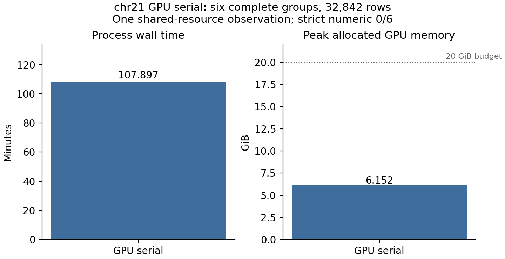

# 当前完整 GPU 串行验证

本次验证使用 chr21 的一个连续表型，包含芯片 Step1、全染色体 single-variant、全部 26 组 coding/noncoding gene-based 和汇总。完整组与 42 个基础 mask 定义见[指南](REGENIE.md#完整-mask-和-gpu-执行)。当前全量关联采用 `ExecutionConfig(parallel_level="serial", workers=1, max_gpu_gb=20.)`；全 26 组和三个 Summary 文件尚未完成最终验收。

## 范围与环境

正式 discovery 名单经基因型和排除名单对齐后输入 44,365 人，连续表型（公开代称 `trait_01`）有效 41,538 人。chr21 包含 13,733,596 个 WGS 位点；整条染色体的关联验证均使用同一份完整 509,468 个 QC 芯片位点拟合的 LOCO。Step2 两边共用 GPU 导出的 LOCO，以单独核对关联计算，Step1 预测误差另行记录。

环境为共享 A100 80GB、PyTorch 2.0.0/CUDA 11.8、Triton 2.0、NumPy 1.26.4、SciPy 1.13.1、pandas 1.4.4。GPU 峰值表示本进程 PyTorch 的分配峰值，CUDA 上下文和其他进程占用不计入该值。资源预算为 20 GiB。

冻结原 REGENIE 3.4.1 的核心计算使用 double，没有 float32 运行开关。当前对照基线为原 float64；PyTorch Step1/single 使用 float32/TF32，gene 投影、协方差与推断使用 float64。可在 Python 配置关闭 TF32 或选择 float64，不使用 float16。原实现见[Step1](https://github.com/rgcgithub/regenie/blob/v3.4.1/src/Step1_Models.cpp)、[连续性状投影](https://github.com/rgcgithub/regenie/blob/v3.4.1/src/Step2_Models.cpp)和[VC](https://github.com/rgcgithub/regenie/blob/v3.4.1/src/SKAT.cpp)。

## 完整 Step1

509,468 个 QC 位点划分为 521 个 block、2,605 个 L0 预测列，采用 5-fold。GPU 与同队列原程序（8 CPU 线程）的完整拟合对照为：

| 指标 | 结果 |
|---|---:|
| 两者选中 L1 h | 0.25 |
| CV MSE 最大差（原日志 6 位值） | 9.98×10⁻⁶ |
| chr1–22 LOCO 最大绝对差 / RMSE | 5.92×10⁻⁴ / 1.28×10⁻⁴ |
| LOCO 相关系数 | 0.999999869 |
| chr23 PRS 最大绝对差 | 5.58×10⁻⁴ |
| GPU 总耗时 / L0 / L1 | 644.708 / 639.34 / 0.78 秒 |
| 原程序总耗时 | 1131.51 秒 |
| GPU 峰值分配 | 986,269,184 字节 |

总时间包含初始化、整理和保存；原程序/GPU 的观测耗时比约 1.76（1131.51/644.708），为共享资源下的非隔离观测。LOCO 按 FID/IID 对齐，原预测只写 6 位有效数字。23 行染色体、样本映射、chr23 全基因组预测和 pred.list 已检查。当前全量串行 pipeline 导入这些已验证的预测，没有再次拟合 Step1。

## 全染色体 single-variant

当前 GPU 串行运行扫描全部 13,733,596 个 WGS 位点，使用 minMAC20、N=41,538，输出 314,209 行；single 阶段耗时 424.529767 秒。独立输出比较确认表头、13 列布局、行序、结构字段、NA、.ids 和五项数值门槛均通过。该时间是 single 阶段计时，尚无本轮完整 pipeline 墙钟和峰值结果。

## 完整 gene 组的串行测量

已完成 PTV、Missense、Intron、Pseudo、RNA、Intron_Gnocchi4 六个完整组，共 32,842 行，每组包含其全部 setlist gene 和 masks。计时在同一份已冻结的 21 个实现模块上完成；源码摘要保存在[匿名资源记录](../benchmarks/real_gpu_serial_resources_2026-10-05.json)。

| 指标 | 实测 |
|---|---:|
| 进程墙钟 | 6473.804485 秒 |
| pipeline 函数计时 | 6470.960217 秒 |
| GPU 峰值分配 | 6,605,298,688 字节（6.15 GiB） |
| 结构与附属文件通过 | 6/6 组 |
| 全组严格数值通过 | **0/6 组** |

结构审计包括表头、行序、N、NA、EXTRA、.ids，以及 masks BED/BIM/FAM/snplist。完整 gene 数值等价尚未达到；输出格式和严格数值分别登记。资源图与CSV只覆盖这六组，不代表全部 26 组的最终验收，也不与原全 26 组 gene-only 驱动换算倍速。

本次完整 26 组 GPU 串行运行仍在验证，最终状态、数值验收、显著性/locus 汇总、总耗时和显存待结果闭合后登记。新计算版本的结果须与其实际源码和配置配对。

## 数值门槛与检查

逐行比较容差为 A1FREQ 绝对差 2×10⁻⁶；BETA/SE 绝对差 1×10⁻⁶ 加相对差 1×10⁻⁵；CHISQ 绝对差 1×10⁻⁴ 加相对差 1×10⁻⁵；LOG10P 绝对差 1×10⁻⁴。非有限值和 NA 比较原始 token；不会因结果超门槛调整验收阈值。

已完成串行测量对应的冻结统计实现通过本地与验证 GPU 环境的 111 项回归，框架报告时间分别为 119.770 和 54.939 秒。此次串行入口清理包含 21 个实现模块，本地 111 项回归全部通过，框架报告耗时为 64.704 秒；清理后的完整端到端测量尚未登记。覆盖 ridge/QT 独立解、Davies 故障路径、SKAT-O 积分与下溢边界、退化 kernel、SBAT/NNLS、packed BED、样本重排、全部 mask 表头、评分白名单交集、原格式导出、缓存及失败恢复。数学 fixture 用于回归，性能数字均来自真实数据；精简和优化后的代码须按实际源码另行验证。

Raw 表型可按论文协变量重新处理；当前真实验证使用现成残差表，raw 协变量处理相对原 R 流程的全队列对照尚未完成。当前范围为连续单表型常染色体 discovery；全研究 22 条染色体、阳性显著命中和二分类/生存/联合多表型不在本次验收中。

私有输入、逐变异/逐基因结果、矩阵和输入文件指纹仅保存在分析者的验证目录。公开资源只包含匿名类别、计数、资源测量和软件摘要。[输入与命令](API.md)、[原算法与文献](REGENIE.md#数值后端与参考)提供复现入口。
