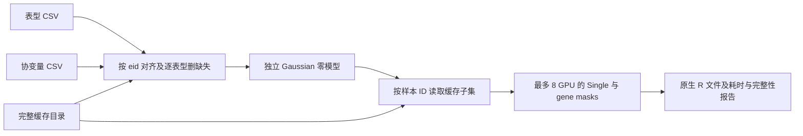

# 三输入全染色体分析

`run` 从两个 CSV 和一个已转存的缓存目录拟合普通 Gaussian 零模型，并运行 Single、coding、noncoding 和 ncRNA。CSV 中每个表型列独立分析；它们可以有不同的缺失样本。运行阶段只读取缓存，不需要原始 GDS、GDS SDK、预先拟合的模型或手工编写基因作业配置。



## 三个输入

1. **表型 CSV**：第一列必须是 `eid`，后面每列是一个有名称的数值表型。`eid` 使用标准十进制整数，例如 `101`；不接受 `101.0`、前导零或重复 ID。空单元格、`NA`、`NaN` 表示缺失值。
2. **协变量 CSV**：第一列同样是 `eid`，后面的所有数值列进入回归。每列必须有唯一名称；分类变量应先编码为数值或哑变量。自动加入截距；已有全为 1 的截距列时不重复添加。只含 `eid` 的文件表示仅校正截距。
3. **缓存目录**：包含完整的六状态 CSR/Zstandard 基因型缓存、标准 ID 样本索引、位点与功能注释，以及 coding/noncoding/ncRNA 作业目录。目录应由转存准备步骤产生；只复制基因型压缩文件无法完成关联分析。

输入示意（虚构数值）：

```csv
eid,trait_a,trait_b
101,0.13,1.20
103,0.27,NA
107,-0.10,0.80
```

```csv
eid,adjustment_a,adjustment_b
101,0.3,1
103,0.5,0
107,0.2,1
```

程序按数值 `eid` 从小到大对齐表型、协变量和缓存。表型缺失只排除该表型的样本；任一协变量缺失排除该参与者的所有表型分析。报告分别记录缓存外 ID、协变量文件缺少的 ID、缺失值排除数和最终人数。协变量共线、重复 ID、无穷值和非数值内容会直接报错。

## Python 调用

```python
from torchstaar import run

if __name__ == "__main__":
    report = run(
        phenotype_csv="phenotypes.csv",       # eid + 一个或多个表型列
        covariate_csv="covariates.csv",        # eid + 全部需要校正的协变量
        cache_directory="population_cache",    # 转存后的完整可复用目录
    )
    print(report["counts"])
```

仅调整实际需要的参数：

```python
from torchstaar import run

if __name__ == "__main__":
    report = run(
        "phenotypes.csv", "covariates.csv", "population_cache",
        output_directory="results/experiment_01",
        devices=["cuda:0", "cuda:1"],
        chromosomes=["21"],
        analyses=["individual", "coding", "noncoding", "ncrna"],
        memory_limit_gib=40,
    )
```

多进程采用 `spawn`，因此脚本调用需放在 `if __name__ == "__main__"` 中。Notebook 可直接使用命令行入口。

## 命令行调用

```bash
torchstaar phenotypes.csv covariates.csv population_cache
torchstaar-run phenotypes.csv covariates.csv population_cache \
  --output-directory results/experiment_01 --devices cuda:0 cuda:1
```

也可使用 `python -m staar_phewas.run`。`--chromosomes 1 2` 选择染色体；`--analyses coding noncoding` 选择分析；`--transform rint` 在每个表型的完整样本集上做秩逆正态转换。默认不转换表型。

## 默认参数及含义

| 参数 | 默认 | 意义 |
|---|---:|---|
| `workers` | 8 | 最多 8 个 worker；每个选中的 GPU 各 1 个进程。默认使用当前可见的前 8 张卡。 |
| `devices` | 自动 | 可显式指定 GPU 列表；不重复使用同一设备。 |
| `chromosomes` | 全部缓存染色体 | 从目录清单选择染色体；支持 1–22。 |
| `analyses` | 四类全部 | `individual` 是 Single；另外为 `coding`、`noncoding`、`ncrna`。 |
| `memory_limit_gib` | 40 | 每个 worker 的 CUDA 缓存分配器与原生计算预算上限，单位 GiB。 |
| `cpu_threads_per_worker` | 2 | 每个 GPU worker 的 CPU 线程数，避免多个进程过度争抢 CPU。 |
| `host_memory_limit_gib` | 200 | 项目共享主机工作区预算；在实际 mask 大小确定后申请，预算不足则重新排队。 |
| `host_memory_reserve_gib` | 20 | 在 live cgroup 上限内保留的主机余量；实际容量取配置上限与 cgroup 上限的较小值，再减去这部分。 |
| `matmul_mode` | `tf32` | 基因型关联的 FP32 存储和 TF32 矩阵乘法。`fp64` 用于显式参考控制。 |
| `null_fit_mode` | `fp64` | 普通 Gaussian 零模型拟合的显式精度；拟合完成后按关联模式转换状态。 |
| `transform` | `none` | `rint` 在样本对齐与缺失排除后转换表型。 |
| `covariance_block_size` | 4096 | 长 mask 的缓存协方差面板宽度；成熟的原始 reduction 分块仍为 512。 |
| `long_mask_threshold` | 5000 | `M <= 5000` 使用成熟路径；`M > 5000` 使用 FastSKAT 混合谱。 |
| `long_mask_rank` | 512 | 长 mask 保留的前导特征值数。 |
| `seed` | 1729 | 固定低秩初始化随机种子。矩估计使用已构造的 dense covariance，`probes=0`。 |
| `individual_effective_block_size` | 1024 | Single 的有效候选列打包宽度；不与 4096 协方差面板混用。 |
| `single_mac_cutoff` | 20 | Single 的最低 minor allele count。 |
| `single_group_variants` | 5000 | 保持原实现的 Single 输出分组顺序。 |
| `single_output_groups` | 20 | 每个输出分片至多包含 20 个完整原始组，避免收集整染色体结果。 |
| `analysis_options` | base、variant | 新入口采用原 base wrapper 语义，纳入 SNV 和 indel；rare MAF 默认 0.01、均值插补。可覆盖 `AnalysisOptions` 中相应参数。 |
| `output_directory` | 表型文件旁的新结果目录 | 可显式给出以便复用或恢复。 |
| `resume` | `True` | 输入哈希和配置一致时复用既有计划与已完成结果。 |
| `retry_failed` | `False` | 为 `True` 时重新排队失败作业；不会重复已验证完成的作业。 |

FP64 零模型拟合与基因型关联是不同阶段：这里显式设置前者，避免高个数样本下协变量投影的拟合误差。关联阶段仍使用 TF32/FP32，不使用 float16 或 bfloat16。FastSKAT 输出属于近似结果；真实数据的精度验收需逐字段与指定参考比较 `|Δ(-log10 p)| < 0.001`，运行成功本身不代表该条件已经通过。

## 输出和恢复

结果目录包含 `plan.private.json`、完整拟合状态 `models/*.npz`、`jobs.sqlite`、原生 `.Rdata` 文件以及 `report.private.json`。每个基因作业写一个原生文件；Single 按完整 5000 变异组边界写分片，并保存分片行数、SHA-256、全局行号和最终 factor levels 的索引。每个原生文件写出后重新解析，逐 cell 核对计算值；Single 还检查列、行号和 factors。分片的 factor-level 布局与整染色体一次输出并不相同。

恢复时验证完成文件和模型的 SHA-256，以及源码、缓存 manifest、基因目录和 promoter 输入的绑定；Linux 使用 PID、启动 ticks 与 boot ID 核对 worker，避免把 PID 复用当作旧作业仍存活。同一结果目录只允许一个 launcher。准备尚未结束的染色体保留在 pending；已完成元数据的染色体先运行，首次 dispatch 后固定其 metadata SHA。失败或预算超限会记录在 SQLite 中，并使 `run` 抛出异常。

主机内存门控同时观察 live cgroup 的实际压力、其他既有应用和已核验 worker 的 RSS；常驻 reader/model 保留内存预留，不能在作业结束时把它们当成释放。长 mask 只有拿到实际维度对应的共享预留后才分配主机基因型工作区。资源不足时丢弃本次准备并重新排队，避免多个 worker 各持有小预留等待大预留。noncoding/ncRNA 的候选注释索引在结果目录内按染色体建立一次，其他 worker 校验并通过只读 mmap 复用；Single 与 coding 不会预先构建该索引。

耗时包括端到端 wall time、模型拟合、作业设置、准备、协方差、检验、输出和资源等待。CPU wall 和 CUDA stream 阶段可能重叠，不能直接相加。共享 GPU 的时间需在实验报告中注明共享负载。

这些文件包含参与者与具体分析结果，只应保存在授权的私有数据目录；不要提交到公开源码仓库。公开 benchmark 应使用匿名的计数、配置、时间、内存和精度摘要。

## 缓存目录清单

`cache_dataset.json` 由准备步骤生成，版本为 `schema_version=1`。根目录 `sample_ids.npy` 保存缓存人群的标准整数 ID；染色体条目声明 `container_directory`、`metadata_directory`、`gene_catalog` 和可选 `promoter_intervals`。所有路径均相对于缓存根目录，也可通过目录链接复用既有染色体缓存。`promoter_intervals` 为 JSON 数组，每项是 `[chromosome, inclusive_start, inclusive_end]`。元数据 manifest 绑定对应基因型 manifest 和物理来源行索引，并保存 QC、位点、REF/ALT、功能类别、注释分数等字段。运行阶段使用缓存逻辑样本轴，不重新读取原始文件。

## 验证与参考

输入对齐、OLS 零模型、恢复绑定、非法概率和资源申请逻辑的单元测试见 `tests/test_three_input_run.py`；它们是功能验证，不是模拟数据 benchmark。缓存协方差、Single 和整个三输入流程的真实数据比较应另见当前版本的匿名 benchmark 记录，并区分 warm covariance 阶段与端到端时间。

原方法与代码：[STAARpipeline](https://github.com/li-lab-genetics/STAARpipeline)、[STAAR](https://github.com/xihaoli/STAAR)、[GMMAT](https://github.com/hanchenphd/GMMAT)。本项目用 PyTorch 实现零模型与关联统计；分析入口不调用 R 或原始 GDS SDK。R 原生格式由 [rdata](https://github.com/vnmabus/rdata) 写出。
