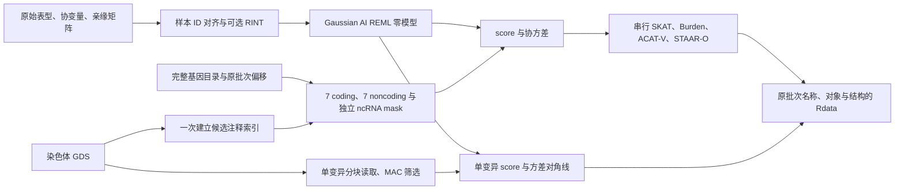

# 单个连续表型的完整染色体分析

`staar-phewas-chromosome` 按原 STAARpipeline 教程的完整基因目录，运行单变异、gene-based coding 和 noncoding 关联。输入已经注释的 SeqArray GDS、连续表型、亲缘矩阵和原参考目录；输出原生 Rdata。实际关联计算、零模型拟合和序列化均由 Python/PyTorch 完成。

已发布 0.2.0 的 FP64 完整真实验证采用 GPU 串行模式：chr21、一个连续表型、42,652 个样本，全部 795 项任务及 18 份关联文件通过原 R 对照。15 个 mask 均有真实非空结果，单变异输出 318,132 行；完整计时和数值记录见 [benchmark](benchmark.md) 与 [mask 库存](base_reference_inventory.md)。

本版默认原生 `tf32`，FP32 状态和矩阵输出，复用局部 mask 的 u/V、批量计算注释权重及完整谱。真实 chr21 全部 795 项任务完成，19 份原生文件结构与严格零模型通过；478,082 个 P 全部有效、可比较，原 R 或本版任一 `P<0.05` 的 24,713 个联合值最大 logP 差为 `0.0003579714`，无超限。固定零模型和已有无损转存缓存上的进程墙钟 `429.097 s`，300 秒目标尚未达到。每项输入格式见 [TF32 pipeline](tf32_pipeline.md)，计时边界见 [benchmark](tf32_benchmark.md)。




## 输入和输出

1. `phenotypes` 只含一个连续表型，`input` 指向已对齐的 NPZ。`y_raw`、`ids`、协变量及稀疏亲缘字段见 [输入准备](prepare.md)。`gds_sample_ids` 保存原 GDS 字符串；程序逐条染色体重新按 ID 查找行号，不能把某条染色体的行号直接用于另一条。
2. `gds` 是该染色体原生 GDS；`qc_path` 指定 PASS 字段。`annotation_catalog` 是名称到节点的映射；默认按教程使用 11 个 PHRED 注释，`aPC.LocalDiversity` 另生成负向权重。
3. `promoter_intervals_file` 是原 TxDb 全基因 `promoters(upstream=3000, downstream=3000)` 的闭区间 TSV，列为 chromosome/start/end。远端 enhancer 按 GeneHancer 的基因指向保留，不能限制到目标基因跨度内。
4. `manifest` 是原参考目录导出的 JSON。`genes_info` 是完整有序的 JSON 对象数组，每项含非空字符串 `gene_name` 和整数 `start/end`，坐标为一基闭区间且 `1<=start<=end`；`ncRNA_genes` 也是完整有序的对象数组，每项含非空字符串 `gene_name`，不能使用裸字符串数组。同时提供 `chromosome`、PASS 位点的 `start_loc/end_loc`、`array_offsets` 四项 coding/noncoding/ncrna/individual，及 `coding_genes_per_batch=50`、`ncrna_genes_per_batch=100`、`individual_region_size=10000000`。偏移表示前面染色体已经占用的批次数；不能只导出有候选变异或有显著结果的基因。
5. `output_directory` 收到全部关联批次文件。`output_prefix` 对应原脚本的研究前缀；各批次继续原全基因组 array ID。空 mask 遵循原包的 `NULL` 和拼接规则，不人为添加结果行。
6. 表型项的 `output_null` 是私有 `.Rdata/.rds` 路径，保存 `obj_nullmodel`；`save_model` 是可选的私有 `.npz` 路径，指定时保存完整拟合状态和本次生效模式。不指定时不写 NPZ，也不自动改写 `model` 输入 cache。报告记录配置、生效模式、任务范围、数量、耗时、显存与原生写出信息；报告及展开计划保存在私有目录。个体 ID 保留在私有输入和模型文件中。

| 分析 | 完整 mask | 默认筛选 |
|---|---|---|
| Coding | plof、plof_ds、missense、disruptive_missense、synonymous、ptv、ptv_ds | `0<MAF<0.01`，至少 2 个稀有变异 |
| Noncoding | upstream、downstream、UTR、promoter_CAGE、promoter_DHS、enhancer_CAGE、enhancer_DHS | 同上 |
| ncRNA | ncRNA | 同上，按独立 ncRNA 目录 |
| Single variants | 全部 PASS 位点的单变异 score 检验 | `MAC>=20`，包含 SNV/Indel/多等位位点 |

基因集合的 `variant_type` 与单变异的类型独立：示例按教程以 SNV 检验基因集合、以 `variant` 检验单变异。选择 `Indel` 或 `variant` 会改变 PTV 的 frameshift 组成，应与原 R 参数保持一致。missense 按原包加入 disruptive missense 的额外组合列。

## Python 调用

```python
import json
from pathlib import Path
from staar_phewas.chromosome import chromosome_configuration, run_chromosome

# 私有配置包含数据路径；参考目录保留全部基因及原始顺序。
with open("private/full_chromosome.json") as configuration_file:
    chromosome_config = json.load(configuration_file)
with open(chromosome_config["manifest"]) as manifest_file:
    reference_manifest = json.load(manifest_file)

# 展开计划后可先检查全基因数量、15 类 mask 和原输出文件名。
expanded_configuration = chromosome_configuration(chromosome_config, reference_manifest)
print(expanded_configuration["coverage"])

# 当前开发版的候选设置显式写入，便于复现；不是完整 TF32 验收结论。
chromosome_config.update(
    matmul_mode="tf32",
    statistics_tail_optimization=True, statistics_execution="serial",
)
# 从 raw 表型拟合零模型，再完成整个染色体。
execution_report = run_chromosome(chromosome_config, device="cuda:0")
execution_report_path = Path("private/full_chromosome_report.json")
execution_report_path.parent.mkdir(parents=True, exist_ok=True)
with execution_report_path.open("w") as report_file:
    json.dump(execution_report, report_file, indent=2)
```

## 命令行调用

先按 [安装说明](pipeline.md) 建立 Conda 环境，将示例复制到 `private/full_chromosome.json` 并替换私有路径。当前开发版采用上述 TF32 默认；FP64 同输入控制配置需显式设置 `matmul_mode="fp64"` 和 `precision_control=true`，并使用独立输出与 cache。

```bash
# 先生成完整任务计划；不执行关联计算。
staar-phewas-chromosome private/full_chromosome.json \
  --plan-only --report private/expanded_chromosome.json

# 运行并保存完整时间、覆盖范围与显存报告。
staar-phewas-chromosome private/full_chromosome.json \
  --device cuda:0 --report private/full_chromosome_report.json
```

| 参数 | 含义 |
|---|---|
| `statistics_execution` | 当前完整染色体 CLI 仅接受 `serial`，按原任务顺序计算；底层批量接口的历史对照见 [statistics](statistics.md) |
| `analysis_options.genotype_block_size` | 每次解码位点数，示例 1024；不改变原统计分组 |
| `analysis_options.annotation_block_size` | 注释索引扫描的位点块大小，示例 250000 |
| `analysis_options.memory_limit_gib` | 正、有限的数值 GiB，默认 20；同时约束 pipeline 与每次 TF32 乘法。乘法额度还受实时 CUDA free、未使用 reserved 和固定 256 MiB reserve 限制；实际 allocated 峰值超配置使运行失败 |
| `subset_variants_num` | 原单变异分组大小，默认 5000；分组基于 MAC 筛选后的序号，与解码块大小独立 |
| `mac_cutoff` | 原 wrapper 的 allele 初始 MAC 下限，默认 20：先求 `ALT_AC = 2*round(N*(1-allele_missing_rate))-REF_AC`，再取 `MAC = min(REF_AC, ALT_AC)`。Base 据此筛选，随后不加第二次完整 dosage MAC 筛选；PheWAS 对各 trait 另按未填补完整 dosage 的 MAC 筛选 |
| `analysis_options.rare_maf_cutoff` / `analysis_options.rv_num_cutoff` | 基因集合稀有频率上限 / 最小变异数，默认 0.01 / 2 |
| `phenotypes[i].transform` | JSON 字符串，默认 `none`；`rint` 在最终样本上用原平均并列秩规则变换。仅对 `input` 新拟合生效，加载 `model` 不重复变换 |
| `phenotypes[i].sample_indices_file` | 可选私有 `.npy` 路径，用于加载旧 `model` 时补充 N 长度、唯一且在 GDS 范围内的零基整数样本行号；已有 canonical `gds_sample_ids` 时按 ID 重新绑定 |
| `phenotypes[i].sample_id_rule` | JSON 字符串：`auto`（默认）、`exact`、`last_underscore_token`；分别自动匹配、严格原 ID 匹配、按 GDS ID 最后一个下划线后片段匹配。用于未保存 canonical GDS ID 的输入，任何归一化重复都报错 |
| `--plan-only` | 只写展开的任务 JSON；其配置仍属于私有文件 |
| `--report` | 正式执行时写汇总报告；计划模式时写展开配置 |

关联计算保留原 Saddle 的搜索边界和尾概率停止规则。单变异只计算方差对角线，避免构造无需使用的全变异协方差。不同 mask 的重复集合可复用结果；注释索引仅建一次。局部并集先保留已缓存结果，并对同 family 中相同、同序的变异索引只执行一次统计，再按原 mask 位置回填；只有一个未缓存集合时走原逐 mask 路径。权重批量复用及计数器含义见 [TF32 pipeline](tf32_pipeline.md#配置参数)。

原 R 使用 double / FP64，0.2.0 的严格 FP64 基线保留冻结记录。本版采用原生 TF32 / FP32 的相同公式，不做分量重建；全部文件结构和严格零模型必须通过，关联 P 以任一侧 `P<0.05` 的联合范围逐值检查 logP 差 <=0.001。全部 P 的有效性、可比较性和原生 log 一致性仍必检。完整流程计时包含本次索引绑定、读取与准备、统计和写出；本版复用固定零模型及已生成缓存，首次转存与新拟合另计。

## 原 R 调用

```r
library(STAARpipeline)
library(SeqArray)

genotype_file <- seqOpen("private/chr21.gds")
# 原参考环境提供 genes_info、ncRNA_gene、Anno_catalog 和 promoter 区间。
chromosome_genes <- genes_info[genes_info[, 2] == 21, , drop = FALSE]
chromosome_ncrna <- ncRNA_gene[ncRNA_gene[, 1] == 21, , drop = FALSE]
coding_result <- Gene_Centric_Coding(
    chr = 21L, gene_name = as.character(chromosome_genes[1, 1]),
    genofile = genotype_file, obj_nullmodel = null_model,
    category = "all_categories_incl_ptv", variant_type = "SNV",
    Annotation_dir = "", Annotation_name_catalog = Anno_catalog, Annotation_name = annotation_names,
    QC_label = "annotation/info/QC_label")
noncoding_result <- Gene_Centric_Noncoding(
    chr = 21L, gene_name = as.character(chromosome_genes[1, 1]),
    genofile = genotype_file, obj_nullmodel = null_model,
    category = "all_categories", variant_type = "SNV",
    Annotation_dir = "", Annotation_name_catalog = Anno_catalog, Annotation_name = annotation_names,
    QC_label = "annotation/info/QC_label")
ncrna_result <- ncRNA(
    chr = 21L, gene_name = as.character(chromosome_ncrna[1, 2]),
    genofile = genotype_file, obj_nullmodel = null_model,
    variant_type = "SNV",
    Annotation_dir = "", Annotation_name_catalog = Anno_catalog, Annotation_name = annotation_names,
    QC_label = "annotation/info/QC_label")
individual_result <- Individual_Analysis(
    chr = 21L, start_loc = chromosome_start, end_loc = chromosome_end,
    genofile = genotype_file, obj_nullmodel = null_model,
    variant_type = "variant", mac_cutoff = 20, subset_variants_num = 5000,
    QC_label = "annotation/info/QC_label")
seqClose(genotype_file)
```

完整原版对照调度脚本位于 [validation/oracles](../validation/oracles)。它只用于开发验证，调用锁定版本的原函数。原版并行墙钟时间、各进程耗时之和、函数耗时之和分别报告。

## 来源与版本

基础流程参照 [STAARpipeline](https://github.com/li-lab-genetics/STAARpipeline) 的 Gene-Centric 和 Individual Analysis 教程；多独立表型接口参照 [STAARpipelinePheWAS](https://github.com/li-lab-genetics/STAARpipelinePheWAS)。原数据对照锁定推荐镜像实际安装的 STAARpipeline 0.9.9，避免将不同版本的提取和填补规则混作同一参照。

参考：Li et al., Nature Genetics 2020, [doi](https://doi.org/10.1038/s41588-020-0676-4)；Li et al., Nature Methods 2022, [doi](https://doi.org/10.1038/s41592-022-01640-x)；Chen et al., AJHG 2019, [doi](https://doi.org/10.1016/j.ajhg.2018.12.012)。

已发布 0.2.0 的 CUDA 关联计算保持 FP64，参考 LAPACK 和 CPU 精度匹配属于该历史路径。本版原生 TF32 / FP32 不需要参考 LAPACK 精度库；矩阵、完整谱、原 Saddle 尾概率及计时边界见 [precision](precision.md)与[完整 benchmark](tf32_benchmark.md)。

## 更新与比较范围

- 0.2.0：完成上述 FP64 全染色体原生输出验收；端到端及分步骤计时见 [benchmark](benchmark.md)。
- 早期 0.3.0 分量版（已退役）：新增实际 TF32 分量乘法、设备驻留 Single 路径、显式乘法审计、模式相关显存检查与可选阶段计时。19 个真实 mask 与 300 个低 Score 的检查属于阶段证据；短 native 已完成结构、非 P 严格与 logP 对照；stage13 原失败任务 native 重验通过，stage13 完整串行重验完成 490/795 项后，在第 491 项触发工作区 guard 的保护性 `MemoryError`，未改变精度；已完成 coding/noncoding 的 11 份原生文件对照通过，最大 logP 差为 `0.000524982733251467`，尚未完成完整 ncRNA 与 Single 验收，当前不报告 TF32 全流程加速比。

- 本版原生 TF32 / FP32（F）：完整 795 项任务、15 个 mask、19 份原生文件结构与严格零模型通过；478,082 个 P 均有效、可比较，显著联合范围 24,713 个 P 无超限。进程墙钟 `429.097 s`，300 秒目标未达；B/C2/E 的 332 个 residuals 严格误差保留为旧失败记录。见 [本版 benchmark](tf32_benchmark.md)。

代表性 profile 保留完整目录中的原 array ID、文件名及任务顺序；若缩短 Single 区间，报告明确区间范围，原 R 在同一区间重新生成 Single 对照。它不代表完整 Single 覆盖。完整运行保持全部目录、15 种 mask、原 Single 区间与输出结构。

旧短流程与分量重建实验均为历史范围，完整评估已取消，不作为新原生 TF32 精度或耗时。记录见 [TF32 benchmark](tf32_benchmark.md)。
