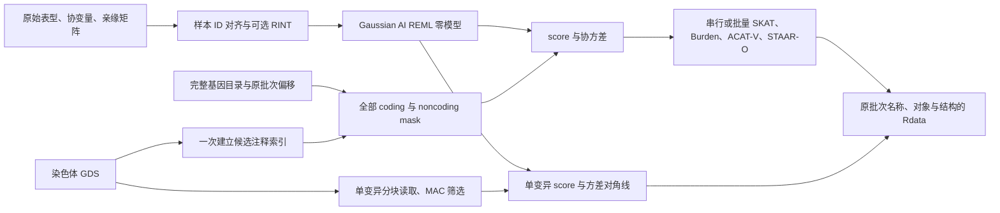

# 单个连续表型的完整染色体分析

`staar-phewas-chromosome` 按原 STAARpipeline 教程的完整基因目录，运行单变异、gene-based coding 和 noncoding 关联。输入已经注释的 SeqArray GDS、连续表型、亲缘矩阵和原参考目录；输出原生 Rdata。实际关联计算、零模型拟合和序列化均由 Python/PyTorch 完成。

0.2.0 的完整真实验证采用 GPU 串行模式：chr21、一个连续连续表型、42,652 个样本，全部 795 项任务及 18 份关联文件通过原 R 对照。15 个 mask 均有真实非空结果，单变异输出 318,132 行；完整计时和数值记录见 [benchmark](benchmark.md) 与 [mask 库存](base_reference_inventory.md)。



## 输入和输出

1. `phenotypes` 只含一个连续表型，`input` 指向已对齐的 NPZ。`y_raw`、`ids`、协变量及稀疏亲缘字段见 [输入准备](prepare.md)。`gds_sample_ids` 保存原 GDS 字符串；程序逐条染色体重新按 ID 查找行号，不能把某条染色体的行号直接用于另一条。
2. `gds` 是该染色体原生 GDS；`qc_path` 指定 PASS 字段。`annotation_catalog` 是名称到节点的映射；默认按教程使用 11 个 PHRED 注释，`aPC.LocalDiversity` 另生成负向权重。
3. `promoter_intervals_file` 是原 TxDb 全基因 `promoters(upstream=3000, downstream=3000)` 的闭区间 TSV，列为 chromosome/start/end。远端 enhancer 按 GeneHancer 的基因指向保留，不能限制到目标基因跨度内。
4. `manifest` 是原参考目录导出的 JSON。`genes_info` 保留所有蛋白编码基因及原顺序，每项为 `gene_name/start/end`；`ncRNA_genes` 保留全部 ncRNA 的 `gene_name`。同时提供 `chromosome`、PASS 位点的 `start_loc/end_loc`、`array_offsets` 四项 coding/noncoding/ncrna/individual，及 `coding_genes_per_batch=50`、`ncrna_genes_per_batch=100`、`individual_region_size=10000000`。偏移表示前面染色体已经占用的批次数；不能只导出有候选变异或有显著结果的基因。
5. `output_directory` 收到全部关联批次文件。`output_prefix` 对应原脚本的研究前缀；各批次继续原全基因组 array ID。空 mask 遵循原包的 `NULL` 和拼接规则，不人为添加结果行。
6. `output_null` 保存 `obj_nullmodel`；`save_model` 保存可复用的完整私有 NPZ 拟合状态。运行报告仅含范围、数量、耗时和显存，不含个体 ID。

| 分析 | 完整 mask | 默认筛选 |
|---|---|---|
| Coding | plof、plof_ds、missense、disruptive_missense、synonymous、ptv、ptv_ds | `0<MAF<0.01`，至少 2 个稀有变异 |
| Noncoding | upstream、downstream、UTR、promoter_CAGE、promoter_DHS、enhancer_CAGE、enhancer_DHS | 同上 |
| ncRNA | ncRNA | 同上，按独立 ncRNA 目录 |
| Single variants | 全部 PASS 位点的单变异 score 检验 | `MAC>=20`，包含 SNV/Indel/多等位位点 |

基因集合的 `variant_type` 与单变异的类型独立：示例按教程以 SNV 检验基因集合、以 `variant` 检验单变异。选择 `Indel` 或 `variant` 会改变 PTV 的 frameshift 组成，应与原 R 参数保持一致。missense 按原包加入 disruptive missense 的额外组合列。

## Python 调用

```python
import json
from pathlib import Path
from staar_phewas.chromosome import chromosome_configuration, run_chromosome

# 私有配置包含数据路径；参考目录保留全部基因及原始顺序。
with open("examples/staar-chromosome.json") as configuration_file:
    chromosome_config = json.load(configuration_file)
with open(chromosome_config["manifest"]) as manifest_file:
    reference_manifest = json.load(manifest_file)

# 展开计划后可先检查全基因数量、15 类 mask 和原输出文件名。
expanded_configuration = chromosome_configuration(chromosome_config, reference_manifest)
print(expanded_configuration["coverage"])

# 从 raw 表型拟合零模型，再完成整个染色体。
execution_report = run_chromosome(chromosome_config, device="cuda:0")
execution_report_path = Path("runs/full_chr21/report.json")
execution_report_path.parent.mkdir(parents=True, exist_ok=True)
with execution_report_path.open("w") as report_file:
    json.dump(execution_report, report_file, indent=2)
```

## 命令行调用

先按 [安装说明](pipeline.md) 建立 Conda 环境，替换示例的私有文件路径。

```bash
# 先生成完整任务计划；不执行关联计算。
staar-phewas-chromosome examples/staar-chromosome.json \
  --plan-only --report private/expanded_chr21.json

# 运行并保存完整时间、覆盖范围与显存报告。
staar-phewas-chromosome examples/staar-chromosome.json \
  --device cuda:0 --report runs/full_chr21/report.json
```

| 参数 | 含义 |
|---|---|
| `statistics_execution` | `serial` 按 mask 计算；`batched` 将同尺寸的注释核/集合合并到 PyTorch 批量计算。输入筛选与输出顺序相同 |
| `genotype_block_size` | 每次解码位点数，示例 1024；不改变原统计分组 |
| `annotation_block_size` | 注释索引扫描的位点块大小，示例 250000 |
| `memory_limit_gib` | 单集合密集计算预检预算，示例 20 GiB |
| `subset_variants_num` | 原单变异分组大小，默认 5000；分组基于 MAC 筛选后的序号，与解码块大小独立 |
| `mac_cutoff` | 原 wrapper 的 allele 初始 MAC 下限，默认 20：先求 `ALT_AC = 2*round(N*(1-allele_missing_rate))-REF_AC`，再取 `MAC = min(REF_AC, ALT_AC)`。Base 据此筛选，随后不加第二次完整 dosage MAC 筛选；PheWAS 对各 trait 另按未填补完整 dosage 的 MAC 筛选 |
| `rare_maf_cutoff` / `rv_num_cutoff` | 基因集合稀有频率上限 / 最小变异数，默认 0.01 / 2 |
| `transform` | `rint` 在最终样本上用原平均并列秩规则变换；已变换数据用 `none` |
| `--plan-only` | 只写展开的任务 JSON；其配置仍属于私有文件 |
| `--report` | 正式执行时写汇总报告；计划模式时写展开配置 |

批量计算按真实矩阵尺寸分组，避免用补零改变原 Saddle 的搜索边界；敏感的尾概率沿用原停止规则。单变异只计算方差对角线，避免构造无需使用的全变异协方差。不同 mask 的重复集合可复用结果；注释索引仅建一次。

原 R 包使用 double。真实数据的 float32/允许 TF32 探针不能通过当前 P 值容差，因此关联统计保持 float64。FP64 Tensor Core 的专项探针与保留原顺序的生产计算分开记录，不能由硬件能力推断实际执行核。精度探针及已验证耗时见 [统计计算](statistics.md) 和 [benchmark](benchmark.md)。完整染色体的计时应包含索引、基因型读取、拟合和写出，不能以统计核心计时替代。

## 原 R 调用

```r
library(STAARpipeline)
library(SeqArray)

genotype_file <- seqOpen("private/chr21.gds")
# 原参考环境提供 genes_info、ncRNA_gene、Anno_catalog 和 promoter 区间。
chromosome_genes <- genes_info[genes_info[, 2] == 21, , drop = FALSE]
chromosome_ncrna <- ncRNA_gene[ncRNA_gene[, 1] == 21, , drop = FALSE]
coding_result <- Gene_Centric_Coding(
    chr = 21L, gene_name = as.character(chromosome_genes[1, 1]),
    genofile = genotype_file, obj_nullmodel = null_model,
    category = "all_categories_incl_ptv", variant_type = "SNV",
    Annotation_dir = "", Annotation_name_catalog = Anno_catalog, Annotation_name = annotation_names,
    QC_label = "annotation/info/QC_label")
noncoding_result <- Gene_Centric_Noncoding(
    chr = 21L, gene_name = as.character(chromosome_genes[1, 1]),
    genofile = genotype_file, obj_nullmodel = null_model,
    category = "all_categories", variant_type = "SNV",
    Annotation_dir = "", Annotation_name_catalog = Anno_catalog, Annotation_name = annotation_names,
    QC_label = "annotation/info/QC_label")
ncrna_result <- ncRNA(
    chr = 21L, gene_name = as.character(chromosome_ncrna[1, 2]),
    genofile = genotype_file, obj_nullmodel = null_model,
    variant_type = "SNV",
    Annotation_dir = "", Annotation_name_catalog = Anno_catalog, Annotation_name = annotation_names,
    QC_label = "annotation/info/QC_label")
individual_result <- Individual_Analysis(
    chr = 21L, start_loc = chromosome_start, end_loc = chromosome_end,
    genofile = genotype_file, obj_nullmodel = null_model,
    variant_type = "variant", mac_cutoff = 20, subset_variants_num = 5000,
    QC_label = "annotation/info/QC_label")
seqClose(genotype_file)
```

完整原版对照调度脚本位于 [validation/oracles](../validation/oracles)。它只用于开发验证，调用锁定版本的原函数。原版并行墙钟时间、各进程耗时之和、函数耗时之和分别报告。

## 来源与版本

基础流程参照 [STAARpipeline](https://github.com/li-lab-genetics/STAARpipeline) 的 Gene-Centric 和 Individual Analysis 教程；多独立表型接口参照 [STAARpipelinePheWAS](https://github.com/li-lab-genetics/STAARpipelinePheWAS)。原数据对照锁定推荐镜像实际安装的 STAARpipeline 0.9.9，避免将不同版本的提取和填补规则混作同一参照。

参考：Li et al., Nature Genetics 2020, [doi](https://doi.org/10.1038/s41588-020-0676-4)；Li et al., Nature Methods 2022, [doi](https://doi.org/10.1038/s41592-022-01640-x)；Chen et al., AJHG 2019, [doi](https://doi.org/10.1016/j.ajhg.2018.12.012)。

CUDA 关联计算保持 FP64；近均值 Saddle 的参考精度库须提前按 [precision](precision.md#安装锁定的参考-lapack) 安装配置。运行报告分别记录 CPU 谱校正、标量权重转换和 CUDA 执行次数及耗时。
