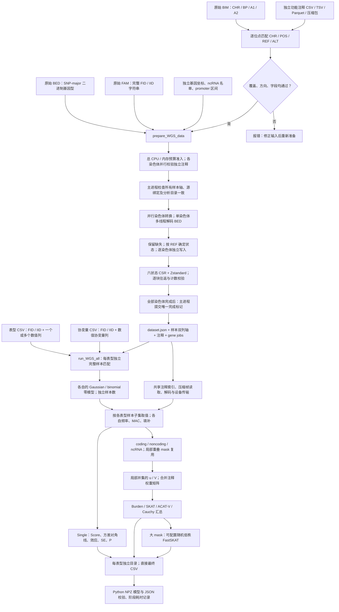

# Fudan WGS Toolkit 使用说明

本工具尚在开发验证阶段，未达到原软件精度，切不可作为真实分析使用的标准化工具。

## 1. 功能与流程

`prepare_WGS_data` 从原始 PLINK BED/BIM/FAM 和独立下载的功能注释构建可校验的遗传数据。`run_WGS_all` 在一张 GPU 上完成单变异、coding、noncoding 和 ncRNA 关联分析。传入多个表型列时，它们共享遗传数据读取、CPU 缓存、注释索引和 CPU–GPU 传输；各表型仍独立筛选完整样本、拟合零模型、计算频率和检验结果。

遗传矩阵计算使用原生 TF32/FP32 运算，不通过拆分乘法重建 FP64。零模型拟合、部分谱校正和稳定尾概率仍保留 FP64，以控制数值误差；这不改变基因型矩阵乘法路径。精度用显著结果的 `−log10(P)` 差异评估，目标为 0.001。该目标不是对所有数据、注释版本和模型的精度保证。



不执行固定窗口或滑动窗口关联分析。Single 的位置分区仅决定输出文件与读取批次，不把邻近变异合并成窗口检验。

## 2. 安装与运行环境

```bash
git clone https://github.com/weikanggong1/Fudan-WGS-Toolkit.git
cd Fudan-WGS-Toolkit
conda env create -f environment.yml
conda activate fudan-wgs-toolkit
```

运行关联分析需要支持 TF32 的 NVIDIA GPU、兼容的驱动以及安装环境中的 CUDA 运行库。默认一张 GPU、8 个 CPU 线程、20 GiB 设备工作区上限。数据准备默认使用 8 个 CPU worker 预算，不占用 GPU；并发染色体数同时受可用任务和 `memory_limit_gib` 的主机工作区估算预算限制。Parquet 注释为可选输入，使用时安装 `python -m pip install -e '.[parquet]'`；CSV/TSV 和压缩包不需要这个额外依赖。

## 3. 输入数据的意义和格式

### 3.1 原始遗传文件

一个染色体对应同名的 `chromosome21.bed`、`chromosome21.bim`、`chromosome21.fam`。BIM 单独不包含基因型，三个文件必须同时提供。

| 文件 | 格式与字段 | 用途 |
| --- | --- | --- |
| BED | 二进制，前三字节 `6c 1b 01`，按变异存储的 PLINK 1 二位编码 | 唯一的基因型来源；支持完整二倍体调用和完全缺失 |
| BIM | 无表头、空白分隔六列：CHR、变异标识、遗传距离、BP、A1、A2 | 确定原始变异顺序、染色体、1-based 位置和两个等位基因 |
| FAM | 无表头、空白分隔六列：FID、IID、父本 ID、母本 ID、sex、phenotype | 确定 BED 样本顺序；分析表型来自另外的 CSV |

不能把 A1 或 A2 自动当作 REF。默认以独立注释的 REF/ALT 匹配等位基因；原始 BIM 标识确实为 `CHR:POS:REF:ALT` 时，可在清单声明 `reference_allele_source: "bim_variant_id"`。转换会核对全部 BIM 行的标识、位置和等位基因，再按声明方向精确匹配独立注释；不会仅凭前缀或首批位点推断。BIM 必须按染色体位置非降序排列，每行两个等位基因明确且不同。BED 无法恢复单个等位基因缺失的半调用；转换记录会明确说明这一限制。

### 3.2 独立功能注释

注释目录包含 `annotations.json`、原始功能注释文件以及独立基因和 promoter 数据。**注释输入必须是原始下载的文件，不能用已准备缓存中的注释替代。** 当前原始注释清单格式为 `raw-wgs-annotations-v1`。

功能注释支持 CSV、TSV、gzip CSV/TSV、含 CSV/TSV 的 `tar.gz`，或 Parquet。压缩包会流式读取，不需要先展开整条染色体。输入文件按染色体位置排列，多个分片按位置顺序写入清单。一个原始 BIM 位点必须有唯一、精确的 CHR/POS/REF/ALT 对应记录；额外的公共库位点不进入遗传数据。默认情况下，缺失位点、重复对应关系或缺少必需字段会报错，不丢弃原始变异，也不把未知权重改成零。

公共注释可能不覆盖输入中的全部 indel/MNV。只有显式声明并验证 `reference_allele_source: "bim_variant_id"`、明确 QC 策略后，才可另声明 `allow_missing_non_snv: true`：保留这些变异的原始基因型，标记 `annotation_available=False`、分类为空和权重为 NaN。SNV 缺注释仍报错。这种数据可做全部变异的 Single 和已覆盖 SNV 的 gene-based；不能做 Indel 或全部变异的 gene-based。要做后两者，需要完整的独立注释。默认不启用该策略。

建议从 [FAVOR Essential 官方数据集](https://doi.org/10.7910/DVN/1VGTJI) 下载对应染色体文件，并核对官方校验值。其原始表包含以下字段。`column_mapping` 明确把原始列映射到包内的语义路径；包内路径是注释键名，不表示外部软件文件中的节点。

| 语义 | 原始 FAVOR 列 | 意义 |
| --- | --- | --- |
| chromosome / position | `chromosome` / `position` | GRCh38 染色体和 1-based 位置 |
| reference / alternate | `ref_vcf` / `alt_vcf` | 包含锚定碱基的原始 REF 与单个 ALT |
| GENCODE.Category | `genecode_comprehensive_category` | exonic、splicing、UTR、upstream、ncRNA 等区域分类 |
| GENCODE.Info | `genecode_comprehensive_info` | 基因归属字符串；保留原始语法 |
| GENCODE.EXONIC.Category | `genecode_comprehensive_exonic_category` | missense、synonymous、stopgain、frameshift 等编码影响 |
| MetaSVM | `metasvm_pred` | disruptive missense 的分类依据 |
| GeneHancer | `genehancer` | enhancer 与目标基因的关联 |
| CAGE / DHS | `cage_tc` / `rdhs` | promoter、enhancer mask 的调控区标记 |
| CADD / LINSIGHT / FATHMM.XF | `cadd_phred` / `linsight` / `fathmm_xf` | 三类功能权重 |
| aPC.EpigeneticActive / Repressed / Transcription | `apc_epigenetics_active` / `apc_epigenetics_repressed` / `apc_epigenetics_transcription` | 三类表观遗传注释主成分 |
| aPC.Conservation | `apc_conservation_v2` | 所选版本的保守性注释主成分 |
| aPC.LocalDiversity | `apc_local_nucleotide_diversity_v3` | 所选版本的局部多样性主成分 |
| aPC.Mappability / TF / Protein | `apc_mappability` / `apc_transcription_factor` / `apc_protein_function_v3` | 可比对性、转录因子和蛋白功能主成分 |

本版使用官方教程链接的 FAVOR Essential GRCh38 原始下载集（DOI `10.7910/DVN/1VGTJI`），没有改用另外一代注释。官方教程先选择原始 CSV 列，再把 Conservation v2、LocalDiversity v3、Protein v3 重命名为分析列；上表直接映射同一批原始列，省去中间文件转换。固定教程提交为 `5340326e0506945e35bc9d4d3cb85d5e8d65cd92`，对应 [官方列选择](https://github.com/li-lab-genetics/STAARpipeline-Tutorial/blob/5340326e0506945e35bc9d4d3cb85d5e8d65cd92/FAVORannotator_csv/Annotate.R) 与 [官方列重命名](https://github.com/li-lab-genetics/STAARpipeline-Tutorial/blob/5340326e0506945e35bc9d4d3cb85d5e8d65cd92/FAVORannotator_csv/gds2agds.R)。

本次 chr21 官方压缩包大小为 5,528,780,471 字节，MD5 为 `dccf132a9ed61f18f08ceac69b5c2cab`；下载后已核对官方校验值。准备流程另记录使用的原始文件 SHA-256。公共数据库不保证覆盖任意研究的所有 indel/MNV；同一官方文件的覆盖缺口也不能通过其他版本的权重或旧缓存补齐。

注释版本属于分析输入。更换 aPC 版本可能改变权重和 P 值，不能把这种输入变化解释为 TF32 数值误差。QC 不是公共功能注释：必须映射原始 QC 列，或者在清单中明确声明输入遗传文件已经通过项目 QC，例如 `default_qc: "PASS"`。后者不能替代实际的质量控制。

基因输入可使用独立 CSV。编码基因表的字段为 `hgnc_symbol,chromosome_name,start_position,end_position`；ncRNA 名单为 `chr,ncRNA`；promoter TSV 为 `chromosome,start,end,strand,gene_id`。位置均为 1-based、闭区间。精确复现需要固定这些文件的版本和 promoter 定义，不在运行中重新猜测转录本或启动子长度。

编码基因表和 ncRNA 名单固定为 [原始方法提交 ed3e26f7](https://github.com/li-lab-genetics/STAARpipeline/tree/ed3e26f7fb4c5d70a765840d089e5863896ec081) 的原始参考表，独立转换为上述 CSV。本次 promoter 则读取 [官方 TxDb.Hsapiens.UCSC.hg38.knownGene 3.22.0](https://bioconductor.org/packages/release/data/annotation/html/TxDb.Hsapiens.UCSC.hg38.knownGene.html) 的 SQLite 数据：同一基因的同染色体、同链转录本合并范围，多染色体或多链基因按原规则排除；正链取 `gene_start−3000 ... gene_start+2999`，负链取 `gene_end−2999 ... gene_end+3000`，不裁剪坐标。固定下载包 SHA-256 为 `feb61126a6d874949423703c90e92e6073d22fecf2db18c44aa9859a43d53f4e`。这些参考文件与参与者及基因型无关，不从已经准备的遗传缓存提取。

完整清单生成示例见 [write_annotation_manifest.py](../examples/write_annotation_manifest.py)。其中的目录、文件名和列映射需要与实际下载文件对应。

### 从官方原始参考文件生成三个输入表

先在已安装的 Conda 环境中安装一次性的 Python 参考读取依赖：

```bash
conda activate fudan-wgs-toolkit
python -m pip install -e '.[annotations]'
```

独立下载 [固定官方基因参考资源](https://raw.githubusercontent.com/li-lab-genetics/STAARpipeline/ed3e26f7fb4c5d70a765840d089e5863896ec081/R/sysdata.rda) 与 [官方 TxDb 3.22.0 源包](https://bioconductor.org/packages/3.23/data/annotation/src/contrib/TxDb.Hsapiens.UCSC.hg38.knownGene_3.22.0.tar.gz)。前者 SHA-256 为 `4bfa7ab5fe2c25f8aaf6e4319e683c3e29b97f62e687b01036501cffd32b484f`；后者为 `feb61126a6d874949423703c90e92e6073d22fecf2db18c44aa9859a43d53f4e`。下载文件保持在项目外，不放入本仓库。基因参考资源是外部序列化数据，由 Python 读取，不安装或调用原语言解释器。

把下载文件分别保存为本例的 `gene_reference.archive` 与 `promoter_reference.tar.gz` 后，从仓库根目录运行：

```bash
python examples/export_annotation_references.py \
  --gene-reference-archive /data/downloads/gene_reference.archive \
  --promoter-database /data/downloads/promoter_reference.tar.gz \
  --output-directory /data/raw_annotation_references

# 只有输入遗传文件确已完成项目 QC 时，才声明下面的 PASS。
python examples/write_annotation_manifest.py \
  --output-directory /data/original_annotations \
  --chromosome 21 \
  --variant-archive /data/downloads/chromosome21.tar.gz \
  --gene-csv /data/raw_annotation_references/genes.csv \
  --ncrna-csv /data/raw_annotation_references/ncrna.csv \
  --promoter-tsv /data/raw_annotation_references/promoter_intervals.tsv \
  --default-qc PASS
```

随后把 `/data/original_annotations` 传入 `prepare_WGS_data(annotation_directory=...)`。如果项目有逐位点 QC 列，应映射它而不声明固定 PASS；若原始非 SNV 存在注释覆盖缺口，仍须遵循上文的显式覆盖策略，示例不会自动容许缺注释。

| 导出参数 | 意义 |
| --- | --- |
| --gene-reference-archive | 独立下载的原始基因参考资源；内含 genes_info 与 ncRNA_gene 两个表，保持原始行顺序 |
| --promoter-database | 原始 TxDb 源包 tar.gz，或从同一原始包独立提取的 SQLite 数据库；不是遗传缓存 |
| --output-directory | 不存在的新目录；生成 genes.csv、ncrna.csv、promoter_intervals.tsv 和 reference_export.private.json |
| --gene-source-sha256 | 基因参考资源的预期 SHA-256；默认锁定上述固定官方资源 |
| --promoter-source-sha256 | promoter 原始输入的预期 SHA-256；默认按 tar 或 SQLite 锁定 3.22.0 资源；独立 SQLite 默认 SHA 为 7fab4f12a779f3917f84f19e6fe10b66fd5564ad015da55163d5c17e6c86f573 |
| --promoter-package-version | 预期 promoter 包版本，默认 3.22.0；tar 包 DESCRIPTION 必须一致；使用其他合法版本时须显式提供版本与预期校验和 |

脚本不会下载数据、运行外部解释器、从缓存提取注释或重新分发原始资源。promoter 通过同染色体、同链转录本范围构造，排除多范围基因，保留官方闭区间及可能的越界坐标，不截到 1。准备阶段再筛选目标常染色体并校验坐标。输出私有证明记录源 SHA、转换规则、各文件 SHA 与条数，不应上传为分析数据。

本版脚本使用真实官方下载输入验证：gene CSV 18,445 行、ncRNA CSV 21,104 行、promoter TSV 35,356 行。分别用原始 tar 和 SQLite 导出时，三个文件均与固定参考的 SHA-256 完全一致；这是参考资源转换检查，不能替代关联分析的精度或耗时 benchmark。

### 3.3 表型与协变量 CSV

两个文件均使用 UTF-8、逗号分隔和表头。前两列为字符串 `FID,IID`，后续列必须是数值。下面仅展示格式，不是 benchmark 数据。

```text
FID,IID,trait_a,trait_b
0,person_001,2.8,NaN
0,person_002,NaN,4.1
family_b,person_003,3.6,5.2
```

```text
FID,IID,age,sex,PC1,PC2
0,person_001,51,0,0.01,-0.02
0,person_002,63,1,0.03,0.01
family_b,person_003,47,1,-0.01,0.02
```

| 输入 | 含义及要求 |
| --- | --- |
| FID / IID | 与原始 FAM 完整匹配的身份双列；保留前导零、下划线和 FID `0`；相同 IID 属于不同 FID 时是不同样本 |
| 表型数值列 | 一列对应一次独立关联分析；列名同时用于输出文件夹，不能含路径分隔符 |
| 协变量数值列 | 默认各表型使用全部协变量；`phenotype_covariates` 可为每个表型选择不同列；自动添加截距，已有全 1 截距列时不再添加 |
| 缺失值 | 空白、NaN、NA、null 等转成缺失；每个表型独立排除该表型或它所选协变量缺失的样本；不填补表型 NaN |
| 二分类表型 | 必须显式声明 `phenotype_families={"trait_b": "binomial"}`；连续表型默认 `gaussian`；二分类值必须为 0/1，分析样本中须同时存在两类 |

重复 FID/IID 对、无穷大数值、非数值协变量和秩不足的协变量设计会报错。当前公共入口使用普通回归零模型，不推断亲缘结构；二分类入口采用非 SPA 的 logistic 零模型。原始基因型缺失填补和表型 NaN 排除是两个不同步骤：基因型按每个表型分析样本集合的频率处理，表型不插值。

## 4. Python 调用

```python
from pathlib import Path
from fudan_wgs_toolkit import prepare_WGS_data, run_WGS_all

original_plink_directory = Path("/data/original_plink")
original_annotation_directory = Path("/data/original_annotations")
prepared_genetic_directory = Path("/data/prepared_genetics")
phenotype_csv = Path("/data/phenotypes.csv")
covariate_csv = Path("/data/covariates.csv")
association_output_directory = Path("/data/results")

# 准备遗传文件一次，后续单表型和多表型复用同一数据。
preparation_report = prepare_WGS_data(
    source_directory=original_plink_directory,
    annotation_directory=original_annotation_directory,
    output_directory=prepared_genetic_directory,
    chromosomes=["21"],
    cpu_threads=8,
    memory_limit_gib=8,
    chunk_size=256,
)

# 表型 CSV 的每个数值列独立分析，样本集合允许不同。
association_report = run_WGS_all(
    phenotype_csv=phenotype_csv,
    covariate_csv=covariate_csv,
    prepared_directory=prepared_genetic_directory,
    output_directory=association_output_directory,
    chromosomes=["21"],
    analyses=("individual", "coding", "noncoding", "ncrna"),
    device="cuda:0",
    cpu_threads=8,
    memory_limit_gib=20,
    phenotype_families={"trait_a": "gaussian", "trait_b": "gaussian"},
    # 未列出的表型默认用全部协变量；每列只检查自己的协变量缺失。
    phenotype_covariates={"trait_a": ["age", "sex", "PC1", "PC2"],
                          "trait_b": ["sex", "PC1", "PC2"]},
    gene_variant_type="SNV",
)
print(association_report["completed"])
```

### prepare_WGS_data 的每个参数

| 参数 | 默认值 | 含义 |
| --- | --- | --- |
| source_directory | None | 原始 BED/BIM/FAM 的目录；自动发现每条染色体的一组同名文件 |
| output_directory | None，必填 | 新准备目录，不能覆盖已完成数据 |
| prefixes | None | Python 字典 `{染色体: 文件前缀}`；目录有多组同染色体文件时明确指定 |
| chromosomes | None | 要准备的染色体列表；None 为发现的全部常染色体；仅支持 1–22，其他染色体名称报错 |
| annotation_directory | None，必填 | 原始注释目录、annotations.json 路径，或同结构字典 |
| sample_pairs | None | 可选 FID/IID CSV 或 `[n,2]` 字符串数组，选择并确定样本顺序；None 保留完整 FAM |
| variant_indices | None | 可选递增、唯一的零基 BIM 行号；字典可为各染色体分别指定；明确标记为局部验证数据 |
| memory_limit_gib | 8 | 主机工作区估算的调度预算，单位 GiB；据此减少并发进程，不是总 RAM/RSS 硬上限 |
| cpu_threads | 8 | 准备阶段的总 CPU worker 预算，正整数；默认并行染色体准备，单染色体并行解码；1 为串行 |
| hardlink_annotations | True | 同文件系统尽量硬链接准备后的注释，失败后复制；不链接原始基因型 |
| resume | False | 恢复完全相同输入、样本和变异选择的未完成转换；校验绑定后继续 |
| max_frames | None | 分块检查点限制；达到后返回 completed=False，不发布 dataset.json |
| chunk_size | 256 | 每个压缩帧的变异数，1–1024；减小它可降低解码峰值内存 |

转换的 `completed=True` 才表示选择的全部染色体和变异完成。每块保留状态计数、校验和和往返校验结果。source_bytes 使用真实 BED 字节数；大文件压缩容器有 10% 存储上限，小型接口测试有最小容器开销额度。不要把检查点、PID 或准备中的临时目录当作完成数据。

准备阶段的主机内存预算采用工作区估计。高非零比例基因型的 CSR 校验临时数组、较长的注释字符串及 Python 进程开销可能超出估计；调度报告中的估算值不等于实测峰值 RSS。减少 `chunk_size`、`cpu_threads` 可降低这些开销。恢复未完成转换时，会重新核对根样本双列、身份键和已完成染色体的数据流校验和，再发布整体完成标记。

### run_WGS_all 的每个参数

| 参数 | 默认值 | 含义 |
| --- | --- | --- |
| phenotype_csv | 必填 | FID/IID 加一个或多个数值表型列 |
| covariate_csv | 必填 | FID/IID 加数值协变量列；可仅有身份双列以拟合截距模型 |
| prepared_directory | 必填 | prepare_WGS_data 已完成的根目录 |
| output_directory | 必填 | 新结果目录，每个表型一个子目录 |
| chromosomes | None | 分析的染色体；None 为准备数据中的全部常染色体 |
| analyses | 四类全部 | individual、coding、noncoding、ncrna 的任意非空组合 |
| device | cuda:0 | 单个 CUDA 设备；当前不跨设备调度 |
| cpu_threads | 8 | 读取、解码及 CPU 数值阶段的线程预算 |
| memory_limit_gib | 20 | 设备工作区预算，必须大于 0 且不超过 20 GiB |
| phenotype_families | None | `{表型列名: gaussian/binomial}`；未声明列为 gaussian |
| phenotype_covariates | None | `{表型列名: [协变量列名, ...]}`；未声明列用全部协变量，空列表为仅截距；列名必须存在且不重复 |
| gene_variant_type | SNV | gene-based 的 SNV、Indel 或 variant 选择；Single 始终扫描全部变异；SNV 模式使用功能注释权重，其他模式遵循原规则关闭这些权重 |
| transform | none | none 或 rint；rint 为连续表型的秩逆正态变换，二分类不能用 |
| null_fit_mode | fp64 | Gaussian 零模型拟合用 fp64 或 tf32；关联矩阵计算保持 TF32/FP32 |
| covariance_block_size | 4096 | 缓存协方差计算的变异块大小；降低可减少中间工作区 |
| long_mask_threshold | 5000 | 超过此 M 的 mask 使用 FastSKAT；不会跳过该 mask |
| long_mask_rank | 512 | FastSKAT 随机低秩的目标秩；这是近似谱，不是完整谱等价声明 |
| seed | 1729 | FastSKAT 随机种子，非负整数 |
| single_mac_cutoff | 20 | Single 保留的最小 minor allele count |
| single_group_variants | 5000 | Single 的结果分组大小，影响读取与组装 |
| single_region_size | 10000000 | Single 输出的位置分区宽度，单位 bp；不是区域关联检验 |
| individual_effective_block_size | 1024 | Single 内部有效变异批大小 |
| device_cache_bytes | 536870912 | 设备共享缓存容量，单位字节；0 禁用留存 |
| compact_cache_bytes | 67108864 | CPU 紧凑状态缓存容量，单位字节；0 禁用留存 |
| metadata_cache_bytes | 268435456 | CPU 注释元数据缓存容量，单位字节，正整数 |
| resume | False | 仅复用已完成、全部输入及代码校验和相同且文件未变化的结果；不恢复中途关联 run |

这些预算约束包管理的工作区；CUDA 上下文、其他用户进程及文件系统缓存不在包内显存计数中。运行报告记录实际分配和保留峰值，而不是把参数值当成实测峰值。

多染色体准备使用独立 Python 进程；在独立脚本中，把调用放进 `if __name__ == "__main__":`，避免进程启动时重复执行顶层代码。命令行入口已经包含此保护。`max_frames` 为显式检查点调试参数，转换阶段采用串行调度来保持全局精确帧上限；普通完整准备默认并行。转换先完成所有输入、样本轴和注释的检查，再写基因型；主进程只在全部染色体完成后提交数据集完成标记。

## 5. 命令行调用

```bash
prepare-WGS-data \
  --source-directory /data/original_plink \
  --annotation-directory /data/original_annotations \
  --output-directory /data/prepared_genetics \
  --chromosomes 21 --cpu-threads 8 --chunk-size 256

run-WGS-all /data/phenotypes.csv /data/covariates.csv /data/prepared_genetics \
  --output-directory /data/results \
  --chromosomes 21 --device cuda:0 --cpu-threads 8 --memory-limit-gib 20
```

`python -m fudan_wgs_toolkit` 与 `run-WGS-all` 等价。准备 CLI 可用 `--sample-pairs`、`--max-frames`、`--resume`、`--copy-annotations`；指定精确 prefixes 和 variant_indices 使用 Python 接口。其余关联参数的 CLI 名称采用短横线，例如 `--long-mask-rank`。`--phenotype-families` 和 `--phenotype-covariates` 接受相应映射字典的 JSON 文件路径；`--gene-variant-type` 对应 gene-based 变异类型。

## 6. 输出与分析方法

```text
prepared_genetics/
  dataset.json                 # 完成的数据集及源绑定
  sample_pairs.npy             # n×2 原始 FID/IID 字符串
  sample_ids.npy               # 身份双列的无歧义内部键
  chr21/                       # 压缩基因型、索引、元数据和完成标记
  catalogs/                    # 独立来源的基因 jobs 与 promoter 区间

results/
  trait_a/
    chr21_single_0001.csv
    chr21_single_0002.csv
    chr21_coding.csv
    chr21_noncoding.csv
    chr21_ncrna.csv
  trait_b/
    ...
  models/trait_0001.npz         # Python 零模型与双列身份
  plan.private.json            # 输入、代码、样本和参数绑定
  report.private.json          # 完成状态、阶段耗时、缓存与输出校验
```

只写最终 CSV、Python NPZ 和 JSON，不生成外部语言专用对象。CSV 不添加队列表型 field ID、Phenotype 或 Phenotypic category 列；表型名称由父目录确定。浮点数以 17 位有效数字保存，避免导出阶段引入额外舍入。空结果保留表头。

| 输出 | 主要列与含义 |
| --- | --- |
| Single | CHR、POS、REF、ALT、ALT_AF、MAF、N、pvalue、pvalue_log10、Score、Score_se、Est、Est_se |
| pvalue_log10 | 正值 `−log10(P)`，不是 log10(P)；极小 P 下可在 pvalue 下溢时仍保留对数结果 |
| Score / Score_se | score 及其标准误；Est / Est_se 为由 score 检验得到的效应估计及标准误 |
| gene-based | Gene name、Chr、Category、#SNV、cMAC；随后为两组 Beta 权重的 SKAT、Burden、ACAT-V 和各注释权重结果 |
| WGS-S / B / A | 分别汇总 SKAT、Burden、ACAT-V 的注释加权检验；不是新定义的统计公式 |
| WGS-O / ACAT-O | 对相应检验 P 值做 Cauchy 合并的总体结果；名称已统一到当前接口 |

coding 包括 pLoF、pLoF 加 disruptive missense、missense、disruptive missense、synonymous。noncoding 包括 upstream、downstream、UTR、promoter CAGE/DHS、enhancer CAGE/DHS；ncRNA 单独运行。每个表型使用自己的 MAF、MAC 和有效 mask，不因为共享读取而使用多个表型样本的交集。

公共入口的 gene-based 规则固定为严格 `0 < MAF < 0.01`：准备数据的完整样本轴频率和当前表型完整案例的频率都必须满足该条件，每个 mask 至少有 2 个符合条件的变异。缺失基因型按当前表型样本的等位基因频率作均值填补；表型和协变量的 NaN 仍按完整案例规则排除。这些筛选和填补规则在共享与独立单表型运行中相同。

Score 和协方差分别为 `u = Gᵀr`、`V = GᵀPG`。Single 只求需要的方差对角线。Burden 把全部权重列合并计算，ACAT-V 复用单变异统计量并保留极罕见变异合并规则。局部重叠 mask 共享基因型和协方差；不同零模型的 V 不直接共用。SKAT 使用加权协方差的特征值和稳定尾概率分支，大 mask 使用声明的随机近似。统计小值通过稳定对数尾概率和 Cauchy 小 P 分支处理，不能简单把 P、效应或 SE 乘一个系数再检验。

普通连续表型的样本精度为相同的正数 `s` 时，gene-based 协方差先使用归一化的精度 `1`、精度加权协变量矩阵 `A/s` 和固定效应协方差 `C*s`，最后把协方差乘回 `s`。这里 `A=Σ⁻¹X`、`C=(XᵀΣ⁻¹X)⁻¹` 均来自已有拟合状态。这与原公式相同，避免把同一常量精度预乘基因型后再作 TF32 输入舍入，不增加矩阵乘法；Score 保持原计算。恢复原单位后才进入特征值阈值和尾概率检验。非恒定精度、二分类、带亲缘旋转块的模型和 FP64 对照保留原路径；归一化状态计入设备预算，并在模型张量改变时失效。

## 7. 原始方法与验证记录

算法来源、许可证和固定参考提交见 [NOTICE.md](../NOTICE.md)。原始方法的调用参数与输入格式见 [原始 pipeline 教程](https://github.com/li-lab-genetics/STAARpipeline-Tutorial)、[原始多表型实现](https://github.com/li-lab-genetics/STAARpipelinePheWAS)。这些链接用于解释来源，本包不安装、包装或运行这些项目。

| 原方法的调用示例 | 本包对应分析 |
| --- | --- |
| [单变异官方调用](https://github.com/li-lab-genetics/STAARpipeline-Tutorial/blob/5340326e0506945e35bc9d4d3cb85d5e8d65cd92/STAARpipeline_Individual_Analysis.r) | `analyses=("individual",)`；保持相同 MAC、样本集合和零模型 |
| [coding 官方调用](https://github.com/li-lab-genetics/STAARpipeline-Tutorial/blob/5340326e0506945e35bc9d4d3cb85d5e8d65cd92/STAARpipeline_Gene_Centric_Coding.r) | `analyses=("coding",)`；本入口固定教程默认的五类 coding mask |
| [noncoding 官方调用](https://github.com/li-lab-genetics/STAARpipeline-Tutorial/blob/5340326e0506945e35bc9d4d3cb85d5e8d65cd92/STAARpipeline_Gene_Centric_Noncoding.r) | `analyses=("noncoding",)`；相同 promoter、调控区、UTR、上下游定义 |
| [ncRNA 官方调用](https://github.com/li-lab-genetics/STAARpipeline-Tutorial/blob/5340326e0506945e35bc9d4d3cb85d5e8d65cd92/STAARpipeline_Gene_Centric_ncRNA.r) | `analyses=("ncrna",)`；使用同一独立 ncRNA 名单 |

原方法示例的模型、变异类型、QC、频率阈值和注释列均属于对照条件。当前普通模型入口不能直接与不同样本或亲缘结构的旧结果比较；大 mask 的随机谱路径也需单独标明。公开仓库保留原调用链接，本包的可执行入口全部为 Python。

精度对照必须固定参与者、表型处理、协变量、REF 方向、缺失处理、注释版本和每个 mask 的位点集合。重点报告任一实现 P<0.05 的并集上最大 `|−log10(P_gpu) − −log10(P_reference)|`，同时给出全部有限 P 值范围的诊断结果。源格式解码一致、CSV 无舍入损失与统计方法一致是三项不同的验证。

当前版本的迁移验证及历史端到端结果见 [验证记录](../validation/README.md)。记录明确区分真实数据、接口测试、局部验证和整条染色体完成的运行；不使用人工输入的单测耗时代替真实 benchmark。

## 8. 最近版本

| 版本 | 更新 |
| --- | --- |
| 0.8.0 | 改为 Fudan WGS Toolkit；prepare_WGS_data 原始 PLINK + 独立注释入口，默认多 CPU 并行；run_WGS_all 单/多表型统一入口；常量精度的原生 TF32 协方差归一化；严格 FID/IID；直接 CSV；删除退休读取器、非 Python 实现、旧导出和旧文档 |
| 0.7.0 | 整合共享多表型与完整 mask 路径；CPU 预算 8；大 mask 使用 FastSKAT；该版输入和导出接口已经被 0.8.0 替代 |

## 9. 参考文献与数据格式

- Li X et al. Dynamic incorporation of multiple in silico functional annotations empowers rare variant association analysis of large whole-genome sequencing studies. *Nature Genetics* (2020). [DOI](https://doi.org/10.1038/s41588-020-0676-4).
- Li Z et al. A framework for detecting noncoding rare-variant associations of large-scale whole-genome sequencing studies. *Nature Methods* (2022). [DOI](https://doi.org/10.1038/s41592-022-01640-x).
- Zhou H et al. FAVOR: functional annotation of variants online resource and annotator for variation across the human genome. *Nucleic Acids Research* (2023). [DOI](https://doi.org/10.1093/nar/gkac966).
- Liu Y, Xie J. Cauchy combination test: a powerful test with analytic p-value calculation under arbitrary dependency structures. *JASA* (2020). [DOI](https://doi.org/10.1080/01621459.2018.1554485).
- [PLINK BED/BIM/FAM 官方格式](https://www.cog-genomics.org/plink/1.9/formats)、[FAVOR Essential 独立注释](https://doi.org/10.7910/DVN/1VGTJI)。外部资源保持独立版本、许可与校验，不打包进发行文件。
