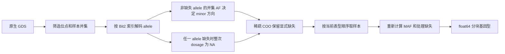

# 原生 GDS 读取和多表型样本对齐

## 1. 功能

`SeqArrayGDS` 直接以只读方式打开 CoreArray/SeqArray GDS，读取选定样本和位点。计算过程中不启动 R。读取器按 `genotype/@data` 重建每个位点的 Bit2 编码，保留多等位位点，识别当前编码层数对应的缺失值；读取 QC 时恢复 factor 标签，读取变长 INFO 时按索引恢复各位点的数组。

多表型分析先在所有表型的样本并集确定 minor allele 方向，再为每个表型提取自己的样本、计算 MAF 和填补缺失值。单个表型提取后不会再次翻转 allele。这对应 STAARpipelinePheWAS 的读取顺序。

Base 与 PheWAS 使用同一个原基因型 helper：`ALT_AF <= 0.5` 时选择 ALT，包括 AF 恰好为 0.5 的 tie；等价地，`REF_AF >= 0.5` 时 `minor_is_alt=True`。PheWAS 的各 trait 保留并集决定的方向，base 也不另作第二次 tie 翻转。后述 `reference`/`count` 区别属于频率求值与填补，不是两种 tie 方向。



GDS 是 CoreArray 格式。它需要原生 GDS 解码器；不能用 HDF5 读取器打开。

可选的 `staar_gds_flat` 适配器通过已安装的官方 PyGDS capsule SDK 批量读取原始 Bit2 元素。它复用 CoreArray 解压和迭代器，没有关联检验或 R 调用，也不复制 CoreArray 实现。Python 随后恢复编码层、缺失、allele 和请求顺序。未安装适配器时使用官方 pygds 的通用读取接口。

## 2. Python 调用、输入和输出

输入为一个 SeqArray GDS 文件，以及零起始的位点索引和样本索引。数组中索引必须唯一；返回顺序与请求顺序一致。基因型计算限定二倍体。文件中的一维编码索引可以整体读入，样本 × 全部位点矩阵不会整体读入。

```python
import numpy as np
from torchstaar.gds import SeqArrayGDS

genotype_path = "input.gds"  # 用户已处理的原生 GDS
sample_ids = np.loadtxt("phenotype_sample_ids.txt", dtype=str, ndmin=1)
variant_indices = np.arange(100, 356, dtype=np.int64)  # 零起始位点索引

with SeqArrayGDS(
    genotype_path,
    genotype_raw_memory_bytes=256 * 2**20,  # CPU 原始读取缓冲区预算
    genotype_max_gap_layers=8,             # 合并读取允许跨过的编码层数
) as genotype_reader:
    union_sample_indices = genotype_reader.sample_indices(sample_ids)
    quality_labels = genotype_reader.read_field(
        "annotation/info/QC_label", variant_indices
    )
    variant_indices = variant_indices[quality_labels == "PASS"]
    minor_block = genotype_reader.minor_block(
        variant_indices, union_sample_indices
    )
    # 此例单表型使用全部并集样本；多表型可传任意子集及顺序。
    phenotype_rows = np.arange(len(union_sample_indices), dtype=np.int64)
    genotype, maf, mac, missing_counts, minor_is_alt = minor_block.trait_dense(
        phenotype_rows, imputation="mean"
    )
    # genotype: [当前表型样本数, 当前块位点数]，float64，缺失已填补。
    # maf: 每个位点当前表型的 minor allele frequency。
    # mac: 填补前、非缺失样本的 minor allele count。
    # missing_counts: 每个位点缺失的当前表型样本数。
    # minor_is_alt: 并集方向是否为 ALT（与 REF 不同的全部 allele 合并）。
```

各接口和参数：

| 接口 | 参数和返回值 |
|---|---|
| `SeqArrayGDS(path, genotype_raw_memory_bytes=256*2**20, genotype_max_gap_layers=8)` | `path` 为原生 GDS 路径；只读打开；支持 `with` 自动关闭。两个可选参数分别限制 CPU 原始缓冲区字节数和合并读取允许跨过的编码层数；不限制最终解码矩阵或 GPU 张量。 |
| `reader_metadata` | 返回实际 `reader_backend`、适配器二进制 SHA-256、上述预算及 `native_reads` 的 flat/selected 调用次数和返回字节数；整数解码另记录实际设备、次数及切换原因。 |
| `n_samples`, `n_variants`, `ploidy` | 文件的样本数、位点数和固定基因型倍性。 |
| `sample_ids()` | 返回文件顺序的样本 ID 数组；调用者负责保留在本地数据环境。 |
| `sample_indices(sample_ids)` | 按请求的 ID 顺序返回文件中的零起始样本索引；不存在或重复的 ID 报错。 |
| `describe(path)` | 返回节点的维度、存储类型、压缩和属性，不返回载荷。 |
| `read_field(path, variant_indices=None)` | `path` 为数组节点；省略索引则读取整个该字段。固定字段返回位点位于轴 0 的数组；变长 INFO 返回每个位点一个数组的列表，长度 0 返回空数组。 |
| `read_field("$ref"/"$alt"/"$num_allele", indices)` | 返回 REF、完整逗号分隔 ALT 字符串或 allele 数量，不将多等位位点拆成新位点。 |
| `read_ref_alt(indices)` | 一次读取 allele 字段，返回顺序一致的 REF 和完整 ALT 两个数组，避免重复读取该节点。 |
| `read_genotype(variant_indices, sample_indices)` | 返回 `[位点, 样本, 倍性]` 整数 allele code，缺失为 `-1`。最多 7 层用 int16，8–15 层用 int32，16 层用 int64，避免高 code 溢出。 |
| `read_ref_dosage(variant_indices, sample_indices)` | 返回 `[样本, 位点]` float64 REF 拷贝数，缺失为 NaN；对应 SeqArray 的 `$dosage`。 |
| `minor_block(variant_indices, union_sample_indices, device=None, minimum_mac=None)` | 在并集样本确定方向，返回 CPU `SparseMinorBlock`。COO 包含非零 dosage 和显式 NaN；未存储元素为零。`device=None` 使用 CPU；CUDA 设备且 SDK 可用时用 Torch 整数解码。`minimum_mac` 省略时保留全部列；指定非负阈值时按原 helper 的 allele 初始 MAC 筛列，返回的 `variant_indices` 同步筛选。 |
| `iter_minor_blocks(indices, union_samples, block_size=256, device=None, minimum_mac=None)` | 按请求顺序逐块提取；`block_size` 必须为正整数。设备及 MAC 参数与 `minor_block` 相同；解码块大小不改变过滤后原版 5000 位点的统计分组。 |
| `SparseMinorBlock.observed_mac(trait_rows=None)` | 返回 `[块位点数]` float64 未填补 dosage 列和，忽略 NaN。省略 `trait_rows` 用全部并集样本；指定时按这些并集行号计算。 |
| `SparseMinorBlock.initial_mac()`、`allele_missing_rate()` | 分别返回原 helper 的 allele 初始 MAC 和缺失 allele 比例，均为 `[块位点数]` float64；与完整 dosage 的 MAC、缺失样本数不同。全部 allele 缺失时初始 MAC 为 NaN。 |
| `SparseMinorBlock.select_columns(column_indices)` | 按本块零起始列号返回新块。列号须唯一，可乱序；保留样本顺序、显式 NaN、源 allele 摘要及请求列顺序。 |
| `SparseMinorBlock.trait_dense(trait_rows, imputation="mean", frequency_mode="count")` | `trait_rows` 是并集样本列表中的零起始行，按当前 null model 顺序提供。`count` 对应 PheWAS，`reference` 对应 base；公式见下文。`mean` 用该路径的 `2*MAF` 填补，保留原 MAF；`minor` 填零并以全部当前表型样本计算 MAF。返回上例中的五项。 |
| `SparseMinorBlock.to_torch_sparse(device="cpu")` | 返回指定设备的 float64 COO tensor，保留显式 NaN；调用统计计算前须按表型处理缺失。 |

QC 节点由数据配置指定。应先核对实际字段，不能仅因节点存在便认为其值可用于筛选。`read_field` 对 folder 报错；本模块尚未提供 FORMAT 数据提取接口。

### Base 与 PheWAS 的频率求值顺序

以上逐表型示例对应 PheWAS：在样本并集确定 minor 方向后，用当前表型的非缺失 dosage 列和计算 `MAF = MAC / (2 * (N - missing_count))`。Base STAARpipeline 保留另一条路径：先在模型样本求 REF_AF，再计算 `ALT_AF = 1 - REF_AF` 和 `MAF = min(REF_AF, ALT_AF)`，沿用 helper 返回的 MAF。低层接口的 `frequency_mode="count"/"reference"` 分别实现两条路径；pipeline 用 `AnalysisOptions(wrapper_semantics="phewas"/"base")` 选择原 wrapper 行为。当前完整 Single 与上一 TF32 的结构/数值对照及有界官方 R 对照见[真实验证](torchstaar.md#真实验证与计时范围)。

`mean` 都用各自得到的 `2 * MAF` 填补缺失，而不是在填补后重新估计频率。`minor` 都填零并使用全部模型样本作为分母：base 用 `MAC_restore = round(((2*MAF)*(1-allele_missing_rate))*N)` 恢复计数，再求 `MAF = MAC_restore/(2*N)`；PheWAS 用完整 dosage 的列和除以 `2*N`。Base 的恢复公式用于 minor 填补后的频率，与下表的初始 MAC 筛选公式不同。没有半缺失、样本和 minor 方向相同的情况下，两个实数等价的频率公式可能有不同浮点舍入，随之改变 mean 填充值。Base/PheWAS 的选择关系到原 wrapper 的计算语义，不能仅由 Rdata 输出布局推断。

### 半缺失 genotype 的两种统计粒度

原 SeqArray 的频率与 dosage 缺失规则不同：AF、AC 和 `seqMissing(per.variant=TRUE)` 按 allele 统计，每个已知 allele 都贡献计数；任一 allele 缺失时，该二倍体样本的整个 dosage 为 NA。因此不能仅用非缺失 dosage 求出的列和与样本数来重建原 helper 的 REF_AF 或 missing rate。

| 统计量 | 原版统计粒度 | 使用位置 |
|---|---|---|
| REF_AF、ALT_AF | 非缺失 allele；`ALT_AF = 1 - REF_AF` | 并集 minor 方向及 base MAF |
| REF_AC、原 helper missing rate | 已知 allele 的 REF 计数；缺失 allele / `2*N` | 先求 `ALT_AC = 2*round(N*(1-missing_rate))-REF_AC`，再取初始 `MAC = min(REF_AC, ALT_AC)` |
| dosage、返回的 `missing_counts` | 任一 allele 缺失则该样本整次调用缺失 | genotype 和 mean/minor 填补 |
| PheWAS 当前表型 MAC/MAF | 完整 dosage 的列和与非缺失整次调用样本数 | 每 trait 的 MAC 筛选与 `count` 频率 |

半缺失边界用合成 GDS 契约验证。例如一个位点有 8 个已知 allele、其中 5 个为 REF，base MAF 为 `1-5/8=0.375`；完整 dosage 仅有三个样本，PheWAS 当前表型 MAF 为 `3/(2*3)=0.5`。半缺失样本的 dosage 仍为 NA。CPU/GPU 读取路径分别保留 allele 摘要和整次调用缺失规则；这类单测用于格式边界，性能测量使用真实输入。

初始计数须保留上面的减法和 `round` 次序。例如 `N=6`、7 个已知 allele、`REF_AC=4`，缺失率为 `5/12`：float64 的 `N*(1-missing_rate)` 为 `3.4999999999999996`，原式得到 `ALT_AC=2`、初始 MAC 为 2；用 MAF 恢复的另一公式会得到 3。两者不能合并成同一个 MAC 定义。

### CUDA 整数解码与单变异 MAC 预筛

读取器把 Bit2 编码层恢复、allele 计数和 dosage 生成放到指定 CUDA 设备。整数计数传回 CPU 后，以 NumPy float64 保持原 REF_AF、`1-REF_AF` 和 R `round` 求值顺序；mean 填补及关联统计仍遵循上面的 wrapper 语义。SDK 适配器只提供原始读取，没有新增 C++ 关联计算。

```python
import numpy as np
from torchstaar.gds import SeqArrayGDS

sample_ids = np.loadtxt("phenotype_sample_ids.txt", dtype=str, ndmin=1)
variant_indices = np.arange(100, 1124, dtype=np.int64)
with SeqArrayGDS("input.gds") as genotype_reader:
    union_sample_indices = genotype_reader.sample_indices(sample_ids)
    minor_block = genotype_reader.minor_block(
        variant_indices, union_sample_indices,
        device="cuda",       # 也可传 torch.device；默认 None 使用 CPU
        minimum_mac=20,      # 原 helper 的并集 allele 初始 MAC 阈值
    )
    retained_variant_indices = minor_block.variant_indices
    initial_mac = minor_block.initial_mac()
    allele_missing_rate = minor_block.allele_missing_rate()
    whole_call_mac = minor_block.observed_mac()
    # 上述三个摘要均与 retained_variant_indices 一一对应。
    metadata = genotype_reader.reader_metadata  # 调用后的实际累计计数
```

单变异 pipeline 自动传入首个 CUDA 模型的设备及 MAC 阈值；gene 类别默认沿用 CPU 提取。没有 SDK 适配器时使用 CPU 读取，并在 `minor_genotype_decode_fallback_reason` 记录原因。实际解码设备见 `minor_genotype_decode_backend`、`minor_genotype_decode_calls`；它们记录完成的调用，不根据配置推定 CUDA 已使用。

显式指定 `minimum_mac` 时，`individual_decode_coverage` 累计解码位点数、MAC 保留数、半缺失 genotype 数、REF_AF tie 位点数、全部 allele 缺失位点数及最大 Bit2 层数。计数描述本次实际读取范围，不能补充未读取的全染色体覆盖。每个块另保存 `union_ref_ac`、`union_called_alleles`、`union_initial_mac` 和 `union_missing_rate` 四个源摘要，按块位点顺序排列。

### 染色体注释索引与流式检验

`PheWASPipeline.prepare_annotation_index` 分块筛选 QC、位点类型和类别，再解析实际候选行的基因注释。相同染色体、位点类型和类别只准备一次；UTR 与 ncRNA 后续按基因查询索引，enhancer 保留原注释指定的远端基因。编码区仍采用原基因目录的坐标范围。候选索引保留 GDS 行顺序；MAF、缺失填补及稀有位点筛选继续由每个表型自己的样本决定。

```python
import json
import numpy as np
from torchstaar.gds import SeqArrayGDS
from torchstaar.io import load_null_model
from torchstaar.pipeline import AnalysisOptions, PheWASPipeline

null_model = load_null_model("phenotype_null.npz", device="cuda")
annotation_catalog = json.load(open("annotation_catalog.json", encoding="utf-8"))
with SeqArrayGDS("chromosome.gds") as genotype_reader:
    association_pipeline = PheWASPipeline(
        genotype_reader, [null_model],
        qc_path="annotation/info/QC_label",
        annotation_catalog=annotation_catalog,
        options=AnalysisOptions(annotation_block_size=250_000,
                                genotype_block_size=128, memory_limit_gib=20),
    )
    annotation_index = association_pipeline.prepare_annotation_index(
        "21", categories=["UTR", "ncRNA"], include_ncrna=False,
    )
    utr_variant_indices = annotation_index.indices("GENE_A", "UTR")
    # 候选数尚未经过当前表型的 MAF 和缺失筛选。
    candidate_counts = annotation_index.manifest()
    association_pipeline.statistics_execution = "serial"
    association_results = [association_pipeline.test_set(utr_variant_indices)]
    # 返回顺序为 [位点集合][模型]；不足两个稀有位点的模型结果为 None。
    for model_index, record_block in association_pipeline.iter_individual_records(
        "21", mac_cutoff=20, variant_type="variant", subset_variants_num=5000,
    ):
        # 每次处理一个有界结果块，不需累计整个染色体的个体或结果矩阵。
        print(model_index, len(record_block))
```

`categories` 可选七类 noncoding 及 `ncRNA`；省略时准备七类 noncoding，`include_ncrna=True` 另加 ncRNA。promoter 类须提供 `promoter_intervals`，格式为原参考的 `(chromosome, start, end)` 区间；同一索引不接受随后更换参考区间。`annotation_index.indices` 返回只读、零起始的 GDS 行号，缺少候选的基因为空数组；未准备的类别报错。`manifest()` 只列实际候选，完整扫描的基因目录应另用原版目录，保留没有候选的基因。

`annotation_block_size` 限制每批元数据行数，`genotype_block_size` 限制每批解码位点数，`memory_limit_gib` 是 GPU 工作空间估计上限。非连续元数据索引用有界连续节点读取恢复请求顺序，避免为每个小查询构造全染色体选择向量。单变异计算只求 score 和方差对角线，每块一次传回结果；5000 位点的原版分组以并集 MAC 筛选后的序号确定，与解码块大小独立。

CLI 每次打开染色体均用 null model 的 canonical GDS sample IDs 重新映射样本行，并验证顺序。缓存的另一染色体行号不能直接代用。当前完整生产CLI使用 `statistics_execution="serial"`；二元SPA和联合多表型使用各自低级API与验证范围。

单变异从稀疏 dosage 和独立 allele 摘要预筛 MAC，先筛掉达不到原阈值的列，再为保留列调用 `trait_dense`。Base 和 PheWAS 的并集初始 MAC 都由 REF_AC、allele missing rate 及上述 ALT_AC 公式得到；base 随后不再用完整 dosage MAC 二次筛选，PheWAS 当前表型仍按完整 dosage 的列和筛选。读取和解码仍须得到这些位点；过滤前不重复建立各表型的 dense 矩阵。并集 minor 方向、每个表型自己的 MAF 和 mean 填补、过滤后的 5000 位点分组、REF/ALT factor 与 row.names 按原 wrapper 规则处理。当前六状态缓存路线的有效列合批保留这些规则；四份完整 Single 输出与上一 TF32 逐项核对，并另作有界官方 R 对照。

## 3. 命令行和安装

只检查维度和字段结构：

```bash
python -m torchstaar.gds --gds input.gds --node annotation/info/QC_label
```

原生依赖固定为 CoreArray/pygds commit `b7a2dbbebf3b06ac4e97c806e36ec4e1a6af5bdd`。Conda 环境可提供 Python、NumPy、C++ 编译器和 liblzma 后构建该依赖：

```bash
conda create -n staar-gds -c conda-forge python=3.12 numpy=1.26 pip setuptools wheel xz cxx-compiler
conda activate staar-gds
LZMA_PREFIX="$CONDA_PREFIX" python -m pip install --no-deps --no-build-isolation \
  'git+https://github.com/CoreArray/pygds.git@b7a2dbbebf3b06ac4e97c806e36ec4e1a6af5bdd'
```

直接从固定官方来源安装：PyPI 同名 `pygds` 项目是另一用途的软件。读取器会检查 `pygds.gdsfile`，发现错误依赖时明确报错。原生解码依赖采用 GPL-3；安装后保留它的许可证和来源信息。

### 可选的官方 SDK 批量读取适配器

在已安装上述 PyGDS 的环境中显式构建本项目的 C++ 适配器。还需要 setuptools、Python 开发头文件和 C++ 编译器；前面的 Conda 环境提供这些构建依赖。

```bash
python -m torchstaar.gds_flat --output-dir ./build/gds-flat
export PYTHONPATH="$PWD/build/gds-flat${PYTHONPATH:+:$PYTHONPATH}"
python -m torchstaar.cli analysis.json
```

构建只在指定目录写入适配器和中间文件，不下载依赖、不写入 site-packages。构建输出 JSON 含 `native_binary_sha256`、`adapter_source_sha256`、`sdk_headers_sha256` 和 `pygds_version`。二进制依赖当前 Python/SDK/编译环境，跨环境应重新构建并保留新的 SHA。

运行时可直接记录读取器实际使用的后端：

```python
from torchstaar.gds import SeqArrayGDS

with SeqArrayGDS("input.gds") as genotype_reader:
    metadata = genotype_reader.reader_metadata
    print(metadata["reader_backend"])          # native_auto 或 pygds_generic
    print(metadata["native_binary_sha256"])    # 通用路径时为 None
    print(metadata["native_reads"])            # flat/selected 各自的次数和返回字节数
```

`native_auto` 在合并块包含至少两个选定位点、且所需样本少于全文件一半时调用 selected 路径；其余块使用 flat 路径。这是当前实现的选择规则，尚未用完整染色体结果证明对所有查询都更快。返回字节数记录 SDK 输出缓冲区，不代表存储设备实际读入或解压的字节数。

底层 `read_flat_path(file_id, node_path, flat_offset, flat_count, output_dtype="uint8")` 读取连续的原始元素。`read_selected_rows_path(file_id, node_path, flat_offset, raw_rows, row_width, row_selection, output_dtype="uint8")` 按同一个选择向量读取各原始行；`row_selection` 是长度为 `row_width` 的连续一维 bool、uint8 或 int8 数组，只接受 0/1，输出按自然元素顺序排列。常规分析应调用 `SeqArrayGDS`，由它处理索引、编码层及顺序恢复。

只有适配器模块不存在时自动使用 `pygds_generic`。已安装模块的导入错误、无效文件句柄、关闭后的文件和越界请求均直接报错，不用通用路径掩盖错误。读取过程中不触发编译或安装。

## 4. R 原软件对应调用

```r
library(SeqArray)
genotype_file <- seqOpen("input.gds")
seqSetFilter(genotype_file, variant.id = selected_variant_ids,
             sample.id = phenotype_sample_ids)
reference_dosage <- seqGetData(genotype_file, "$dosage")
quality_labels <- seqGetData(genotype_file, "annotation/info/QC_label")
seqClose(genotype_file)
```

`$dosage` 是 REF 拷贝数。表型子集处理采用 STAARpipelinePheWAS 的 `Genotype_sp_extraction`、`Missing_num.sp` 和逐表型 mean/minor 填补规则。独立解码检查可用 R `gdsfmt` 读取同一 GDS 节点作参照。

## 5. 当前验证与测量

当前完整 Single 测量的 reader 是已转存六状态缓存，原 GDS 继续提供元数据；4 个原生文件及精度见[主指南](torchstaar.md#真实验证与计时范围)。SDK 原始读取、packed 读取与已转存 reader 的准备成本分开。frame/hash/样本轴与 MAC 边界契约验证格式；真实全量数值参考为上一接受的 TF32 输出，官方 R 对照范围另列。

## 6. 更新记录

当前保留原minor方向、缺失/部分缺失、样本子集重排与原MAC初筛；读取不隐式编译/安装。六状态缓存默认decoded LRU64MiB、逐miss校验与open/close source证明，API见 [cache](sixstate_cache.md)。

## 7. 原实现和参考文献

- [CoreArray/pygds 原生 Python 接口](https://github.com/CoreArray/pygds)：GDS 文件解压和节点读取。
- [SeqArray 官方源代码](https://github.com/zhengxwen/SeqArray)：基因型层数、缺失码、REF dosage 和变长 INFO 格式。
- [PySeqArray 官方源代码](https://github.com/CoreArray/PySeqArray)：Python SeqArray 解码语义参考；本模块不依赖该预发行包。
- [STAARpipelinePheWAS](https://github.com/li-lab-genetics/STAARpipelinePheWAS)：并集方向与逐表型样本提取逻辑。
- Zheng X et al. SeqArray—a storage-efficient high-performance data format for WGS variant calls. *Bioinformatics* (2017). [doi:10.1093/bioinformatics/btx145](https://doi.org/10.1093/bioinformatics/btx145).
- Zheng X et al. A high-performance computing toolset for relatedness and principal component analysis of SNP data. *Bioinformatics* (2012). [doi:10.1093/bioinformatics/bts606](https://doi.org/10.1093/bioinformatics/bts606).
