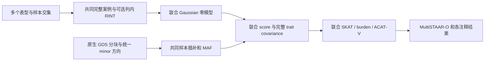

# 联合多表型 Gaussian MultiSTAAR

`torchstaar.multi` 在同一批完整案例样本上联合建模多个连续表型，估计表型间协方差，再计算联合 SKAT、burden、ACAT-V 和 MultiSTAAR-O。矩阵运算、特征值、卡方尾概率、鞍点近似和 Cauchy 合并均使用 PyTorch float64；生产分析不调用 R。



## 输入与输出

`fit_joint_gaussian_null` 的输入 `phenotypes` 是 `[样本数 n, 表型数 t]` 的有限连续值矩阵，`t>=2`。所有列须来自相同样本、相同顺序，先移除任一列缺失的行。`covariates` 是包含截距的 `[n,p]` 满秩矩阵；省略时使用截距。输入既有残差化表型时，额外协变量须与实际分析设计一致。

输出 `JointGaussianNullModel` 保存 `[p,t]` 固定效应、`[协方差组件数,t,t]` 的 `theta`、每个样本 `[t,t]` 精度块以及拟合状态。`fit_method` 记录普通 REML、严格 AI-REML 或显式因子 REML；`residual_covariance_singular` 记录残差组件边界。`sample_ids` 与基因型行必须严格对齐。模型文件含个体 ID 和残差，属于研究数据。

`model.score_covariance(genotype)` 接收已经统一 minor 方向、插补完成的 `[n,m]` dosage。它返回长度 `t*m` 的 score 和 `[t*m,t*m]` covariance，排列为第一表型的全部变异、第二表型的全部变异，依此类推。使用原始 GDS 时，应先按所有模型的 union 样本确定 minor 方向，再为该联合模型的共同样本重新计算 MAF 和插补。

`multi_staar_test` 返回 `num_variant`、`cMAC`、六组基础检验与各注释检验、六个 STAAR-S/B/A 合并值、`ACAT-O` 和 `STAAR-O`。列名与单表型函数一致；统计量使用表型间协方差。

## 参数

| 参数 | 含义 |
|---|---|
| `phenotypes` | 有限值的 `[n,t]` 共同完整案例矩阵。 |
| `covariates=None` | `[n,p]` 固定效应设计；默认截距。 |
| `sample_ids=None` | 与行对齐的唯一 ID；直接调用省略时生成行号。 |
| `kinship_diagonal=None` | 与行对齐的真实 GRM 对角；传入后拟合残差和遗传两个表型协方差组件。省略表示明确选择普通模型。 |
| `edge_rows/edge_cols/edge_values=None` | GRM 边输入；当前联合实现拒绝非零边，不忽略它们。 |
| `device="cuda"` | 运算设备；`"cpu"` 用于本地数值检查。 |
| `apply_rint=False` | 在共同样本上每列平均 ties 排序，使用 `(rank-3/8)/(n+1/4)` 和 R AS241 正态分位数。 |
| `maxiter=500`、`tol=1e-5` | 对角 GRM 联合 AI-REML 的迭代上限和原版相对参数停止规则。 |
| `robust=False` | 默认使用原版 AI 更新，并在不能表示的奇异残差协方差边界报错。显式 `True` 改用 PyTorch 协方差因子 REML，确保两个完整协方差组件为 PSD，以梯度驻点判断收敛，并使用总协方差的 `P*y`；这是独立的边界修复模式，不声称等于原版失败时的数值输出。 |
| `score/covariance` | 联合 score 与 trait-major covariance。 |
| `maf/mac` | 每个变异的共同样本 MAF 和原版 `round(MAF*2*n)` MAC；MAC 控制 ACAT-V 的 ultra-rare 分组。 |
| `annotations=None`、`names=None` | `[m,q]` PHRED 注释及列名；默认只按 MAF 加权。 |
| `n_pheno=None` | 联合表型数；默认由 score 长度除以变异数推断。 |
| `mac_threshold=10` | `MAC<=10` 的变异先做联合 burden，再并入 ACAT-V。 |
| `rare_maf_cutoff=.01` | 仅保留 `0<MAF<cutoff`。 |
| `rv_num_cutoff=2`、`rv_num_cutoff_max=1000000000` | 纳入变异数须至少达到下限且严格小于上限。 |
| `cmac=None` | 可传入插补后 `sum(G_rare)`，保持原版 cMAC；默认使用 MAC 总和。 |
| `acat_calibration="chi2"` | 联合 MultiSTAAR 使用自由度为表型数的卡方检验。 |

普通模型的残差协方差为 `T=E'E/(n-p)`，联合 score 为 `vec(G'E T^-1)`，covariance 为 `T^-1 ⊗ G'(I-X(X'X)^-1X')G`。对角 GRM 模型按样本计算 `Sigma_i=Te+K_ii*Tk`，AI 更新同时估计两个组件的所有表型方差和协方差。每个关联块只形成 `(t*m)^2` 的统计协方差，避免形成 `(t*n)^2` 的稠密投影。

## Python 调用

```python
import numpy as np
import torch
from torchstaar.multi import fit_joint_gaussian_null, multi_staar_test

# 私有文件：所有数组均按共同完整案例的样本顺序排列。
aligned_data = np.load("joint_inputs.npz", allow_pickle=False)
null_model = fit_joint_gaussian_null(
    phenotypes=aligned_data["phenotypes"],       # [n,t]，连续表型
    covariates=aligned_data["covariates"],       # [n,p]，包含截距
    sample_ids=aligned_data["sample_ids"],
    kinship_diagonal=aligned_data["grm_diagonal"],
    device="cuda", apply_rint=True,
)
score, score_covariance = null_model.score_covariance(aligned_data["genotype"])
maf = torch.as_tensor(aligned_data["maf"], dtype=torch.float64, device="cuda")
association_results = multi_staar_test(
    score=score, covariance=score_covariance, maf=maf,
    mac=torch.round(maf * 2 * null_model.n),
    annotations=aligned_data["annotation_phred"],
    names=["CADD", "aPC.Conservation"],
    cmac=float(aligned_data["genotype"].sum()),
)
null_model.save("joint_null.pt")  # 含个体数据，只保存到私有运行目录。
```

明确不使用 GRM 的普通模型调用时省略 `kinship_diagonal`。已有 GRM 时，不能为规避拟合失败而自动删除它。二值表型、重复测量、多 GRM 和非零跨样本 GRM 边不属于本函数支持的联合 Gaussian 输入。

## 命令行

联合多表型属于显式FP64对照API；通用入口需配置 `matmul_mode="fp64"`、`precision_control=true`，然后运行 `torchstaar analysis.json --device cuda`。当前TF32完整染色体生产范围仍为单Gaussian表型。联合模型以共同完整案例的二维 `y_raw[n,t]` 准备文件作为一个 phenotype 配置项；它与多个独立单表型配置项有不同统计含义。配置必须明确写 `joint_mode`：`ordinary` 表示省略 GRM，`strict` 保留原版对角 GRM AI 与边界失败，`robust` 显式采用独立因子 REML。加载已拟合 NPZ 缓存时也必须指定与缓存一致的模式，不会自动切换。

```json
{
  "name": "joint_traits",
  "input": "joint_inputs.npz",
  "joint_mode": "strict",
  "transform": "rint",
  "phenotype_names": ["phenotype_one", "phenotype_two"],
  "sample_id_rule": "exact",
  "save_model": "joint_null.npz",
  "output_null": "joint_null.Rdata"
}
```

准备 NPZ 还包含 `ids[n]`，可含 `covariates[n,p]`、`sample_indices[n]`、`grm_diagonal[n]` 及稀疏边字段，所有数组按共同样本顺序。输入缺失须先去掉；RINT 只在共同样本上逐列排序。`sample_id_rule` 可以是 `exact`、`last_underscore_token` 或 `auto`。首次绑定后缓存实际 GDS ID，后续染色体按 ID 重新定位和验证，保留模型顺序，不复用未经检查的物理行号。

联合 native null 写出真正 `glmmkin.multi`：保留 covariance、scaled residual、稀疏 trait-major `Sigma_i` 与 `Sigma_iX`；`null_layout="multistaar"` 保留原 MultiSTAAR wrapper 字段，默认 `phewas` 追加 pipeline 的 flags。写出只使用 Python XDR 序列化。每个模型的单变异输出包含联合 score 向量和自由度为表型数的卡方 P，没有单一效应估计。

命令行配置与输出结构见 [pipeline 说明](torchstaar.md)。直接检查联合模型代数可以运行 `python -m pytest tests/test_multi.py`。

## 原 R 对应与当前范围

参考为 [MultiSTAAR 0.9.7.1 固定源码](https://github.com/xihaoli/MultiSTAAR/tree/c372e135d88d5537c43af2d0f3e935f47cafd11c)，原 R 对照使用作者推荐环境中的 MultiSTAAR 0.9.7.1、GMMAT 1.3.2。原接口示意为：

```r
null_model <- MultiSTAAR::fit_null_glmmkin_multi(
  cbind(phenotype_one, phenotype_two) ~ 1,
  data=phenotype_data, kins=kinship_matrix, id="sample_id"
)
association_results <- MultiSTAAR::MultiSTAAR(
  genotype, null_model, annotation_phred
)
```

本模块保留联合 Gaussian 独立 API 与显式 FP64 对照入口。完整生产 TF32 染色体入口仍限单个 Gaussian 表型；本版有效列合批不覆盖联合模型，未给出新的联合全量精度或性能结论。普通模式、严格 AI 模式与显式因子模式是不同模型选择，应固定实际参考模式，不自动删除 GRM 或切换拟合算法。

## 原实现与参考文献

- [MultiSTAAR R 与 C++ 源码](https://github.com/xihaoli/MultiSTAAR/tree/c372e135d88d5537c43af2d0f3e935f47cafd11c)，GPL-3。
- [GMMAT 原实现](https://github.com/hanchenphd/GMMAT)，联合 AI-REML 参考 `glmmkin.multi.ai`；实际对照需固定包版本和模型模式。
- Li X, Chen H, et al. [MultiSTAAR 多表型稀有变异方法](https://doi.org/10.1101/2023.10.30.564764)。
- Li X, Li Z, et al. [STAAR](https://doi.org/10.1038/s41588-020-0676-4), Nature Genetics, 2020。
- Liu Y, et al. [ACAT](https://doi.org/10.1016/j.ajhg.2019.01.002), American Journal of Human Genetics, 2019。
- Chen H, et al. [SMMAT](https://doi.org/10.1016/j.ajhg.2018.12.012), American Journal of Human Genetics, 2019。
