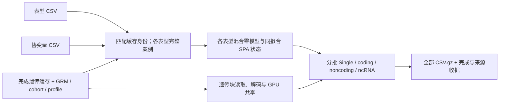

# 已完成缓存的 PheWAS 兼容入口

`fudan_wgs_toolkit.phewas_cache` 读取已完成的旧版 `cache_dataset.json` 缓存。它保留数字样本 ID、缓存人群顺序、注释设置和原始物理行证明，不重新执行遗传数据准备，也不修改已有基因型或 metadata 文件。

| 输入 | 格式与含义 |
| --- | --- |
| `cache_directory` | 包含 `cache_dataset.json` 的目录；根清单 `schema_version` 为 1。 |
| `chromosomes` | 可选染色体编号或编号列表；支持 `2`、`"2"`、`"chr2"`。选中项必须存在且无重复清单项。 |
| `sample_ids` | 清单指向的 `.npy` 数组，形状 `[n_samples]`，数据类型 `int64`，包含唯一正数 ID；原顺序必须与每条选中染色体的 metadata 相同。 |
| `chromosomes` 清单项 | `name`、`container_directory`（旧名 `cache_directory` 也可）、`metadata_directory`；可包含 `gene_catalog` 和 `promoter_intervals`。路径必须处于根目录的逻辑树内，允许复用已转移目录的符号链接。 |
| `annotation_catalog` | 注释名称到 metadata 字段路径的字典，或指向该字典的相对 JSON 路径。 |
| `annotation_names` | 权重注释的有序名称列表；每个名称必须出现在目录中。 |
| `qc_path` | 已准备的变异 QC 字段路径。 |
| 染色体 metadata | `portable-six-state-metadata-v1`、schema 1；旧身份标记必须为 `positive_decimal_int64`。清单、完成标记、样本数组及原始行数组的 SHA-256 均须匹配。 |

`_dataset(cache_directory, chromosomes=None)` 返回 `(root, manifest_path, manifest, chromosome_entries, sample_ids)`。返回的样本数组是只读映射，样本 ID 和顺序均保持原值。检查只读取清单及小型样本/metadata 数组，不解码遗传数据帧。注释目录、权重顺序、QC 路径以及字段覆盖必须与每条选中染色体的 metadata 一致。

```python
from fudan_wgs_toolkit.phewas_cache import _dataset

# 只验证并打开现存缓存，不创建或重建遗传数据。
cache_root, cache_manifest_path, cache_manifest, chromosome_entries, sample_ids = _dataset(
    cache_directory="/path/to/completed_cache",
    chromosomes=["2", "21"],
)
```

`PortableMetadataReader(..., legacy_numeric=True)` 是 PheWAS 的显式兼容选项；省略时仍要求新版 `fid_iid_json` 和完整 FID/IID 对。旧数字 ID 不会被制造成 FID/IID 对。`source_sample_rows` 表示原始来源中的物理行，并须绑定基因型清单；模型 `sample_rows` 表示缓存人群内部的逻辑行 `0..n_samples-1`。二者通过共享状态读取器的明确校验连接，不互换解释。

新版 `dataset.json` schema 2 继续由主接口验证完整 FID/IID 身份。当前数字 ID PheWAS 输入遇到该格式会明确报错，不自动截断或改写身份。普通主接口的模型族、协变量和变换参数保持其原语义；旧 PheWAS 路线继续读取既有 kinship、cohort 和协变量 profile 绑定，并保留连续表型的既有变换及二分类混合模型。

局部验证使用匿名小型缓存，覆盖原 ID 和顺序保留、目录链接、缺失染色体、注释漂移、重复或非法 ID、完成标记与样本/原始行 checksum 损坏，以及新版身份隔离。这些是兼容性测试，不是全量数据精度或运行时间 benchmark；全量运行仍须使用新源码绑定并通过完整模型和输出覆盖检查。

## 从三个输入运行多个表型

`run_WGS_all` 根据遗传缓存清单选择对应流程。以下示例消费已有 `cache_dataset.json`，不调用遗传数据准备函数。

| 输入或参数 | 含义与格式 |
| --- | --- |
| `phenotype_csv` | UTF-8 逗号分隔、有表头；第一列固定为 `eid`，其余列各为一个连续或 0/1 表型。这里 `eid` 是旧输入格式的身份键名；值须为不带前导零的唯一正十进制整数。缺失值按各表型独立排除。 |
| `covariate_csv` | 同样以 `eid` 为第一列，其余列为数值协变量。缓存 `phewas.covariate_profiles` 指向的 profile 文件规定各表型的模型族和协变量选择；只匹配缓存中存在的身份，保留缓存顺序。 |
| `prepared_directory` | 已完成缓存目录。`phewas.kinship_npz` 声明 ID 绑定的 GRM；`phewas.cohort_rows` 可声明缓存逻辑行子集；`phewas.covariate_profiles` 声明 profile。侧文件是缓存的一部分。 |
| `output_directory` | 本次新运行的输出目录；模型、来源收据及 CSV 均在其中私有保存。 |
| `gpu_ids` | 此次本地主机上使用的不同 CUDA 设备编号。跨主机部署消费同一份冻结计划。 |
| `trait_batch_size` | 一个遗传块内的表型计算批次大小，正整数，默认 16；全部表型均会计算，不是只选择这一批。 |
| `continuous_transform` | `paper`（默认）执行协变量 OLS 残差、RINT 和原始标准差恢复；`rint` 直接变换；`none` 保留输入单位。二分类沿二分类混合模型和 SPA 流程。 |
| `chromosomes` | 默认全部已有常染色体；可选择编号列表。 |

每个 GPU worker 需要 8 个可用 CPU affinity 核，本机多 GPU 运行需至少 `8 * len(gpu_ids)` 个可用核。worker 的数值线程数为 4；共享 cgroup 的实际 CPU quota 仍会限制并发算力。GPU 工作区依据运行时可用内存准入，不采用普通模型路线的固定 20 GiB 上限。

缓存 `phewas` 对象中的路径必须相对于缓存根目录；侧文件的格式如下。身份、GRM 和 cohort 均属于分析输入，不由运行入口重新构造。

| 侧文件 | 格式与意义 |
| --- | --- |
| `kinship_npz` | 无 pickle 的 NPZ：`sample_ids` 为唯一身份字符串 `[n]`；`diagonal` 为有限、非负的 GRM 对角线 `[n]`；`edge_rows`、`edge_cols` 为零基整数索引 `[e]`，范围在 `[0,n)` 且不含对角项；`edge_values` 为有限非对角 GRM 值 `[e]`。三个 edge 数组形状相同；可保存一个三角形或一致的对称成对项。GRM 必须覆盖所有实际分析样本。 |
| `cohort_rows` | 可选 `.npy`：唯一的零基缓存逻辑行索引整数向量，或长度为缓存样本数的布尔 mask。筛选后仍保留缓存原顺序；不是原始遗传文件的物理行。 |
| `covariate_profiles` | 可选 UTF-8 CSV，表头顺序固定为 `phenotype,model_family,profile,covariate_columns`。每个表型恰有一行；`model_family` 为 `gaussian` 或 `binomial`，`profile` 为分组标签，`covariate_columns` 用分号连接协变量 CSV 中的列名，列名须存在且不重复。 |

没有显式 profile 路径时，入口先检查协变量 CSV 同目录的同名 `.profiles.csv`；两者都不存在时使用全部协变量，并按实际非缺失数值识别 0/1 二分类。显式 profile 更适合固定模型族的重复分析。协变量设计自动加截距、删除常量和线性相关列，并将实际设计写入模型 metadata；各表型分别排除所需输入缺失的样本。



```python
from fudan_wgs_toolkit.run import run_WGS_all

if __name__ == "__main__":
    # 将所有表型留在一次提交中；每个遗传块在表型批次间共享。
    run_report = run_WGS_all(
        phenotype_csv="/data/phenotypes.csv",
        covariate_csv="/data/covariates.csv",
        prepared_directory="/data/completed_cache",
        output_directory="/results/new_phewas_run",
        gpu_ids=[0, 1],
        trait_batch_size=16,
        continuous_transform="paper",
    )
    print(run_report["association_rows"])
```

多 GPU 调用会启动独立 Python 进程；将示例保存为脚本后运行，并保留上述启动保护。交互式环境建议使用下面的命令行入口。

```bash
python -m fudan_wgs_toolkit.run \
  /data/phenotypes.csv /data/covariates.csv /data/completed_cache \
  --output-directory /results/new_phewas_run \
  --gpu-ids 0 1 --trait-batch-size 16 --continuous-transform paper
```

统一 `run_WGS_all` / `fudan_wgs_toolkit.run` 入口自动识别两种遗传清单。专用 `phewas_run` 仅消费旧数字身份缓存，下列调用从同样三个输入创建计划、拟合全部模型并完成关联；无需自行填写模型数或表型数。

```bash
python -m fudan_wgs_toolkit.phewas_run \
  --phenotype-csv /data/phenotypes.csv \
  --covariate-csv /data/covariates.csv \
  --cache-directory /data/completed_cache \
  --output-directory /results/new_phewas_run \
  --gpu-ids 0 1 --continuous-transform paper
```

专用 CLI 从输入运行时的表型批次默认值为 32；统一入口默认 16，可用 `--trait-batch-size` 修改。专用 CLI 不提供染色体或批次选择参数；需要这些选项时使用 `run_WGS_all` 或 Python 的 `run_phewas`。`--plan` 模式只执行指定 worker，适用于已经完成资源分配、来源绑定和 worker 屏障的部署；它不自动启动跨主机任务。

四类全部概率结果流式写到 `csv/{individual,coding,noncoding,ncrna}/chr<编号>/<字段签名>/` 下的 `.csv.gz` 分片。每行的 `trait_index` 映射到私有表型索引；分片保留位点或 gene/mask、概率值和数值诊断，完整字段及文件 SHA 记录在完成收据中。返回值是含 `completed`、`association_rows`、`end_to_end_seconds` 的字典；详细 worker 报告和模型来源保存在 `report.private.json`。原生 gzip CSV 可直接用 `pandas.read_csv` 或标准库读取。

旧混合模型路线使用可用 GPU 内存、全部 variant gene masks 和固定的成熟统计设置。可显式使用 `memory_limit_gib=None`、`gene_variant_type="variant"`；现代路线专属参数的非默认值会在启动前报错，避免参数被静默忽略。现代 `dataset.json` 路线默认保留 20 GiB、SNV 以及精确 FID/IID 输入，其专属参数仍按主接口文档生效。

## 本次模型与 Single 修正

二分类混合模型在 AI 更新不能收敛时，对同一 GRM 和同一模型的方差参数执行有界 Brent 搜索；方差在零边界时重新拟合边界状态，保留混合模型来源。极端线性预测值沿原 logit 的边界分支处理，拟合诊断记录边界次数和优化路径。普通关联状态与显著结果的 FP64 SPA 状态来自同一次拟合，SPA 失败计数写入 worker 报告。

这条混合 PheWAS 路线的二分类 gene-based 检验使用 STAAR-Burden，名义 `P<0.05` 的结果选入 FP64 SPA 复算；二分类 Single 使用相同筛选阈值。连续表型仍执行各自的 gene-based 检验。

连续混合模型先在单位方差尺度拟合，再把模型状态恢复到原表型单位。Single 复用成熟的 GPU 批处理入口，在共享遗传块上按各表型样本轴计算，不把整个稠密基因型送回 CPU。gene-based 与 Single 的数值、输出和 SPA 完整性仍分别检查。

## 当前冻结源码的真实局部验证

冻结实现 SHA-256 为 `0f9a4c6488d8a3037fbb0ebfaabd958d82aeb4090463d8006248b65585c53f33`。13 项 CUDA 组件检查全部通过且无跳过；另对 4 个匿名真实表型重新拟合并完成局部四类关联。预飞整体耗时为 506.32 秒，包含 CUDA 组件检查、输入检查、拟合、关联和 CSV 写出；完整 CSV 的结构、数值和概率范围回读另行完成。

| 局部输出 | 完整回读行数 |
| --- | ---: |
| Single | 412 |
| coding | 44 |
| noncoding | 16 |
| ncRNA | 8 |
| 合计 | 480 |

拟合错误和正式 SPA 失败均为 0，原准备清单及源码绑定保持不变。这次验证包含真实数据和实际 GPU 执行，不是模拟 benchmark；它没有完成全量关联，也没有完成同输入原软件精度与速度对照。已有普通模型入口的历史验证见 [验证记录](../validation/README.md)，模型来源复用的范围见 [复用说明](phewas_model_reuse.md)。
