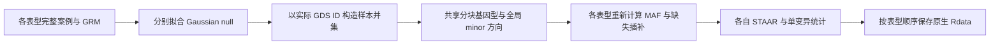

# 多个独立表型的 PheWAS

`PheWASPipeline` 支持多个独立 Gaussian 零模型。每个表型保留自己的完整案例、协变量和 GRM 拟合；读取所有模型的样本并集后，在每个模型样本中重新计算频率和插补值。这与一个模型同时估计相关表型协方差的 [联合 MultiSTAAR](multi.md) 有不同统计含义。



每个输入 NPZ 至少包含 `y_raw[n]`、`ids[n]`，可包含 `covariates[n,p]`、`grm_diagonal[n]` 和零基 `sample_indices[n]`。不同模型允许不同 `n`，个体顺序须与设计矩阵和 GRM 一致。共同个体只在 GDS 并集中读取一次。跨染色体使用实际 GDS ID 重新匹配，不能把上一条染色体的物理行号直接套用。

```python
import json
from pathlib import Path
from torchstaar.gds import SeqArrayGDS
from torchstaar.io import fit_prepared_input
from torchstaar.pipeline import PheWASPipeline

# 所有个体数据和产物存放在私有目录。
annotation_catalog = json.loads(Path("annotation_catalog.json").read_text())
gene_start, gene_end = 200000, 230000  # 示例一基闭区间；实际区域来自私有完整目录
model_one, rows_one = fit_prepared_input("trait_one.npz", device="cuda", transform="rint")
model_two, rows_two = fit_prepared_input("trait_two.npz", device="cuda", transform="rint")
with SeqArrayGDS("chromosome.gds") as gds:
    pipeline = PheWASPipeline(
        gds, [model_one, model_two],
        gds_sample_indices=[rows_one, rows_two],
        qc_path="annotation/info/QC_label",
        annotation_catalog=annotation_catalog,  # 功能注释名 -> 原 GDS 节点
        annotation_names=["CADD", "aPC.LocalDiversity"],
    )
    results = pipeline.coding(
        chromosome="22", gene_name="GENE_B", start=gene_start, end=gene_end,
        category="all_categories",
    )
```

`results` 的各类别包含按 `[model_one, model_two]` 排列的结果；某个模型未达到稀有变异数下限时保留原版空项。所有模型共用 union 的 minor allele 方向，随后按各自完整案例计算 MAF；不会为每个模型再次翻转等位基因。参数、各分析输入和正式输出详见 [pipeline](torchstaar.md)。

多个独立模型使用低级API或显式FP64对照配置 `matmul_mode="fp64"`、`precision_control=true`，命令为 `torchstaar analysis.json --device cuda`；当前TF32完整染色体入口为单Gaussian模型。`phenotypes` 数组中每一项对应一个独立模型：

```json
{
  "phenotypes": [
    {"name": "trait_one", "input": "trait_one.npz", "transform": "rint", "save_model": "null_one.npz"},
    {"name": "trait_two", "input": "trait_two.npz", "transform": "rint", "save_model": "null_two.npz"}
  ],
  "qc_path": "annotation/info/QC_label",
  "annotation_catalog": "annotation_catalog.json",
  "annotation_names": ["CADD", "aPC.LocalDiversity"],
  "chromosomes": [{"name": "22", "gds": "chromosome.gds", "jobs": [{
    "kind": "coding", "arguments": {"gene_name": "GENE_B", "start": 200000, "end": 230000},
    "output": "coding_results.Rdata"
  }]}]
}
```

无需 `joint_mode`；多个独立模型的 `n_pheno` 各为 1。每个 model cache 保存自己的样本顺序。正式关联输出使用 Rdata/RDS；多个 genomic job 指向同一输出文件时，coding/noncoding 按原版 append 保留重复类别名。`debug_output` 仅在 `debug_json=true` 时额外保存同一次计算的私有 JSON。

原版 R 对应调用为 `Gene_Centric_Coding_PheWAS(..., obj_nullmodel_list=list(null_one, null_two))` 和 `Individual_Analysis_PheWAS`。原模型分别由 `STAARpipeline::fit_nullmodel(y~1, data=..., kins=..., id="id")` 拟合。

## 当前范围

多个独立模型各自保留可用观测；缺失位置不同不取全体表型共同交集，不插补 NaN。并集方向与各模型频率仍按原提取规则计算。完整染色体强制 TF32 入口目前限单个连续 Gaussian 模型；本文为独立模型 API/显式 FP64 对照用法，不属于本版 Single 优化与完整 benchmark。当前精度和计时只见 [主指南](torchstaar.md#真实验证与计时范围)，不从单模型结果推导多表型速度。

参考：[STAARpipelinePheWAS](https://github.com/li-lab-genetics/STAARpipelinePheWAS)、[原 STAARpipeline](https://github.com/li-lab-genetics/STAARpipeline)。
