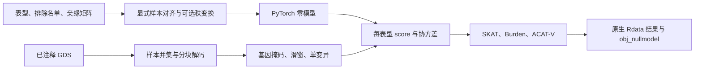

# Gaussian STAAR PheWAS GPU pipeline

本实现从已注释的 SeqArray GDS 读取基因型，用 PyTorch float64 拟合零模型并计算关联统计。原版 R 包用于独立对照。连续影像表型可使用一个零模型、多个独立零模型的 PheWAS 列表，或保留性状相关性的联合 Gaussian 模型；后者见 [MultiSTAAR](multi.md)。二分类 SPA 核心及其验证范围见 [binary](binary.md)。



## 输入与输出

- GDS：每个染色体一个已注释的 SeqArray 文件，原生读取 `sample.id`、`variant.id`、`position`、`chromosome`、`allele`、`genotype/data`。具体编码规则见 [GDS 说明](gds.md)。不支持用 HDF5 读取器代替 GDS。
- 对齐表型 NPZ：`y_raw` 是长度 N 的有限连续值；`ids` 是长度 N 的唯一字符串；可选 `covariates` 为 N×P，需自行包含截距；省略时采用截距。对齐时已排除缺失表型和排除名单。
- 亲缘信息：同一 NPZ 可包含长度 N 的 `grm_diagonal` 及 `grm_edge_row`、`grm_edge_col`、`grm_edge_value`。边索引从零开始，允许一条边一次或对称两次；模型保留非零项。稀疏矩阵不再次阈值化。
- `sample_indices`：可选长度 N 的初始 GDS 行索引，保持表型顺序；首次绑定时验证其与 ID 一致。`gds_sample_ids` 优先保存原 GDS 字符串，程序逐染色体重新按 ID 查找并校验行号。没有该字段时，CLI 的 `sample_id_rule` 可设 `exact`、`last_underscore_token` 或默认 `auto`；后者先尝试完整字符串，再尝试唯一的末尾下划线字段，歧义或不匹配时拒绝计算。
- 注释目录：JSON 将 `CADD`、`GENCODE.Category` 等名称映射到 GDS 节点。质控字段必须现场确认；示例使用 `QC_label`，可在配置中修改。
- 正式关联输出：原生 `.Rdata` 或 `.rds`；保存对象名分别为 `results_coding`、`results_noncoding`（也用于 ncRNA）、`results_sliding_window`、`results_individual_analysis`。保留 R 的列名、列顺序、列表层次、混合矩阵元素类型、factor levels、row.names，以及空结果 `NULL`。JSON 仅用于显式打开的调试比较。具体格式与批次文件约定见 [原生输出](r_native_output.md)。
- 正式零模型输出：`obj_nullmodel.Rdata`，保存 `obj_nullmodel`；单性状对象具有原 `glmmkin` 类和稀疏 Matrix 字段，生产序列化由 Python 完成。样本 ID 和拟合状态属于私有个体级数据。
- 已保存零模型 NPZ：包括样本 ID、设计矩阵、方差分量、残差、固定效应协方差及亲缘块分解；这是个体级文件，应存放在私有目录。

## Python 调用

下面的 `trait_A`、`GENE_A` 和区间坐标都是占位值；使用时从自己的表型列和参考 manifest 填入实际名称及区间。文件路径对应私有输入，完整格式见 [输入准备](prepare.md)。

```python
from staar_phewas import SeqArrayGDS, PheWASPipeline, AnalysisOptions
from staar_phewas.io import fit_prepared_input
import json

# 每个输入已经按该表型的有效样本排列。
null_model, sample_indices = fit_prepared_input(
    "private/aligned_trait.npz", device="cuda", transform="rint"
)
annotation_catalog = json.load(open("private/annotation_catalog.json"))
with SeqArrayGDS("private/chr22.gds") as genotype_file:
    association_pipeline = PheWASPipeline(
        genotype_file, [null_model],
        gds_sample_indices=[sample_indices],
        qc_path="annotation/info/QC_label",
        annotation_catalog=annotation_catalog,
        annotation_names=["CADD", "aPC.LocalDiversity"],
        options=AnalysisOptions(genotype_block_size=128, memory_limit_gib=20),
    )
    coding_results = association_pipeline.coding(
        chromosome="22", gene_name="GENE_A", start=100000, end=101000
    )
    sliding_results = association_pipeline.sliding(
        chromosome="22", start=100000, end=104000, window_length=2000
    )
    individual_results = association_pipeline.individual(
        chromosome="22", start=100000, end=104000, mac_cutoff=20
    )
    # 序列化原生 R 对象，不启动 R 进程。
    from staar_phewas.r_output import write_association_output
    write_association_output("runs/Study_Coding_1.Rdata", coding_results,
                             kind="coding", layout="phewas")
```

非编码 `noncoding(chromosome, gene_name, promoter_intervals=...)` 和 `ncrna(chromosome, gene_name)` 默认按整个当前染色体的注释匹配基因。显式 `start/end` 会限制候选区域。Promoter 区间必须来自与 R 参照相同的 TxDb 全基因 `promoters(upstream=3000, downstream=3000)`，一行 `(chromosome,start,end)`，坐标闭区间；不能用目标基因的简单上下游距离代替。参考数据从原作者资源取得。

## 命令行

CUDA 的严格原版复现还需先按 [精度库安装](precision.md#安装锁定的参考-lapack) 建立独立参考 LAPACK prefix，并配置该页的环境变量。随后在主 Python 环境执行以下分析命令。

```bash
conda env create -f environments/staar-gpu.yml
conda activate staar-phewas-torch
LZMA_PREFIX="$CONDA_PREFIX" python -m pip install --no-deps --no-build-isolation \
  'git+https://github.com/CoreArray/pygds.git@b7a2dbbebf3b06ac4e97c806e36ec4e1a6af5bdd'
python -m pip install -e .
staar-phewas-torch examples/staar-analysis.json --device cuda --report runs/summary.json
```

CoreArray genomic `pygds` 固定到源码 commit；同名 PyPI 项目并不是此 GDS 读取器。使用环境里的 NumPy 头文件编译，避免 build isolation 另装不同 ABI 的 NumPy。固定 Conda GPU 环境已通过依赖解析，原生 GDS 依赖已在真实运行环境编译并用于验证。示例输入路径需替换为自己的私有文件。

## 参数

| 参数 | 默认 | 含义 |
|---|---:|---|
| `device` | `cuda` | 计算设备，支持 `cpu`、`cuda:0` |
| `transform` | `none` | `rint` 使用平均并列秩及 `(rank−3/8)/(N+1/4)` 后正态分位数；在最终分析样本上进行 |
| `tol` / `maxiter` | `1e-5` / `500` | GMMAT AI REML 收敛阈值和迭代上限 |
| `max_block_size` | `2048` | 亲缘连通块的最大分解规模；超过时明确报错 |
| `qc_path` | `annotation/filter` | 原生 GDS 中 PASS 标签的字段 |
| `annotation_catalog` / `annotation_names` | 空 / 空 | 名称到节点映射和按顺序采用的 PHRED 注释 |
| `rare_maf_cutoff` | `0.01` | 严格 `0<MAF<cutoff` 的稀有变异筛选 |
| `rv_num_cutoff` | `2` | 允许检验的最少稀有变异数 |
| `rv_num_cutoff_max` | `1e9` | 变异数达到此上限时拒绝检验，与原版边界相同 |
| `rv_num_cutoff_max_prefilter` | `1e9` | 并集预过滤后的变异数上限 |
| `variant_type` | `SNV` | `SNV`、`Indel`、`variant`；多等位位点分类沿用 SeqVarTools |
| `wrapper_semantics` | `phewas` | `phewas` 按每 trait 完整 dosage 重算 MAF；`base` 保留原 helper 的 REF_AF/MAF 及舍入顺序。完整单表型染色体入口要求 `base`，两种频率与缺失规则见 [对照](base_reference_inventory.md#base-与-phewas-的频率和缺失填补) |
| `imputation` | `mean` | `mean` 用对应 wrapper 的 `2×MAF` 填补；`minor` 填零，base 从 allele 摘要恢复 MAC，PheWAS 用完整 dosage 列和，再各除以 `2×N` |
| `genotype_block_size` | `128` | 每次解码的位点数，不改变统计集合 |
| `memory_limit_gib` | `20` | 每集合密集计算内存预检预算，过大时明确拒绝 |
| `category` | `all_categories` | 类别选择；coding 可用 `all_categories_incl_ptv` |
| `include_ptv` / `include_ncrna` | `False` | 加入相应额外类别 |
| `window_length` | `None` | None 检验单个闭区间；偶数长度生成半窗重叠滑窗 |
| `mac_cutoff` | `20` | 单变异并集的 allele 初始 MAC 下限；PheWAS 对每 trait 再按未填补 dosage MAC 筛选，base 不加第二次 cutoff |

GPU 计算保持 float64；没有将精度降为 TF32/float16。 标量注释转换及少量敏感谱使用 CPU 精度校正，必需的参考 LAPACK Conda 安装和实际计数见 [precision](precision.md)。PheWAS 多个独立零模型与单个相关多表型 MultiSTAAR 模型的含义不同。

完整单表型染色体计划、全部 mask、原批次文件及可选 `statistics_execution=batched` 参数见 [chromosome](chromosome.md)。0.2.0 的完整 chr21 benchmark 使用 GPU 串行模式，795 项任务和全部 18 份关联文件通过原 R 严格对照。基因型解码块不改变原单变异的 5000 位点分组。真实 FP32/允许 TF32 对照及保持 FP64 的原因见 [precision](precision.md)。

## 原 R 调用

```r
library(STAARpipeline)
library(STAARpipelinePheWAS)
library(SeqArray)

null_model <- fit_nullmodel(
    trait_A ~ 1, data = aligned_phenotypes,
    kins = sparse_relationship_matrix, id = "sample_id",
    family = gaussian(), method.optim = "AI"
)
genotype_file <- seqOpen("private/chr22.gds")
# 此示例的 Annotation_name_catalog$dir 使用完整 GDS 节点名。
results <- Gene_Centric_Coding_PheWAS(
    chr = 22, gene_name = "GENE_A", genofile = genotype_file,
    obj_nullmodel_list = list(null_model),
    QC_label = "annotation/info/QC_label",
    Annotation_dir = "",
    Annotation_name_catalog = Annotation_name_catalog,
    Annotation_name = c("CADD", "aPC.LocalDiversity")
)
seqClose(genotype_file)
```

正式零模型的 `id_include` 必须是 GDS 原始字符串；外部映射后的短 ID 不能直接传给 `seqSetFilter`。验证版本与记录见 [benchmark](benchmark.md)；掩码细节见 [masks](phewas_masks.md)，统计公式和边界见 [statistics](statistics.md)。

## 版本与来源

0.1.0：原生 GDS 分块读取、Gaussian AI REML、PheWAS 样本并集、coding/noncoding/ncRNA、半窗滑动和单变异 score，保留原版注释权重与 missense 补充组合。

主要参照 [STAARpipelinePheWAS](https://github.com/li-lab-genetics/STAARpipelinePheWAS)，以及作者 README 推荐镜像中实际安装的 [STAAR fork](https://github.com/yuxinyuanqt/STAAR/tree/4bbf77ba8a90894a434f5eb4473d540e172dad05)、[STAARpipeline fork](https://github.com/yuxinyuanqt/STAARpipeline/tree/fbce778bf14cc4f9e892989a194c64bae2670311) 和 [GMMAT](https://github.com/cran/GMMAT/tree/ef49eec8d0d95951a48f7055a77321077dbc8c13)。当前主作者仓库不能直接提供 PheWAS 所需的全部 `_sp` 函数，因此对照锁定作者推荐的依赖集合。

参考：Li et al., Nature Genetics 2020, [doi](https://doi.org/10.1038/s41588-020-0676-4)；Li et al., Nature Methods 2022, [doi](https://doi.org/10.1038/s41592-022-01640-x)；Chen et al., AJHG 2019, [doi](https://doi.org/10.1016/j.ajhg.2018.12.012)。源码按 GPL-3.0 发布，见 LICENSE.md；本仓库不附带个体数据或第三方参考数据库。
