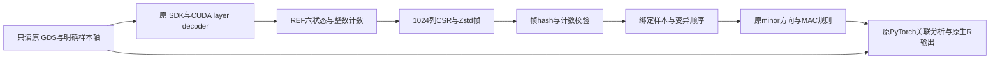

# 六状态 CSR 缓存

缓存把源 GDS 的全部物理变异列按1024列分帧，保存指定物理样本轴上的原始 REF 状态。重复关联分析可以直接读取 CSR 帧，原 GDS 继续提供样本ID、位点与注释信息。源 GDS 保留，缓存不保存关联结果、表型或原始 allele ID；多等位位点按 REF 与任意非 REF 合并，不能由缓存还原各 ALT 身份或两条 lane 的顺序。



## 输入与状态意义

| 输入/状态 | 意义及格式 |
|---|---|
| 原 GDS | SeqArray GDS；原 SDK/packed reader 可读；当前转换器要求 diploid |
| `samples.npy` | 一维、唯一、有界 `int64` 物理样本行号；不是样本ID；输出严格保持该顺序 |
| `model` | 可替代 samples.npy 的既有 null model；用原 CLI 的 sample-ID 规则绑定物理行号 |
| 0 | 两条 REF，REF/called=(2,2)，CSR隐含默认值 |
| 1 | 一条 REF、一条任意非REF，(1,2) |
| 2 | 两条任意非REF，(0,2) |
| 3 | 两条缺失，(0,0) |
| 4 | 一条 REF、一条缺失，(1,1) |
| 5 | 一条任意非REF、一条缺失，(0,1) |

转换时不做 MAC 过滤、minor 翻转或缺失填补，保留全物理轴上的空列与零 layer 变异。半缺失状态保留 called allele 与 REF 计数；后续 dosage 缺失处理沿用原 reader。minor 方向由当前请求样本的原 REF AF 决定，不能直接把 REF 当成 minor。缓存样本可以是源样本子集，但必须覆盖后续分析请求；运行时允许子集与重排，禁止重复/越界/缓存轴外样本。CSR 样本索引在 `N<65536` 时使用 `uint16`，更大轴使用 `uint32`；有效合批要求 `N×effective_block_size<=2^31−1`，并通过当前显存预检。

## 转存命令

```bash
# 先打印计划；此命令不读 genotype、不创建输出、不运行 CUDA。
python -m torchstaar.cache_runtime.export \
  --gds input.gds --packed-build packed_reader_build \
  --samples-npy selected_physical_samples.npy --output sixstate_cache

# 明确执行；保留 input.gds，已有未完成目录自动检查并恢复。
python -m torchstaar.cache_runtime.export \
  --gds input.gds --packed-build packed_reader_build \
  --samples-npy selected_physical_samples.npy --output sixstate_cache \
  --read-batch 4096 --device cuda:0 --execute
```

| 参数 | 默认/意义 |
|---|---|
| `--gds` | 必填；只读源 GDS 路径 |
| `--packed-build` | 必填；既有、绑定 SDK 的 packed reader 构建目录；不会自动编译/下载 |
| `--output` | 必填；新的缓存目录或同绑定的未完成缓存；完成目录禁止覆盖 |
| `--samples-npy` / `--model` | 必须恰选一个；明确物理轴，或使用原 null model 样本绑定 |
| `--sample-id-rule` | `auto`；model 路径使用原 CLI 支持的ID匹配规则 |
| `--config` | 可选；分析配置文件加入 SHA 输入绑定，不读取其关联输出 |
| `--source-manifest` | 可选JSON；键为安装包根目录相对 `.py` 路径，值为SHA256；必须全部匹配 |
| `--read-batch` | 4096；允许1024/2048/4096物理列；提交帧仍为1024列 |
| `--max-chunks` | 可选正整数；限制本会话帧数用于试转存，未完成结果不能用于分析 |
| `--device` | `cuda:0`；明确的CUDA设备，过程上限20GiB |
| `--execute` | 默认关闭；打开后实际转存 |

`export.convert(args)` 接收 `export.parser()` 的参数对象，返回匿名计时/存储/完成状态字典。控制台仅输出该汇总，不打印样本、基因或位点。转换计时与后续关联 analysis 计时分别记录；缓存生成不证明统计精度或关联 benchmark 通过。

## 输出目录与恢复

| 文件 | 内容 |
|---|---|
| `data.bin` | 每帧非零状态 CSR 的 Zstd bytes；offsets、sample_index、state |
| `headers.bin` | 帧几何、编码、压缩和原始payload/count SHA元数据 |
| `counts.bin` | 每物理列原 REF allele、called allele、半缺失样本数的 int64 三列 |
| `samples.npy` | 缓存顺序的物理样本 `int64[n]` |
| `index.npy` | 完成时生成的帧 start/m、三流 offset/size与SHA目录 |
| `manifest.json`、`COMPLETE` | 完成 manifest 及其 SHA；必须一致才允许读取 |
| `manifest.pending.json`、`journal.json` | 初始化绑定与已提交帧目录，用于恢复 |

Writer 每帧仍写 1024 列。Container 可读取完成 manifest 中 `chunk=1..1024` 的有界帧，包括已有 128 列帧；物理帧必须连续、完整覆盖，流偏移与长度、样本/索引 SHA 及完成标记仍严格检查。这是读取兼容范围，未提供自动跨版本迁移或多目录聚合。

恢复检查输入绑定、样本顺序与所有已提交帧，裁掉未提交尾部，再从下一个物理列继续。每次提交先校验 CSR roundtrip 和原解码整数计数，再写流与 journal。追加缓存的逻辑及实际分配字节均限制在原 GDS 大小的10%以内，包含目录中已有辅助文件；超过上限拒绝继续，完成标记也不允许发布超限容器。实际压缩率由数据决定，不能保证任意 GDS 都满足10%。

## Python分析入口

```python
import json
from pathlib import Path
from torchstaar.cache_runtime import CacheSpec, run_cached_configuration
from torchstaar.cache_runtime.binding import make_source_binding

source_gds = Path("input.gds")
cache_directory = Path("sixstate_cache")
configuration = json.loads(Path("analysis.json").read_text())
expected_binding = json.loads((cache_directory / "manifest.json").read_text())["binding"]

def current_source_proof():
    # 参数/额外键必须与转存时完全一致，包括 decoder AST和sample-ID规则。
    from torchstaar.cache_runtime.state_reader import build_reader
    binding = make_source_binding(
        source_gds, packed_directory="packed_reader_build",
        input_files={"samples": "selected_physical_samples.npy"},
    )
    binding["decoder_ast_sha256"] = build_reader().decoder_ast_sha256
    binding["sample_id_rule"] = "auto"
    return binding

cache_specs = {source_gds: CacheSpec(
    directory=cache_directory,
    expected_binding=expected_binding,
    source_proof=current_source_proof,
)}
report = run_cached_configuration(
    configuration, cache_specs=cache_specs, device="cuda:0",
)
```

`make_source_binding(gds_path, packed_directory=..., input_files=None, source_manifest=None)` 返回源GDS device/inode/size/mtime/ctime、全部安装包Python/C++/header源码、packed构建文件及额外输入的SHA绑定。GDS本身使用完整stat身份，未计算整文件SHA；每次证明都重新调用原packed loader，核对当前SDK binary、原source、official headers及compiled binding。`input_files` 是语义名称到文件路径的字典。配置、model、samples等与转存完全对应；源码升级或输入变化要重新建立缓存绑定，不能跳过失败的证明。

| API/参数 | 输入和输出 |
|---|---|
| `CacheSpec(directory, expected_binding, source_proof, expected_samples=None, compact_cache_bytes=64MiB)` | 显式缓存目录、完成绑定、无参实时证明函数；可选精确样本轴；LRU默认64MiB，约束decoded compact帧的offset/sample/state/count数组，不是压缩stream大小、进程总RAM或显存 |
| `make_reader_factory(original_factory, cache_specs, device='cuda:0')` | 返回独立 SeqArrayGDS兼容factory；cache_specs键是源GDS路径；未配置路径直接拒绝 |
| `run_cached_configuration(configuration, cache_specs=..., device=..., index_caches=None)` | configuration为原CLI字典；返回原CLI报告，原统计和原生R对象输出由原CLI执行 |
| `Container(path, expected_source_binding=None, expected_samples=None)` | 完成容器reader；运行factory总是传绑定；`read_frame(int)`返回CSR arrays、counts、start/m/n字典 |
| `Container.verify_streams()` | 全文件SHA核对，返回True；如要计时须将调用包含在初始化/analysis范围 |
| `Container.check_stream_identity()` / `close()` | 对ownedFD与路径复核身份；正常退出源变化抛错；close释放三条FD |
| `CachedGDSAdapter(original_reader, container, device='cuda:0', compact_cache_bytes=64MiB, own_reader=True)` | 转发源reader的元数据接口，替换minor_block；默认close同时关闭源reader和容器 |
| `minor_block(variant_indices, union_sample_indices, device=None, minimum_mac=None, resident=False)` | 唯一有界整数物理轴；输出保持请求顺序；MAC规则原样；False返回SparseMinorBlock，True返回CUDA DeviceMinorBlock |
| `iter_minor_blocks(..., block_size=256, ...)` | 按请求顺序分块生成同类minor block；block_size必须正整数 |
| `reader_metadata` | 原元数据加缓存读校验、LRU、样本绑定、materialize等计数/计时；组件有嵌套关系不可重复相加 |

样本绑定缓存对完整值、dtype、几何与源样本维度做精确比较，绑定副本为不可写 bytes-backed数组；对象身份或仅形状相同不能复用。数据帧以owned FD/pread读取，校验仍执行原 `_read_frame`。独立容器不共享FD或状态，串行CLI包装在finally恢复factory。当前原CLI未提供factory参数，不能在同一进程把普通CLI与本包装并行运行；需并行时使用独立进程或独立factory构建pipeline。包装不自动选择新统计precision政策。

## 注释索引准备与恢复

候选索引只保存过滤后的原物理行号和类别目录，不缓存 genotype、PHRED、MAF或关联输出。使用原 `pipeline.prepare_annotation_index(...)` 准备后，再保存；恢复后原pipeline继续检查类别覆盖和promoter区间。

| API | 输入、参数与输出 |
|---|---|
| `index_cache.make_binding(...)` | 必填gds_stat(device/inode/size/mtime_ns)、n_variants、source_sha256、annotation_catalog、qc_path、promoter_manifest、chromosome、variant_type、categories；返回严格规范化绑定dict |
| `source_sha256` | 至少annotation_index.py、pipeline.py、masks.py、gds.py四项的真实SHA；类别前的语义绑定 |
| `promoter_manifest` | 无promoter时None；否则file_sha256及原规范化区间对列表normalized_signature，不可用文件名代替内容证明 |
| `index_cache.capture(index)` | 原CandidateAnnotationIndex到NumPy目录/行号数组字典，保留插入顺序和空类别 |
| `index_cache.save(path,index,binding)` | 写非pickle NPZ，原子发布且不覆盖；返回字节数、SHA和匿名计数 |
| `index_cache.prepare(pipe,path,binding,promoter_intervals=None)` | 调用原pipeline准备绑定的全部类别并保存；返回(index,匿名保存报告)；不复制其他索引行 |
| `index_cache.restore(pipe,path,expected_binding,max_uncompressed_bytes=512MiB)` | 核对归档字段、绑定、范围、顺序和promoter；注册并返回CandidateAnnotationIndex；禁止覆盖live index |
| `IndexCacheSpec(path,expected_binding,max_uncompressed_bytes=512MiB)` | 配置上述恢复参数；`index_caches`键为GDS路径，值为spec序列 |
| `runtime.restore_indexes(pipeline,specs)` | 按spec序列恢复并返回index列表 |

```python
from torchstaar.cache_runtime import IndexCacheSpec
from torchstaar.cache_runtime import index_cache

# binding由真实输入stat、源码SHA、注释节点与规范化区间构造。
source_proof = current_source_proof()
index_binding = index_cache.make_binding(
    gds_stat={key: source_proof["gds_stat"][key]
              for key in ("device", "inode", "size", "mtime_ns")},
    n_variants=pipeline.gds.n_variants,
    source_sha256={filename: source_proof["source_files_sha256"][filename]
                   for filename in ("annotation_index.py", "pipeline.py", "masks.py", "gds.py")},
    annotation_catalog=configuration.get("annotation_catalog", {}),
    qc_path=configuration.get("qc_path", "annotation/filter"),
    promoter_manifest=None, chromosome="1", variant_type="SNV",
    categories=["upstream"],
)
prepared_index = pipeline.prepare_annotation_index(
    "1", categories=["upstream"], include_ncrna=False,
)
index_cache.save("candidate_index.npz", prepared_index, index_binding)
index_specs = {source_gds: [IndexCacheSpec(Path("candidate_index.npz"), index_binding)]}
```

## 底层codec与decoder接口

这些模块供转存与reader使用；生产入口优先采用上面的Container/adapter。

| 函数 | 输入与输出；可选参数 |
|---|---|
| `state_reader.state_code(reference,called)` / `build_reader()` / `plan()` | 合法diploid整数对到0..5；构造原decoder状态边界clone并附AST SHA；返回不执行GPU的格式计划 |
| `read_states(reader,variants,samples,device=...,memory_limit_gib=20)` | build_reader返回的callable；唯一有界整数轴；输出CUDA uint8[m,n]、原整数摘要与绑定metadata |
| `sparse_codec_fast.compact(states,max_raw_bytes=256MiB)` | [variant,sample]整数0..5到offsets[m+1]、sample_index[nnz]、state[nnz]；默认0不存储 |
| `validate(offsets,samples,values,m,n)` / `integer_counts(...)` | 检查CSR dtype/顺序/边界；返回原REF/called/half_missing int64[m]字典 |
| `encode(states,level=1,max_raw_bytes=256MiB)` / `decode_compact(payload,meta,...)` | Zstd bytes与header，或校验解压后的CSR三数组；生产Writer明确level3 |
| `sparse_decode_fast.validate_source(offsets,sample_index,state,ref_ac,called_alleles,n,mapping=...)` | 逐项验证后返回不可变ValidatedSource；mapping固定ref-homo-first-six-v1 |
| `prepare_validated(source,columns=None,samples=None,minimum_mac=None)` / `prepare(...,mapping=...)` | 完整轴/子集/重排到exceptions和summaries字典；只接受验证seal，不接受声明已验证的可变数组 |
| `sparse_decode.prepare(...)` / `dosage_numpy(prepared)` | 原CPU参考prepare接口；materialize [sample,variant] minor dosage，3表示缺失 |
| `sparse_decode.workspace_bytes(prepared)` / `to_minor_block(prepared,sample_indices,variant_indices,device='cuda:0')` | GPU工作区预算；生成DeviceMinorBlock，实际索引对应显式caller轴 |
| `codec.packed_size(m,n)` / `pack_plane(states,layout='plane-major',max_packed_bytes=256MiB)` / `unpack_plane_numpy(packed,m,n,...)` | 兼容bitplane工具：3*m*ceil(n/8)大小、packed数组或六状态矩阵；并非生产CSR容器格式 |
| `codec.encode/decode_packed/write_cache/read_cache` | 独立bitplane payload/header或目录；level3，layout与packed预算同上，不用于替代完成CSR目录 |
| `device_decode.validate_payload/unpack_numpy/decode_cuda` | bitplane验证/CPU展开/CUDA展开；n、columns/samples、mapping/layout/bitorder显式一致；CUDA默认cuda:0 |
| `device_decode.workspace_bytes/check_budget` | m/n/packed宽度或required/allocated/free字节到内存估算/拒绝；limit默认20GiB |
| `device_decode.states_to_minor_block(states,sample_indices,variant_indices,minimum_mac=None)` | CUDA六状态到原minor block，无原始ALT身份重建 |
| `store.Writer(path,binding,samples,m,source_bytes=...,storage_fraction=.10)` | 明确物理轴与源大小；append(states,original_counts)提交下一帧；finish()发布完成manifest |

压缩/序列化byte预算不包括输入矩阵、校验临时数组或GPU工作区；20GiB是GPU限制，64MiB是LRU限制。下划线函数是内部实现，不构成稳定调用接口。

## Single 有效列合批

`CachedGDSAdapter.iter_effective_minor_blocks(variant_indices, union_sample_indices, block_size=1024, effective_block_size=1024, device=None, minimum_mac=None, resident=True)` 接收唯一、范围有效的一维整数物理轴。`block_size` 为筛选前读取上限，按缓存帧边界拆分；`effective_block_size` 为通过原 MAC 筛选后的设备列上限，两者均为正整数。`minimum_mac=None` 不额外限制，生产 Single 传原 `mac_cutoff`；`device=None` 使用 adapter 的设备，驻留路线要求 `resident=True`。返回按原顺序的 `DeviceMinorBlock` 迭代器；空/全部过滤请求不生成设备矩阵，尾块可以不足。

样本验证与解码逆向映射用不可变绑定复用；完整值、dtype、维度或来源变化时重新校验。子集以完整缓存 allele counts 作安全 MAC 上界预筛，再按原整数计数和舍入规则计算实际队列摘要。半缺失 R/NA、A/NA 仍参与 allele 摘要，不能用整基因型 sentinel 剂量重建初始 MAC。CPU compact 合批保留来源索引、样本/变异顺序与各列摘要，不新建磁盘缓存。pipeline 的全局原统计分组不随设备批次重置。

`single_batch_optimization` 默认 `true`；兼容缓存 reader、单 Gaussian 模型、单表型、驻留 TF32 CUDA、无 SPA 时启用。`individual_effective_block_size` 默认1024。运行汇总的 `single_optimization_configuration.activated`、`actual_effective_blocks/columns` 记录实际执行；request/configuration 不代表执行。具体参数见 [主指南](torchstaar.md#运行与优化参数)。

## 验证与测量

本版完整 Single 实际扫描13,733,596个输入，1042个设备计算块，输出1,065,735行，genotype SDK回退0。read/validate 262.658秒、compact prepare 631.517秒、materialize主机边界92.985秒；其中compact合批110.944秒已经包含在prepare中。完整reader wall 1000.922秒，读准备阶段与其有嵌套；这些计时不直接相加，也不表示纯磁盘或纯GPU kernel时间。

全部4个原生文件相对上一接受TF32的严格结构与数值对照通过，官方R另有同模型有界Single对照；读取、样本、模型与输入范围见 [真实验证](torchstaar.md#真实验证与计时范围)。本版不重新转存，首次缓存创建成本不在Single耗时内。CPU格式/损坏拒绝契约不能替代真实关联benchmark。

源码升级需保留历史producer证明，并明确核对consumer兼容性及当前输入；一般使用应保持同一转存/读取绑定。不能复制旧expected字典、改manifest或使用固定lambda跳过source proof。分析期间输入和缓存保持不变。

原软件仍直接读取GDS：`SeqArray::seqOpen()` 后由STAARpipeline取基因型。六状态CSR不是R可以直接打开的GDS替代文件。参考：[CoreArray PyGDS](https://github.com/CoreArray/pygds)、[SeqArray](https://github.com/zhengxwen/SeqArray)、[STAARpipeline](https://github.com/li-lab-genetics/STAARpipeline)；文献见 [主指南](torchstaar.md#参考)。
