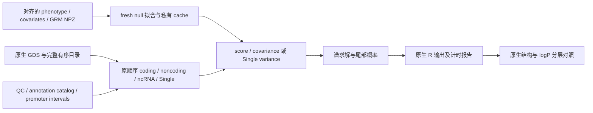

# 原生 TF32 染色体 pipeline

本版使用 `matmul_mode="tf32"`，保持 STAAR 原公式、过滤、插补、全部 mask 和原生 R 输出结构。矩阵运算使用一次 TF32 MMA、FP32 累加和输出；小向量使用 FP32 GEMV/dot。TF32 不拆分输入，也不重建 FP64 乘积。一个 GPU 串行执行各分析任务；GPU 内部同时计算多个权重和矩阵元素。固定窗口和滑动窗口已移除。

本版在真实 chr21 完成全部 795 项任务，19 份原生文件结构及严格零模型通过。478,082 个 P 全部有效、可比较；原 R 或本版任一 `P<0.05` 的 24,713 个联合值均满足 `|-log10(P_R)+log10(P_GPU)|<=0.001`，最大差为 `0.0003579714`。所有 P 的误差仍保存作诊断。固定零模型和已有无损转存缓存上的进程墙钟为 `429.097 s`，300 秒速度目标尚未达到；首次转存、暖缓存与共享 GPU 的边界见 [完整 benchmark](tf32_benchmark.md)。0.2.0 FP64 基线和退役分量版保留为历史。

## Python 与命令行

```python
import json
from pathlib import Path
from staar_phewas.chromosome import run_chromosome

# 私有配置包含原生 GDS、完整目录、注释和已对齐表型。
analysis_configuration = json.loads(Path("private/full_chromosome.json").read_text())
analysis_configuration["matmul_mode"] = "tf32"  # 原生一次 TF32 乘法。
analysis_configuration["statistics_execution"] = "serial"  # 各入口任务串行。
analysis_configuration["local_mask_reuse"] = True  # 同一区域共用 Score 和协方差。
analysis_configuration["weight_batch_optimization"] = True  # 同时计算所有权重。
analysis_configuration["analysis_options"]["memory_limit_gib"] = 20
analysis_report = run_chromosome(analysis_configuration, device="cuda")
```

```bash
staar-phewas-chromosome private/full_chromosome.json --device cuda \
  --report private/summary.json
```

输出为原 STAAR 文件名和保存对象名的 `.Rdata/.rds`，以及聚合计时报告。计算采用 FP32 时仍按原 R `double` 类型序列化结果；这只是文件格式，不重做 FP64 计算。列表顺序、factor、row.names、混合矩阵、空结果 NULL 均保留。文件名规则见 [原生输出](r_native_output.md)。

## 配置参数

| 参数 | 意义与格式 |
|---|---|
| `matmul_mode` | 字符串 `"tf32"`，原生 CUDA 矩阵后端；显式 `"fp64"` 仅用于历史对照。 |
| `statistics_execution` | 字符串 `"serial"`，任务按原目录顺序执行。各任务内部允许 GPU 张量批处理。 |
| `resident_genotypes` | 布尔值，默认 CUDA 开启。Single 以及符合条件的单连续表型 gene family 在 GPU 解码、筛选和插补。gene 先保留无损 uint8 剂量与整数摘要，按实际 rare 列分配 FP32 矩阵；读取前检查 storage、decoder scratch、live free 与 20 GiB 预算，预算不足时从首次读取选择 host 路线。 |
| `local_mask_reuse` | 布尔值，同一局部区域使用 mask 并集计算一次 u/V，再取子矩阵。 |
| `weight_batch_optimization` | 布尔值，将 Burden、SKAT 统计量和 ACAT 权重归约合并。 |
| `statistics_tail_optimization` | 布尔值，批量执行原 Saddle/CCT 分支，减少设备同步。 |
| `stage_profile` | 布尔值，记录读取、准备、传输、Score/协方差、谱/尾部和写出时间；正式端到端复测关闭。 |
| `analysis_options.memory_limit_gib` | 正有限数值，默认 20 GiB；控制块大小和乘法临时工作区。 |

resident gene 的 FP32 矩阵保持样本方向连续，与旧 host 准备布局相同。局部并集受保护退出后，逐 mask 复用已解码 uint8 块，不重读 GDS。无法满足 decoder 预算或存储类型约束时使用现有 host 读取路线；已选 resident 路线发生 decoder OOM 时保留异常。

注释索引按实际调度的 coordinate-free noncoding/ncRNA 类别，在每条染色体准备一次；Single-only 和 coding-only 不预建这类索引。完整混合流程仍准备所需全部类别。合法空 mask 仍写原 R NULL；当全部任务完成且没有有效关联行时，报告 `no_eligible_analysis_products`，乘法计数保持零。

可选 [packed Bit2 reader](gds_packed.md) 在 GPU 解包，保留原剂量和元数据逻辑；需显式构建并配置与当前 SDK 绑定的本地适配器，不自动编译。

`tf32_binned`、`tf32x3`、分量位数、重建 tile 和分量融合参数已退役，不再用于新生产路径。原生 TF32 不需要参考 CPU LAPACK 精度库。

## 私有配置的输入结构与含义



| 配置输入 | 格式与含义 |
|---|---|
| `phenotypes` | JSON 数组，本完整染色体入口恰好一项连续 Gaussian 表型；`name` 为私有运行标签。`input` 是 prepared NPZ 路径；`model` 是完整 null NPZ cache 路径，二者择一。真实对照通过 `input` 重新拟合。 |
| NPZ `y_raw`、`ids` | `y_raw` 为长度 N 的数值表型；`ids` 为同长度、唯一的字符串样本 ID。需要在生成 NPZ 前去掉缺失样本并完成各输入的共同对齐。 |
| NPZ `covariates` | 可选 N×C 数值矩阵，行顺序与表型/ID 相同。矩阵必须显式包含所需截距；省略时拟合函数使用一列截距。`prepare_input` 有协变量时已在首列加入截距，不再重复添加。 |
| NPZ `grm_diagonal` | 可选长度 N 的相关性矩阵对角元素；与下面 edge 列共同表示稀疏 GRM。 |
| NPZ `grm_edge_row`、`grm_edge_col`、`grm_edge_value` | 同长度的一维数组；row/col 为上述对齐样本顺序中的零基整数索引，value 为对应相关性数值。不是 GDS 的绝对 sample index。 |
| NPZ `sample_indices`、`gds_sample_ids` | 可选长度 N 的已对齐 GDS 样本行索引（零基）或实际 GDS ID；用于核对输入绑定，跨染色体按实际 ID 重排。原始 ID 只保存在私有文件。 |
| `phenotypes[i].transform` | JSON 字符串，`none`（默认）或 `rint`；后者在新拟合前做 rank inverse normal transformation。加载 `model` 不重新变换；不同模式对照保持同一变换。 |
| `phenotypes[i].sample_indices_file` | 可选私有 `.npy` 路径，用于加载旧 `model` 时补充 N 长度的零基整数 GDS 样本行号，必须唯一、范围有效且按模型样本顺序对齐。`input` 新拟合使用 NPZ 内 `sample_indices`。已有 canonical `gds_sample_ids` 时按这些 ID 重新查找行号。 |
| `phenotypes[i].sample_id_rule` | JSON 字符串，`auto`（默认）、`exact` 或 `last_underscore_token`。无 canonical GDS ID 时，auto 先严格匹配，失败再按 GDS ID 最后一个下划线后片段匹配；exact 仅允许原 ID，last_underscore_token 仅使用后缀匹配。归一化 ID 不能重复；跨染色体在完成首次绑定后按 canonical ID 重排。 |
| `fit_options` | phenotype 项中的 JSON 对象，拟合参数字典；常用 `tol`、`maxiter`、`max_block_size` 分别控制收敛阈值、最大迭代数和 GRM 相关块大小；使用已冻结参考流程的参数。若给出 `matmul_mode` 必须与 run 配置一致；原生 TF32 不使用分量或 split-K 重建。 |
| `gds`、`chromosome` | JSON 字符串：原生 SeqArray GDS 路径和染色体标记；标记必须与 manifest 一致。分析保留 GDS 内原始变异次序。 |
| `packed_reader_directory` | 可选非空 JSON 路径字符串，指向已显式构建的 packed reader 目录；目录含扩展及私有 `packed_binding.json`。省略时使用原读取路线，配对不符即报错。构建输入见 [packed reader](gds_packed.md)。 |
| `manifest` | 私有 JSON 路径或对象；`genes_info` 是完整有序的 JSON 对象数组，每项必须含非空字符串 `gene_name` 和整数 `start/end`，一基闭区间且 `1<=start<=end`；`ncRNA_genes` 是完整有序的对象数组，每项含非空字符串 `gene_name`，不是裸字符串数组。不能用注释候选列表替代完整目录。 |
| manifest `start_loc/end_loc` | 整个 Single 区间的一基闭区间；最后一个区间也覆盖右端点。 |
| manifest `array_offsets` | `coding/noncoding/ncrna/individual` 的非负整数；表示前面染色体占用的 batch 数，用于延续原软件 native 文件编号。 |
| manifest batch 参数 | `coding_genes_per_batch`、`ncrna_genes_per_batch` 为每个原生批次基因数；`individual_region_size` 为 Single 区间宽度。改变它们会改变输出分组，因此真实对照固定原值。 |
| `annotation_catalog`、`annotation_names` | catalog 为注释名称到 GDS node 路径的字典或私有 JSON 路径；names 为统计权重所用注释名称的有序列表。候选与 baseline 共用完整 catalog 和名称顺序。 |
| `qc_path` | JSON 字符串，GDS 的 QC 标记 node 路径；沿用原 pipeline 的过滤规则。 |
| `promoter_intervals_file` | JSON 路径字符串指向私有 TSV，每行前三列 chromosome/start/end，坐标遵循已冻结的原参考输入；参与原有 promoter mask。 |
| `analysis_options` | JSON 对象；`rare_maf_cutoff` 是 trait rare MAF 阈值（数值，默认 0.01）；`rv_num_cutoff` 是最少变异数（整数，默认 2）；`variant_type` 是 `SNV`/`Indel`/`variant` 字符串选择；`imputation` 是 `mean`/`minor` 插补字符串；`genotype_block_size`、`annotation_block_size` 是基因型/注释块大小（正整数）；`memory_limit_gib` 是正、有限的数值 GiB（默认 20），同时用于 pipeline 和每次 TF32 乘法的工作区预检。全部参数的完整约束见 [API.md](API.md)。 |
| `mac_cutoff`、`subset_variants_num` | 数值 MAC 门槛（默认 20）及正整数变异分组数（默认 5000），分别控制 Single 初始筛选和原软件内部统计分组。保持参考值，不能用额外未经验证的 AC/AN 过滤代替。 |
| `output_directory`、`output_prefix` | JSON 字符串，私有输出目录和原生文件名前缀；对照只换目录，保留原 basenames、对象名和 native layout。 |
| `phenotypes[i].save_model`、`phenotypes[i].output_null` | 可选 JSON 路径字符串：分别写出完整私有 `.npz` cache（含本次生效模式）和原生 null `.Rdata/.rds`。不指定 `save_model` 时不写 NPZ；加载的 `model` 不自动覆写。baseline 和候选使用不同路径，不覆盖旧参考 cache。 |

## 公式、验证和版本记录

Score、协方差、Burden、SKAT、ACAT-V、STAAR-O 使用原公式，见 [矩阵复用](matrix_reuse.md)和[统计实现](tf32_statistics.md)。完整验收使用同一输入、全目录、全部 mask、同样样本与变异顺序，检查全部 native 文件结构、严格零模型、全部 P 的有效性和显著联合范围的 logP 误差。本版计时从固定零模型和已经生成的无损基因型/注释缓存开始，包含 cache 读取与准备、完整关联及原生文件写出；首次 GDS 转存和重新拟合零模型另计；缓存输入、输出与命令见[六状态 CSR 缓存](sixstate_cache.md)。统计矩阵 u/V 均在本次流程中重新计算，缓存 u/V 的短探针不属于这一完整 benchmark。

- 0.2.0：已发布的完整 FP64 基线，见 [benchmark](benchmark.md)。
- 旧 0.3.0 分量重建候选：评估已停止，不发布；历史范围见 [TF32 benchmark](tf32_benchmark.md)。
- 本版（F）：原生 TF32 / FP32、局部并集复用、完整谱批处理与融合求根；gene block 为 1024，Single block 为 8192，原生文件使用 gzip level 1。cached null 的 residuals 按原 NPZ 输入 dtype 序列化，关联张量不变。795 项真实完整任务、19 份原生文件和显著联合范围精度通过，`429.097 s` 的完整缓存流程仍超过 300 秒目标。

原 R 调用见 [chromosome](chromosome.md#原-r-调用)和[null model](null_model.md)。主参考为 [STAARpipelinePheWAS](https://github.com/li-lab-genetics/STAARpipelinePheWAS)、[STAARpipeline](https://github.com/li-lab-genetics/STAARpipeline)及[STAAR](https://github.com/li-lab-genetics/STAAR)；版本映射与文献见 [reference inventory](base_reference_inventory.md)。
