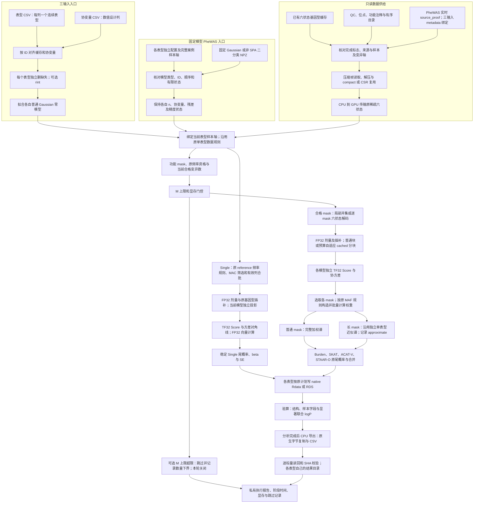

# Torchstaar 使用说明

Torchstaar 用 PyTorch GPU 完成全基因组的 Single、gene-based coding、noncoding 和 ncRNA 关联分析，并保存可由 R 读取的原生结果。独立多表型入口 `torchstaar_phewas` 让各表型保留自己的有效样本和固定零模型，同时共享既有六状态缓存的读取、设备传输与注释准备。固定窗口和滑动窗口不在当前入口范围。

本文对应已验证的 0.7.0 全部 mask 集成版本。当前冻结来源的全部 mask 共享分析与历史组合参考比较已完成；历史有限 M 独立结果及保存的长 mask 控制分别核验，当前共享与参考的 CPU 线程数及源码范围单独列明。

## 功能与流程

| 入口 | 输入与模型 | 调度和计算范围 |
|---|---|---|
| `torchstaar.run` / `torchstaar` | 表型 CSV、协变量 CSV、完整缓存目录；逐表型拟合普通 Gaussian 零模型 | 缓存直接运行，默认最多 8 个 GPU worker、40 GiB/worker；普通与长 mask 的方法由参数选择 |
| `torchstaar_phewas.run_configuration` / `torchstaar-phewas` | 多份已展开的独立单表型配置、完整固定模型、缓存绑定和实时证明 | 一张 GPU 上串行执行各自 TF32 核心，预算最多 20 GiB；本轮关闭 M 上限，全部 mask 对照通过 |
| `torchstaar-config` / `torchstaar-chromosome` | 已有模型或准备好的 NPZ、原目录/注释及显式配置 | 兼容既有分析计划和原生文件编号，见[配置接口](torchstaar_configuration.md) |



两个入口都沿用各自原单表型配置的频率、方向、MAC 和基因型填补规则；缺失表型不插补。三输入入口自动执行 complete-case，固定模型入口要求这些准备已经完成。缓存的共享物理轴不会变成所有表型共同完整案例；不同模型的投影和协方差分别计算。

Coding 包含 `plof/plof_ds/missense/disruptive_missense/synonymous/ptv/ptv_ds`；noncoding 包含 `upstream/downstream/UTR/promoter_CAGE/promoter_DHS/enhancer_CAGE/enhancer_DHS`；ncRNA 使用独立原目录。功能注释定义 mask，统计权重由实际变异类型和配置决定。

## Python 调用、输入与输出

### 三输入直接运行

```python
from torchstaar import run

if __name__ == "__main__":
    analysis_report = run(
        phenotype_csv="private/phenotypes.csv",        # ID + 每个数值表型列
        covariate_csv="private/covariates.csv",        # ID + 数值协变量列
        cache_directory="private/population_cache",  # 完整基因型及 metadata 目录
        output_directory="private/analysis_results",
        chromosomes=["21"],
        analyses=["individual", "coding", "noncoding", "ncrna"],
        devices=["cuda:0"],
        workers=1,
    )
    print(analysis_report["counts"])
```

| 输入 | 格式和意义 |
|---|---|
| `phenotype_csv` | UTF-8 CSV，首列 `eid` 是唯一标准正整数文本 ID，其他列是唯一名称的数值表型；空单元格、`NA/NaN` 表示缺失 |
| `covariate_csv` | 同样首列 `eid`，其他所有数值列进入设计；分类变量先编码为数字或哑变量；仅 ID 列表示只有截距 |
| `cache_directory` | 完整六状态压缩缓存、`cache_dataset.json`、标准样本 ID、每条染色体的 QC/REF/ALT/位置/功能注释、gene 目录及可选 promoter 区间 |
| 缓存样本和变异轴 | 数组保存原 ID 和顺序，metadata manifest 绑定对应基因型 manifest；只复制压缩基因型文件不足以运行四类分析 |
| 输出目录 | 私有 `plan.private.json`、完整模型 `models/*.npz`、恢复状态 `jobs.sqlite`、原生文件和执行报告 |

程序按 ID 对齐三输入，对每个表型删除该表型缺失或协变量缺失的样本。自动加入截距；已经提供全一截距时不重复加入。已有 GRM 或固定混合模型使用配置/PheWAS 接口，不由三输入入口自动补建。CSV 示例、完整 metadata 格式和每个超参数的默认值见[三输入指南](cache_only_run.md)。

### 固定模型独立 PheWAS

```python
import json
from pathlib import Path
from torchstaar_phewas import run_configuration
from private_cache_binding import verified_cache_specs

# 每份 JSON 都含一个模型、该模型的样本行和同一科学作业计划。
independent_analyses = [
    json.loads(Path(filename).read_text())
    for filename in ("private/trait_01.json", "private/trait_02.json")
]
# 全部 mask：取消运行层大小跳过，并恢复 STAAR 默认稀有变异上界。
for independent_analysis in independent_analyses:
    independent_analysis["maximum_mask_variants"] = None
    independent_analysis.setdefault("analysis_options", {})["rv_num_cutoff_max"] = 1_000_000_000

# 私有模块须核对当前源、完整缓存轴与实时源码证明，不返回常量绑定。
current_cache_specs = verified_cache_specs()
association_report = run_configuration(
    analyses=independent_analyses,
    cache_specs=current_cache_specs,
    device="cuda:0",
    device_cache_bytes=512 * 2**20,
    compact_cache_bytes=64 * 2**20,
    metadata_cache_bytes=256 * 2**20,
    cpu_threads=2,  # PyTorch CPU intra-op 线程；结束后恢复调用前数量。
)
Path("private/phewas_report.json").write_text(
    json.dumps(association_report, indent=2, allow_nan=False) + "\n"
)
```

`private_cache_binding` 是分析者自己的证明模块；`verified_cache_specs()` 返回经过实时核对的 `{GDS 路径: CacheSpec}`。完整可实现的 `make_source_binding` 和 `source_proof` 示例见[PheWAS 指南](torchstaar_phewas.md#python-调用)。

| 输入 | 格式和意义 |
|---|---|
| `analyses` | 非空有序 `list[dict]`；每项恰一个表型，GDS、目录、作业参数、QC 和注释设置相同，模型/样本/输出路径各自独立 |
| 固定 Gaussian 模型 | 非 pickle NPZ，含 ID、设计 `x[n,p]`、scaled residuals、精度/亲缘与固定效应协方差；加载后不重新拟合 |
| 固定二分类模型 | typed `binary_state` NPZ、`use_spa=false`；原0/1标签、概率、工作响应、残差、precision、precision_x及固定效应协方差分别保存 |
| `sample_indices_file` | 可选一维 NPY，唯一、有界的零基物理行号 `[n]`，顺序与模型一致；仍核对原 ID，不能直接跨染色体套用 |
| `cache_specs` | 对所有 GDS 显式提供完成缓存的 `CacheSpec`，包含目录、原 `expected_binding`、实时 `source_proof` 及可选完整物理轴 |
| `source_proof` | 无参函数，重新核对当前源、SDK/源码、样本轴及缓存证明后返回原绑定；开始和结束均调用 |
| `jobs` 与输出 | 原有序四类作业及原生输出路径；同一表型兼容 gene 作业按原 append 合并，Single 独立分段，不跨表型共用文件 |

所有模型、样本字段、注释及作业参数详见[PheWAS 输入表](torchstaar_phewas.md#输入格式)；同一引用零模型的来源标记、非 SPA 限制和每项运行参数也在该页逐项说明。

### 运行与优化参数

| 参数或阶段 | 三输入入口 | 固定模型 PheWAS |
|---|---|---|
| GPU 和预算 | `workers=8`，每卡1 worker；默认40 GiB/worker | 同一个 `device` 上串行核心；预算最多20 GiB |
| 关联精度 | `matmul_mode="tf32"`，FP32矩阵存储 | `matmul_mode="tf32"`、`precision_control=false`，无分量重建 |
| 零模型 | 新普通 Gaussian 的 `null_fit_mode="fp64"`，随后转关联状态 | 复用原固定模型；Gaussian与非SPA二分类各自保存状态 |
| Single | MAC20、有效列1024、原分组5000；分片按完整组边界 | 同一物理块共享读取，各自筛选和原顺序，合并尾概率/回传 |
| CPU准备与compact | 自动分配总准备进程、64 GiB共享派生磁盘预算、每worker队列2条/256 MiB | 共享CPUcompact/设备CSR/metadata LRU分别64/512/256 MiB |
| PheWAS CPU线程 | 三输入准备进程由自身参数控制 | `cpu_threads=2` 控制 PyTorch CPU intra-op 线程；严格正整数，结束或异常后恢复原值，报告 requested/effective |
| 普通gene谱 | 成熟完整加权谱和原尾概率 | 与独立单表型相同的小 mask 路线 |
| 长mask | 默认 `M>5000` 使用rank512、seed1729的近似谱，结果标记`approximate=true` | 本轮 `maximum_mask_variants=null`，`analysis_options.rv_num_cutoff_max=10^9`，移除旧的两项大小限制；沿用独立核心长 mask 路线，非 SPA 长 mask 支持见本版真实控制 |
| cached协方差分块 | `cached_variant_tile_size` 请求块宽；自动面板按预算选择实际宽度 | 实际宽度为不超过请求值的512倍数；Score和投影准备仍为512列，native TF32及双向平均保持原规则 |
| 来源与恢复 | 样本ID/metadata/源码绑定及私有恢复计划 | 当前原GDS/物理缓存/SDK/源码证明与独立有序配置 |

两条入口的全部默认值分别见[三输入参数](cache_only_run.md#默认参数及含义)与[PheWAS 参数](torchstaar_phewas.md#运行参数)，兼容底层参数见[配置接口](torchstaar_configuration.md#运行与优化参数)。关联 TF32 与新零模型拟合的 FP64 是两个阶段；近似长谱的精度边界另见[统计与版本说明](hybrid_validation.md)。

成熟单表型长谱核心在最终 Ritz 子空间、trace 和平方矩阶段用分块 FP64 细化，完整变异协方差矩阵仍存为 FP32，Score 与协方差沿用原 TF32/FP32 核心；此阶段不以 FP64 重算完整关联矩阵，也不重建 TF32 分量乘法。

成熟缓存协方差子函数在大样本验证中暴露了显存碎片预算问题：闲置reserved的总字节不能保证可用于新的连续大面板。当前修复在计划前于同一device调用`empty_cache()`释放可回收闲块，再重新测量allocated、reserved和设备free；准入以清理后剩余的`max(allocated,reserved)`保守扣减进程预算，不把unused reserved计为连续可用空间。修复影响面板调度与预算，不改变关联检验。

自动面板在上述剩余预算和实时free范围内选择布局。请求块宽无法容纳时，减小到不超过请求值的512倍数；Score和投影仍按原512列准备，保留两向native TF32产品平均和20 GiB的PheWAS预算。面板H2D之前以及加权面板分配之前再次释放已删除的准备、产品临时数组留下的闲块，保留仍存活的模型与基因型。协方差后端每次调用记录请求/实际块宽、回收次数、released bytes与host耗时；不同模型或mask可以有不同实际宽度。pipeline较早的cached工作区预检也执行同device回收与重新采样，其开销计入pipeline和作业总墙钟，不包含在后端的`allocator_cleanup_*`聚合中。最小512列布局仍无法满足预算时明确报错，不静默跳过该mask。

### 原生与 CSV 输出结构

Single 原 data.frame 含 `CHR/POS/REF/ALT/ALT_AF/MAF/N/pvalue/pvalue_log10/Score/Score_se/Est/Est_se`。`pvalue_log10` 保存稳定的 `−log10(P)`，小 P 比较直接采用该列。Gene 原类别 list 保留 Burden、SKAT、ACAT-V及STAAR合并值；原生 R 文件保留对象名、类型、顺序、factor和空项。

三输入 Single 按完整原始组分片，并记录分片SHA、全局行号和最终factor信息；其分片factor布局与一次整染色体文件不同。固定模型 PheWAS 按原配置输出，与逐个独立配置的文件和对象结构核对。

分析结束后再运行[CPU CSV导出](torchstaar_phewas_export.md)，按私有manifest中核对的原表型名称保存：

```text
private/results/
├── trait_01/
│   ├── single_segment_01.Rdata
│   ├── single_segment_01.csv
│   ├── coding_batch_01.Rdata
│   ├── coding_batch_01.csv
│   └── ...
└── trait_02/
    └── ...
```

公开示意使用匿名名字；正式目录采用输入清单的原名称，各native basename保持不变，CSV为同stem。完整文件必须逐项列入manifest，包括每段Single。额外表型说明列通过确切私有 `exclude_columns` 移除；输出不新增表型标签或字段编号。CSV逐标量读回、保留已有logP；全NULL文件只写正确列头、不伪造行。原生文件保留字节一致的完整R结构。

## 命令行调用

```bash
# 三输入入口，可在后面追加设备、染色体和已说明的超参数。
torchstaar private/phenotypes.csv private/covariates.csv private/population_cache \
  --chromosomes 21 --devices cuda:0 --workers 1 \
  --output-directory private/analysis_results

# 固定模型独立PheWAS：JSON包含独立analyses、caches与live证明函数引用。
PYTHONPATH=private torchstaar-phewas private/phewas.json \
  --device cuda:0 --cpu-threads 2 --report private/phewas_report.json

# 完成关联与原生核对之后，单独CPU后处理。
CUDA_VISIBLE_DEVICES="" python -m torchstaar_phewas.export_results private/native_manifest.json \
  --results-directory private/results --report private/csv_report.json
```

三输入CLI与Python参数一致，缓存metadata完整时不需要原始GDS SDK。固定模型CLI的 `caches[].source_proof` 使用 `模块:函数`，私有模块必须在PYTHONPATH中；原GDS提供只读来源与注释证明，基因型使用既有缓存。`--cpu-threads` 覆盖配置的 `shared_options.cpu_threads`；它控制 CPU 数学线程，不代表 GPU 并发数或单表型 adapter 的 `prefetch_processes`。CSV导出的 `--exclude-column` 可重复填写确切额外元数据列名。完整命令和格式见对应的[三输入](cache_only_run.md#命令行调用)、[PheWAS](torchstaar_phewas.md#命令行调用)和[CSV](torchstaar_phewas_export.md#命令行调用)指南。

## 原软件调用

原R独立调用使用同一零模型、样本、QC、区域、功能注释及mask计划。生产关联入口不调用R。下面展示固定模型逐表型Single；coding/noncoding/ncRNA原调用见[PheWAS原R示例](torchstaar_phewas.md#原-r-独立调用)和[原配置流程](torchstaar_configuration.md#命令行与原-r)。

```r
library(STAARpipeline)
library(SeqArray)
genotype_file <- seqOpen("private/chromosome.gds")
for (trait_index in seq_along(null_model_files)) {
  null_model <- get(load(null_model_files[[trait_index]]))
  single_result <- Individual_Analysis(
    chr=21L, start_loc=region_start, end_loc=region_end,
    genofile=genotype_file, obj_nullmodel=null_model,
    mac_cutoff=20, subset_variants_num=5000, QC_label=qc_node,
    variant_type="variant", geno_missing_imputation="mean")
  # 按该表型原文件分组和对象名保存。
}
seqClose(genotype_file)
```

`null_model_files`、`region_start/region_end`及`qc_node`均由私有原计划提供。实测gene采用 `variant_type="variant"`、两组Beta权重且PHRED权重数为0；原示例应显式设置相同变异类型、注释开关与M上限，不依赖原包不同默认值。

## 精度与耗时

### 0.7.0 全部 mask 的本版结果

本版 13 个固定独立模型完成全部 mask，maximum_mask_variants=null，rv_num_cutoff_max 恢复原默认 10^9，跳过 0 个 mask；共 10,335 个表型作业，原生变异数（#SNV）列计数得到 39 个 M>5000 结果行，输出 234 native 和 8,803,427 行。共享入口 8,443.879 s、外层 driver 8,495.115 s。本轮复用保存的独立参考，共同 8,803,388 行、长 mask 对照补充 39 行、未覆盖 0 行；历史参考有 0 行未匹配。历史组合参考比较 9,143,830 个 P，不可比较 0 个（验收门控），显著联合 536,242 个，最大 logP 误差 1.76570982e-08，超标 0，阈值跨越 0；原生结构与非 P 诊断通过。allocated/reserved 峰值 14.430/19.811 GiB。CPU intra-op 请求/实际线程数为 8/8。历史有限 M 独立入口曾合计 16,772.722 s；其 CPU 线程数、源码及 mask 范围与当前运行不同，不据此计算本轮速度比。该时间来自既有缓存，OS page cache 和共享 GPU 负载未受控；首次转存、原 R 验算、回归、打包和 CSV 均另计。

长 mask 候选验证计划包含 91 个真实表型作业控制，覆盖 Gaussian 与非 SPA 二分类；参考为同模型同配置的独立单表型核心，显著联合最大 logP 误差 4.11766399e-10。长谱的近似标记保留，保存的独立长 mask 对照不将近似谱标作原 R 完整谱。

本版冻结来源的有界原 R 对照使用 STAAR 0.9.8.2、SeqArray 1.48.0，包含 13 模型，117 个 gene 调用、78 文件、206 行和 3,118 个 P，显著联合 130 个、最大误差 0.000901410848；Single 104 个位置、110 个 P，显著联合 78 个、最大误差 5.91581405e-05。这属于选定原 R 作业对照，原 R 未完成整条染色体。

有界原 R 与选定长 mask 资格对照使用同一冻结来源的 2 个 CPU intra-op 线程；本次全量共享使用 8 个 CPU intra-op 线程，按要求复用历史独立结果，未重新启动全量独立分析。旧有限 M 独立参考来自较早源码，补充长 mask 参考来自本版源码；二者均为 2 线程。资格和历史计时分别保留，不作为本次 8 线程同范围速度基准。

本版新冻结来源的CUDA 可见完整回归：1,595 passed、213 subtests passed、1 skipped，93.260 s；0.7.0 wheel 353,253 字节、117 个包源码文件及安装后的 namespace、PheWAS CLI、export CLI 通过。

全部 native 完成后，独立 CPU 阶段验收已激活的新输出：保留 234 native 与 234 CSV（52 Single），共 8,803,427 行；当前生产者绑定、SHA/列头/格式和逐标量读回核验 1,319.498 s。114,671,291 个标量、96,988,035 个数值读回通过，P 与已有 logP 序列化误差为 0；这项计时不含先前 CSV 初次写盘、关联、回归执行或打包构建，不重新计算关联、不启用 GPU。

| 本版共享阶段 | 秒 |
|---|---:|
| Single 作业，含触发的 native 写出 | 1,372.762 |
| coding 作业，含触发的 native 写出 | 1,141.041 |
| noncoding 作业，含触发的 native 写出 | 4,916.520 |
| ncRNA 作业，含触发的 native 写出 | 966.886 |
| 注释准备 | 29.979 |
| 模型加载 | 5.657 |
| 原来源与注释设置 | 9.020 |
| 原生序列化 | 124.357 |

读取 17,060 帧、上传 17,060 个 CSR，H2D 116,410,732,731 字节，SDK 基因型回退 0 次。各作业计时含 append/native，准备及原生分项存在嵌套，不相加得到端到端；旧独立作业在序列化前截止，阶段速度不能直接相除。

### 既往有限 M 验证与计时范围

已完成共享来源在原345,967人缓存的子集上使用13个固定独立模型：12 Gaussian与1非SPA二分类，各35,364–340,795人，并集341,101人。每个表型保留自己的完整案例，13表型交集5,254人，未填补表型NaN或重新转存。

该历史测量的 `variant_type=variant` 同时纳入SNV和Indel，gene采用Beta(1,25)与Beta(1,1)，实际PHRED权重数为0。chr21四类有序计划共10,335表型作业，计算各表型`M<5000` mask，输出234native和8,803,388行。共享与独立TF32的原生结构、非P字段及9,143,284个P全部比较；显著联合536,166个，最大`|Δ(-log10 P)|=0`。

| 13固定模型的记录 | 已完成旧来源（M<5000） | 0.7.0全部 mask 版本 |
|---|---:|---:|
| 独立分析入口合计，含原生输出 | 16,772.722 s | 复用保存的参考；本轮未重跑 |
| 共享分析入口，含原生输出 | 6,091.267 s | 8,443.879 s |
| 最大显著联合logP误差 | 0 | 1.76570982e-08 |
| 输出native/行 | 234 / 8,803,388 | 234 / 8,803,427 |
| 分离的CPU CSV后处理 | 544.193 s | 1,319.498 s |

旧来源入口时间比为2.754，allocated/reserved峰值14.413/19.791 GiB。入口从模型加载计时至原生文件完成，含读取、注释准备和计算；首次转存、R验证、CPU回归、打包和CSV导出另计。新cached分块的闲块回收、重新采样、预算选择、准备、面板传输与协方差计算包含在对应作业时间中；诊断中的`wall_seconds`、回收host耗时与host/CUDA阶段存在嵌套和重叠，不能另加到端到端时间。OS page cache与共享GPU负载未受控。作业分项存在不同序列化边界和嵌套，完整表格及实际读取/传输计数见[PheWAS验证记录](torchstaar_phewas.md#验证与近期记录)。

已完成旧来源的官方R有界对照复用相同固定模型：117个gene函数调用、78gene文件、206行及3,118个P，显著联合最大误差0.000901411；104个Single位置、110个P，显著联合最大误差0.0000591581。此前有限 M 集成候选重新完成这组独立验算：13模型、gene显著联合130个、Single显著联合78个，最大误差分别为0.000901411和0.0000591581，均小于0.001。计数和误差与旧来源相同，各自源码和调用另行核验。它是选定普通 mask 和位置的原R对照；本版新增全 mask 支持后的普通及长 mask 控制见上述当前结果。

原生关联与对照完成后，CPU导出234CSV（52Single），保留各234native，标量读回与源/目标SHA通过，P和已有logP的序列化误差为0。CSV是独立格式转换，不进入关联时间。输出结构示意如上，无需发布个人标签、具体位点或基因表格即可核对流程。

此前有限 M 集成候选在 `CUDA_VISIBLE_DEVICES=0` 的完整回归完成1,443 passed、213 subtests passed、1 skipped，59.23 s；该候选0.7.0 wheel为348,863字节，117个包源码文件及安装后的namespace、PheWAS CLI和CSV export CLI核对通过。这些数量绑定此前冻结来源。新增全 mask 支持后的源码、完整回归、安装、长 mask 控制、真实全量 GPU 对照和 CPU CSV 后处理见上述当前结果；旧有限 M 耗时不用于计算新全 mask 速度比。

## 近期版本与 benchmark 记录

| 版本或来源 | 已有证据与本轮范围 |
|---|---|
| 0.4.0 Single | 已接受单表型chr21 Single与缓存协方差阶段记录，完整字段与时间见[版本历史](hybrid_validation.md#已有真实验证与本版范围) |
| 0.5.0三输入与共享验证来源 | 三输入重构与独立PheWAS分别记录；上述13固定模型全chr21小mask计划已完成，原R是有界范围 |
| 0.6.0单表型主线 | compact复用与CPU多进程准备；339,013人选定四类作业两组候选44,600个P/logP误差0；时间和冷热边界见[0.6.0记录](hybrid_validation.md#060样本-compact-复用与-cpu-预取) |
| 0.7.0全 mask 集成版本 | 基于`dbda0dc`合并成熟单表型核心、独立PheWAS与CSV，关闭 M 上限并覆盖长 mask；CPU准备池健康状态与异常传播、cached wrapper预取及索引恢复hook修复属于生命周期与输入准备；成熟cached子函数的显存碎片预算bug修复为同device回收闲块后重测、保守扣除剩余reserved，并记录回收开销；面板仍按预算自适应512倍数产品宽度，原512列准备、native TF32与双向平均保留，检验公式不变；全部 mask 共享、历史组合参考、Gaussian/非 SPA 长 mask 控制、回归及安装通过 |

机器可读匿名记录：[已完成共享旧来源](../benchmarks/torchstaar_phewas_chr21_previous_source.json)、[0.7.0候选状态](../benchmarks/torchstaar_phewas_chr21_merged_0_7_0.json)。三输入旧benchmark保留在[原版本历史](hybrid_validation.md)，配置Single细节保留在[配置指南](torchstaar_configuration.md#真实验证与计时范围)，不重复发布同一历史报告。

## 参考文献和原始实现

- [STAAR](https://github.com/li-lab-genetics/STAAR)：Score、Burden、SKAT、ACAT与原尾概率。
- [STAARpipeline](https://github.com/li-lab-genetics/STAARpipeline)：独立Single、coding、noncoding与ncRNA原实现；[STAARpipelinePheWAS](https://github.com/li-lab-genetics/STAARpipelinePheWAS)提供原多表型提取流程。
- Li X et al. *Nature Genetics* 52, 969–983 (2020). [DOI](https://doi.org/10.1038/s41588-020-0676-4)。
- Li Z et al. *Nature Methods* 19, 1599–1611 (2022). [DOI](https://doi.org/10.1038/s41592-022-01640-x)。
- Liu Y, Xie J. *JASA* 115, 393–402 (2020). [DOI](https://doi.org/10.1080/01621459.2018.1554485)。
- [GMMAT](https://github.com/hanchenphd/GMMAT)、[SeqArray](https://github.com/zhengxwen/SeqArray)、[rdata](https://github.com/vnmabus/rdata)：模型、GDS和原生对象格式。

源码遵循GPL-3.0-only。个体输入、模型、运行路径、真实标签及具体结果保留私有；公开仅包含通用接口、匿名计数、配置和测量值。
