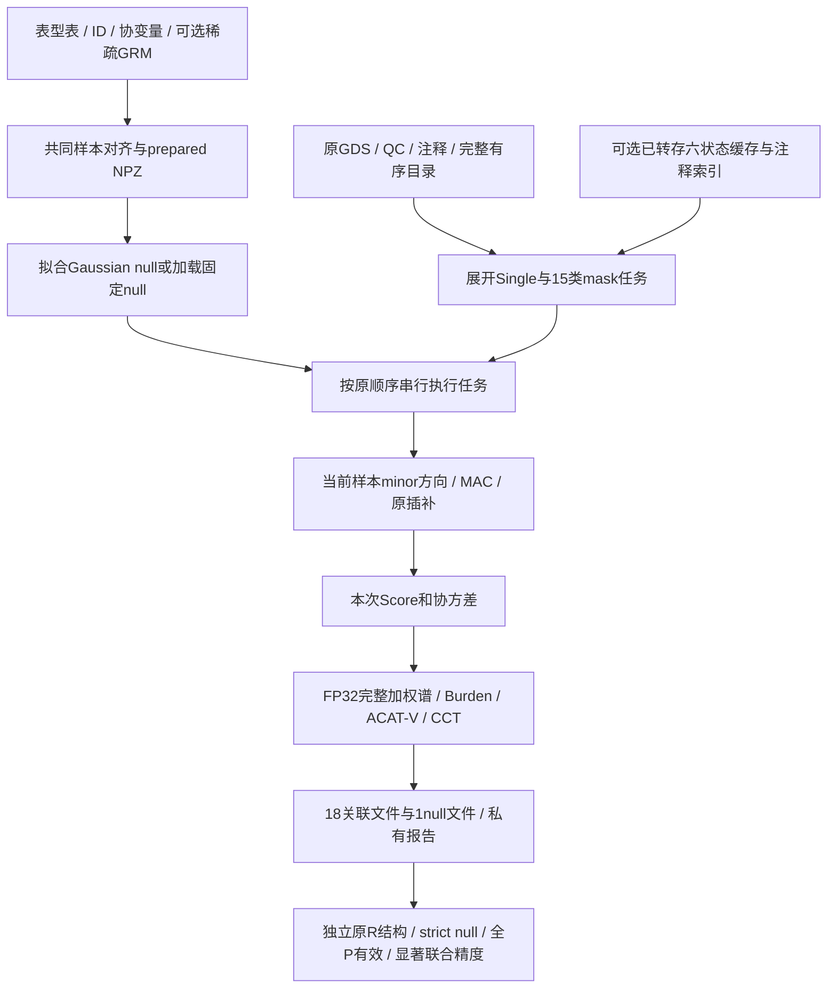
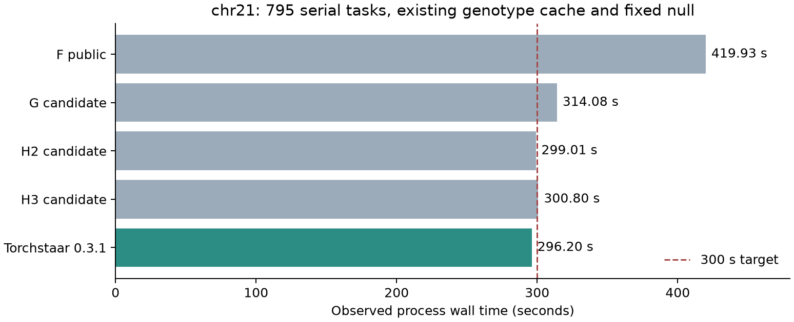

# Torchstaar：完整染色体稀有变异关联分析

## 1. 功能、范围与流程

Torchstaar 从 SeqArray GDS 读取基因型，结合已对齐的连续表型、协变量和可选稀疏亲缘信息，完成零模型、Single、coding、noncoding、ncRNA 和原生 R 文件输出。生产分析使用 PyTorch CUDA，默认原生 TF32矩阵乘法、FP32累加/输出；小向量使用FP32 mv/dot。保留原 STAAR 的过滤、权重、完整谱、Saddle、Burden、ACAT-V/CCT 和输出顺序，运行时不调用R。各任务在一个GPU串行执行，任务内部按矩阵和权重批处理，默认显存预算20 GiB。

完整染色体入口支持一项连续 Gaussian 表型，覆盖全部15类基因mask和Single，没有固定窗口或滑动窗口检验。原Single区间仅用于调度/分批，不构成聚合窗口检验。联合多表型、多个独立零模型与二分类SPA的专门API分别见 [MultiSTAAR](multi.md)、[多独立模型](phewas_multiple.md)、[二分类统计](binary.md)及[二分类零模型](binary_null.md)，各自保留验证范围。

最新小矩阵完整谱公开整合的完整真实复验**已完成，原R科学门槛通过**。当前公开科学代码完成795项、19文件、strict null及显著联合精度，进程墙钟296.196098秒。前一公开F版本完整复验419.926秒，私有H2小谱候选299.009秒；近期候选与当前公开运行分开记录。当前匿名记录见 [完整汇总](../benchmarks/torchstaar_chr21_2026-10-06.json)。



| 分析类别 | 完整mask及输入范围 |
|---|---|
| Coding | `plof`、`plof_ds`、`missense`、`disruptive_missense`、`synonymous`、`ptv`、`ptv_ds`；完整目录的一基闭区间。 |
| Noncoding | `upstream`、`downstream`、`UTR`、`promoter_CAGE`、`promoter_DHS`、`enhancer_CAGE`、`enhancer_DHS`；按染色体完整注释与基因指向匹配，promoter使用原参考区间。 |
| ncRNA | `ncRNA`；完整独立目录与原注释匹配。 |
| Single | 全部PASS物理位点，原MAC门槛和变异分类；不使用基因mask。 |

## 2. Python、输入、输出与参数

### 完整运行示例

先复制 [完整染色体配置模板](../examples/torchstaar-chromosome.json)，填入用户自己的私有路径和完整有序 manifest；单项低级任务使用 [job 配置模板](../examples/torchstaar-analysis.json)。

安装后的用户入口为 `torchstaar`；核心计算由同一PyTorch实现完成。

```python
import json
from pathlib import Path
from torchstaar.prepare import prepare_input
from torchstaar.chromosome import chromosome_configuration, run_chromosome

# 所有路径与列名都是占位值，实际数据保存在分析者的私有目录。
# 输入表型列为有限连续数值；样本ID保留字符串；有协变量时自动在首列加入截距。
alignment_report = prepare_input(
    gds="private/chromosome.gds",
    phenotypes="private/phenotypes.tsv",
    phenotype_columns=["trait_A"], id_column="IID",
    covariate_columns=["covariate_A"],
    grm="private/relationship.Rdata",  # 无亲缘模型可省略。
    exclude="private/excluded_samples.txt",
    delimiter="tab", output="private/aligned_trait.npz",
)

# 配置内包含下表定义的完整manifest、QC/注释、模型和输出参数。
analysis_configuration = json.loads(Path("private/full_chromosome.json").read_text())
analysis_configuration["phenotypes"][0].update(
    input="private/aligned_trait.npz", transform="rint",
    save_model="private/null_model.npz",
    output_null="private/results/obj_nullmodel.Rdata",
)
analysis_configuration["phenotypes"][0].pop("model", None)
analysis_configuration.update(
    matmul_mode="tf32", weighted_eigensolver="auto",
    statistics_execution="serial", local_mask_reuse=True,
    weight_batch_optimization=True, statistics_tail_optimization=True,
    individual_genotype_block_size=8192,
)
analysis_configuration.setdefault("analysis_options", {}).update(
    genotype_block_size=1024, annotation_block_size=250000,
    memory_limit_gib=20, rare_maf_cutoff=0.01,
    rv_num_cutoff=2, variant_type="SNV", imputation="mean",
)
reference_manifest = analysis_configuration["manifest"]
if isinstance(reference_manifest, str):
    reference_manifest = json.loads(Path(reference_manifest).read_text())
expanded_configuration = chromosome_configuration(analysis_configuration, reference_manifest)
# 计划含完整原目录、15类mask和原批次输出；不要以注释候选列表代替完整目录。
plan_path = Path("private/expanded_configuration.json")
plan_path.write_text(json.dumps(expanded_configuration, indent=2))
analysis_report = run_chromosome(analysis_configuration, device="cuda:0")
Path("private/analysis_report.json").write_text(json.dumps(analysis_report, indent=2))
```

已有完整null时，将表型项改为 `model="private/null_model.npz"`，移除 `input/transform/fit_options`；加载不重复RINT或拟合，也不自动覆盖模型。使用已有缓存时，以展开的配置调用 [六状态缓存](sixstate_cache.md)中的显式 `run_cached_configuration`；原GDS仍提供ID与注释。上例包括新的对齐/拟合，不等同于已有缓存/固定null的benchmark时间范围。

### 输入数据格式

| 配置输入 | 格式与含义 |
|---|---|
| `phenotypes` | JSON 数组，本完整染色体入口恰好一项连续 Gaussian 表型；`name` 为私有运行标签。`input` 是 prepared NPZ 路径；`model` 是完整 null NPZ cache 路径，二者择一。新拟合使用 `input`，本轮性能对照使用 `model`。 |
| NPZ `y_raw`、`ids` | `y_raw` 为长度 N 的数值表型；`ids` 为同长度、唯一的字符串样本 ID。需要在生成 NPZ 前去掉缺失样本并完成各输入的共同对齐。 |
| NPZ `covariates` | 可选 N×C 数值矩阵，行顺序与表型/ID 相同。矩阵必须显式包含所需截距；省略时拟合函数使用一列截距。`prepare_input` 有协变量时已在首列加入截距，不再重复添加。 |
| NPZ `grm_diagonal` | 可选长度 N 的相关性矩阵对角元素；与下面 edge 列共同表示稀疏 GRM。 |
| NPZ `grm_edge_row`、`grm_edge_col`、`grm_edge_value` | 同长度的一维数组；row/col 为上述对齐样本顺序中的零基整数索引，value 为对应相关性数值。不是 GDS 的绝对 sample index。 |
| NPZ `sample_indices`、`gds_sample_ids` | 可选长度 N 的已对齐 GDS 样本行索引（零基）或实际 GDS ID；用于核对输入绑定，跨染色体按实际 ID 重排。原始 ID 只保存在私有文件。 |
| `phenotypes[i].transform` | JSON 字符串，`none`（默认）或 `rint`；后者在新拟合前做 rank inverse normal transformation。加载 `model` 不重新变换；不同模式对照保持同一变换。 |
| `phenotypes[i].sample_indices_file` | 可选私有 `.npy` 路径，用于加载旧 `model` 时补充 N 长度的零基整数 GDS 样本行号，必须唯一、范围有效且按模型样本顺序对齐。`input` 新拟合使用 NPZ 内 `sample_indices`。已有 canonical `gds_sample_ids` 时按这些 ID 重新查找行号。 |
| `phenotypes[i].sample_id_rule` | JSON 字符串，`auto`（默认）、`exact` 或 `last_underscore_token`。无 canonical GDS ID 时，auto 先严格匹配，失败再按 GDS ID 最后一个下划线后片段匹配；exact 仅允许原 ID，last_underscore_token 仅使用后缀匹配。归一化 ID 不能重复；跨染色体在完成首次绑定后按 canonical ID 重排。 |
| `fit_options` | phenotype 项中的 JSON 对象，拟合参数字典；常用 `tol`、`maxiter`、`max_block_size` 分别控制收敛阈值、最大迭代数和 GRM 相关块大小；使用已冻结参考流程的参数。若给出 `matmul_mode` 必须与 run 配置一致；原生 TF32 不使用分量或 split-K 重建。 |
| `gds`、`chromosome` | JSON 字符串：原生 SeqArray GDS 路径和染色体标记；标记必须与 manifest 一致。分析保留 GDS 内原始变异次序。 |
| `packed_reader_directory` | 可选非空 JSON 路径字符串，指向已显式构建的 packed reader 目录；目录含扩展及私有 `packed_binding.json`。省略时使用原读取路线，配对不符即报错。构建输入见 [packed reader](gds_packed.md)。 |
| `manifest` | 私有 JSON 路径或对象；`genes_info` 是完整有序的 JSON 对象数组，每项必须含非空字符串 `gene_name` 和整数 `start/end`，一基闭区间且 `1<=start<=end`；`ncRNA_genes` 是完整有序的对象数组，每项含非空字符串 `gene_name`，不是裸字符串数组。不能用注释候选列表替代完整目录。 |
| manifest `start_loc/end_loc` | 整个 Single 区间的一基闭区间；最后一个区间也覆盖右端点。 |
| manifest `array_offsets` | `coding/noncoding/ncrna/individual` 的非负整数；表示前面染色体占用的 batch 数，用于延续原软件 native 文件编号。 |
| manifest batch 参数 | `coding_genes_per_batch`、`ncrna_genes_per_batch` 为每个原生批次基因数；`individual_region_size` 为 Single 区间宽度。改变它们会改变输出分组，因此真实对照固定原值。 |
| `annotation_catalog`、`annotation_names` | catalog 为注释名称到 GDS node 路径的字典或私有 JSON 路径；names 为统计权重所用注释名称的有序列表。候选与 baseline 共用完整 catalog 和名称顺序。 |
| `qc_path` | JSON 字符串，GDS 的 QC 标记 node 路径；沿用原 pipeline 的过滤规则。 |
| `promoter_intervals_file` | JSON 路径字符串指向私有 TSV，每行前三列 chromosome/start/end，坐标遵循已冻结的原参考输入；参与原有 promoter mask。 |
| `analysis_options` | JSON 对象；`rare_maf_cutoff` 是 trait rare MAF 阈值（数值，默认 0.01）；`rv_num_cutoff` 是最少变异数（整数，默认 2）；`variant_type` 是 `SNV`/`Indel`/`variant` 字符串选择；`imputation` 是 `mean`/`minor` 插补字符串；`genotype_block_size`、`annotation_block_size` 是基因型/注释块大小（正整数）；`memory_limit_gib` 是正、有限的数值 GiB（默认 20），同时用于 pipeline 和每次 TF32 乘法的工作区预检。全部参数的完整约束见 [专门统计API](statistics.md)。 |
| `mac_cutoff`、`subset_variants_num` | 数值 MAC 门槛（默认 20）及正整数变异分组数（默认 5000），分别控制 Single 初始筛选和原软件内部统计分组。保持参考值，不能用额外未经验证的 AC/AN 过滤代替。 |
| `output_directory`、`output_prefix` | JSON 字符串，私有输出目录和原生文件名前缀；对照只换目录，保留原 basenames、对象名和 native layout。 |
| `phenotypes[i].save_model`、`phenotypes[i].output_null` | 可选 JSON 路径字符串：分别写出完整私有 `.npz` cache（含本次生效模式）和原生 null `.Rdata/.rds`。不指定 `save_model` 时不写 NPZ；加载的 `model` 不自动覆写。baseline 和候选使用不同路径，不覆盖旧参考 cache。 |

### 运行与计算参数

| 参数 | 默认、格式和用途 |
|---|---|
| `device` | `"cuda"`或`"cuda:0"`；生产TF32要求CUDA。 |
| `matmul_mode` | `"tf32"`；一次TF32 MMA，FP32累加/输出；不使用float16/BF16。显式FP64控制需 `precision_control=true`，不作为生产默认。 |
| `weighted_eigensolver` | `"auto"`（默认）、`"torch"`或`"cusolver_batched"`；auto在CUDA+TF32+weightbatch时启用33..512的完整谱后端，范围外保留原Torch。CPU/FP64/关闭weightbatch记录effective Torch及inactive reason。 |
| `statistics_execution` | `"serial"`；按完整有序目录执行。 |
| `resident_genotypes` | JSON布尔值，CUDA默认开启；在预算允许时用整数GPU解码/筛选，再形成FP32 rare矩阵；选定路线的异常明确报告。 |
| `local_mask_reuse` | 默认True；相同模型、样本、方向/插补规则的局部mask并集共用u/V，再按原索引取子矩阵。 |
| `weight_batch_optimization` | 默认True；批量权重、Burden与完整加权谱，保留原每列输出。 |
| `statistics_tail_optimization` | 默认True；原Saddle与CCT规则的批量/同步边界，不改变检验公式。 |
| `stage_profile` | JSON布尔值；记录host/CUDA stream阶段边界，会影响观测调度。当前完整复验启用同一公开profiler。 |
| `analysis_options.genotype_block_size` | 正整数；Python低级默认128，完整配置采用1024。 |
| `individual_genotype_block_size` | 正整数；TF32 Single默认8192；与MAC筛选后的原5000统计分组独立。 |
| `analysis_options.annotation_block_size` | 正整数，默认250000；注释扫描分块大小，不改类别顺序。 |
| `analysis_options.memory_limit_gib` | 正有限数，默认20；核对allocated/reserved与fresh CUDA free及临时工作区，超限报错，不是预留显存。 |
| `analysis_options.rare_maf_cutoff` | `(0,0.5]`数值，默认0.01；实际基因筛选为严格 `0<MAF<cutoff`。 |
| `analysis_options.rv_num_cutoff` | 正整数，默认2；至少多少rare变异才检验。 |
| `analysis_options.rv_num_cutoff_max` | 默认10^9；检验变异数须严格小于此值，必须大于最小数。 |
| `analysis_options.rv_num_cutoff_max_prefilter` | 正整数，默认10^9；并集预筛后的上限。 |
| `analysis_options.variant_type` | `"SNV"`、`"Indel"`、`"variant"`；基因默认SNV，Single按自己的类型配置；PTV选择保留原类型规则。 |
| `analysis_options.imputation` | `"mean"`默认，按原wrapper填 `2×MAF`；`"minor"`填0。半缺失方向和频率沿用原规则。 |
| `analysis_options.wrapper_semantics` | 完整单表型入口强制`"base"`；低级PheWAS采用`"phewas"`。base沿原REF_AF补数，PheWAS按当前trait非缺失MAC计频率，两者不混用。 |
| `mac_cutoff` / `subset_variants_num` | 默认20 / 5000，数值门槛 / 正整数分组数；保留原Single allele摘要初筛，不另加未验证过滤。 |
| `tf32_split_k` | 原生配置只接受0；不做分量重建。 |
| `debug_json` | 可选JSON布尔值，仅私有调试；正式结果使用原生R对象。 |
| CacheSpec / IndexCacheSpec | 显式cache/索引路径、完成绑定、实时source证明与样本轴；默认decoded帧LRU64MiB是host RAM，不是显存或总进程内存。全部接口见 [缓存API](sixstate_cache.md)。 |

### 输出结构

| 输出 | 结构与含义 |
|---|---|
| prepared NPZ | 对齐后的原表型、ID、协变量和稀疏GRM数组；是个体级私有输入，不公开。 |
| null NPZ | 完整拟合/模型状态；缓存residuals按原NPZ输入dtype序列化，关联张量仍保持生效矩阵精度。 |
| null `.Rdata/.rds` | 原 `obj_nullmodel`、class和稀疏Matrix属性；严格数值及结构独立比较。 |
| Coding/Noncoding/ncRNA关联 | 原类别列表、mixed matrix、列名/顺序、属性与合法NULL；missense保留disruptive附加组合。 |
| Single关联 | 原data.frame及REF/ALT factor、row.names、列类型/顺序；保留原MAC筛选与分组。 |
| execution report | 任务数、job结果、计时、显存、precision审计和实际backend调用；报告可能含任务标签，应留在私有目录。公开只导出白名单匿名汇总。 |

原生文件命名、保存对象与 `write_association_output` 参数见 [输出API](r_native_output.md)；Score、权重、完整谱和P的低级参数见 [统计API](statistics.md)。输入准备/零模型参数分别见 [prepare](prepare.md)、[Gaussian null](null_model.md)。

### 数学与实际后端

设G为N×M minor剂量矩阵，r为模型scaled residuals，A=Σ⁻¹X，C=(XᵀΣ⁻¹X)⁻¹。关联保留 `u=Gᵀr` 和 `V=GᵀΣ⁻¹G−(AᵀG)ᵀC(AᵀG)`，不建立整条染色体协方差或N×N dense投影。Single只取V对角线。Burden保留 `(wᵀu)²/(wᵀVw)`，SKAT保留 `Σ(w_i u_i)²` 与 `D_w V D_w` 的全部特征值。ACAT-V的低MAC burden合并、CCT小P与精确0/1分支保持原规则。

native weighted caller的33..512 FP32 CUDA方阵使用 `SsyevjBatched`、UPLO=U、NOVECTOR、升序全谱、机器精度tol和100 sweeps；按当前Torch stream计算，列主序clone不改输入。所有info须为0，finite/sorted与fresh workspace guard通过；selected异常不隐式fallback。范围外保持原Torch完整谱。FP64仅用于必要的标量概率和精确权重比例证明，不重做FP64关联dense矩阵，也不截断或近似谱。

`weighted_eigensolver_execution` 报告requested/effective/eligible/inactive_reason、selector、context setup/cleanup；`weighted_spectrum_execution.actual_backend_calls/actual_backend_matrices`按成功的实际API统计。selector/backend关闭后才形成CLI报告，包含calls/matrices/n/info/library versions/SHA/provider及cleanup状态。通用Torch报告 `driver_traced=False`，不能按shape猜测底层driver或把range外全部称为large eig。独立API `torchstaar.cuda_eigen.FP32SmallSpectrumSolver` 的完整参数见 [统计API](statistics.md#完整谱后端)。

## 3. 安装与命令行

```bash
conda env create -f environment.yml
conda activate torchwgs
# CoreArray的原生GDS依赖；使用已有编译器和Conda的NumPy/lzma头文件。
LZMA_PREFIX="$CONDA_PREFIX" python -m pip install --no-deps --no-build-isolation \
  'git+https://github.com/CoreArray/pygds.git@b7a2dbbebf3b06ac4e97c806e36ec4e1a6af5bdd'
python -m pip install -e .

# 准备对齐输入；列名为占位值，实际列名只保存在私有配置中。
torchstaar-prepare --gds private/chromosome.gds \
  --phenotypes private/phenotypes.tsv --phenotype-columns trait_A \
  --id-column IID --grm private/relationship.Rdata \
  --output private/aligned_trait.npz
# 只展开完整计划，不计算关联。
torchstaar-chromosome private/full_chromosome.json \
  --plan-only --report private/expanded_configuration.json
# 按JSON选择完整谱后端。
torchstaar-chromosome private/full_chromosome.json \
  --device cuda:0 --report private/analysis_report.json
# 已展开job配置可在命令行显式覆盖后端。
torchstaar private/expanded_configuration.json --device cuda:0 \
  --weighted-eigensolver cusolver_batched --report private/analysis_report.json
```

主页配方为Python3.10、PyTorch2.5.1、CUDA11.8、torchtriton3.1、NumPy1.26、`zstandard>=0.22`、`rdata==1.1.0`。小谱后端只用标准库ctypes/metadata和已安装官方CUDA库，无新后端依赖。[官方历史Conda安装](https://docs.pytorch.org/get-started/previous-versions/#v251)支持2.5.1/CUDA11.8组合；本次recipe尚未独立创建并完成数值验收，真实benchmark使用服务器已有环境。GDS/packed构建的完整Conda依赖及原SDK来源见 [读取API](gds.md)、[packed构建](gds_packed.md)；构建显式执行，分析运行不自动安装/编译。

| CLI参数 | 用途 |
|---|---|
| config positional | 私有JSON配置；染色体入口接受完整目录配置，job入口接受已展开chromosomes/jobs。 |
| `--device` | 默认cuda；显式设备，生产TF32须为CUDA。 |
| `--report` | 染色体入口必填私有JSON报告路径；job入口可选，省略时向stdout输出报告，仍须保持私有。 |
| `--plan-only` | 染色体入口仅生成计划，不运行关联。 |
| `--weighted-eigensolver` | job入口可覆盖JSON的auto/torch/cusolver_batched；染色体入口在JSON配置该项。 |

## 4. 原R对应调用

原R用于独立参照，生产命令不调用R。对照需同一最终样本、模型、完整目录、15mask、QC/注释、坐标与输出分批。

```r
library(STAARpipeline)
library(SeqArray)
# aligned_phenotypes、sparse_relationship_matrix及注释目录由分析者准备。
null_model <- fit_nullmodel(
  trait_A ~ 1, data=aligned_phenotypes, kins=sparse_relationship_matrix,
  id="sample_id", family=gaussian(), method.optim="AI")
genotype_file <- seqOpen("private/chromosome.gds")
coding_result <- Gene_Centric_Coding(
  chr=21L, gene_name=reference_gene_name, genofile=genotype_file,
  obj_nullmodel=null_model, category="all_categories_incl_ptv", variant_type="SNV",
  Annotation_dir="", Annotation_name_catalog=annotation_catalog,
  Annotation_name=annotation_names, QC_label="annotation/info/QC_label")
noncoding_result <- Gene_Centric_Noncoding(
  chr=21L, gene_name=reference_gene_name, genofile=genotype_file,
  obj_nullmodel=null_model, category="all_categories", variant_type="SNV",
  Annotation_dir="", Annotation_name_catalog=annotation_catalog,
  Annotation_name=annotation_names, QC_label="annotation/info/QC_label")
ncrna_result <- ncRNA(
  chr=21L, gene_name=reference_ncrna_name, genofile=genotype_file,
  obj_nullmodel=null_model, variant_type="SNV", Annotation_dir="",
  Annotation_name_catalog=annotation_catalog, Annotation_name=annotation_names,
  QC_label="annotation/info/QC_label")
individual_result <- Individual_Analysis(
  chr=21L, start_loc=chromosome_start, end_loc=chromosome_end,
  genofile=genotype_file, obj_nullmodel=null_model, variant_type="variant",
  mac_cutoff=20, subset_variants_num=5000, QC_label="annotation/info/QC_label")
seqClose(genotype_file)
```

这是四个原入口的对应调用；完整目录与原生批次需按完整manifest循环，不能以单个调用代表完整benchmark。原版本为STAAR/STAARpipeline0.9.9和锁定参考源码，实际原R采用FP64。原关联参考曾以两个CPU worker、每BLAS一线程运行，关联调度wall24,170.535秒；该范围不含原始表型准备/零模型拟合，与本版固定null/暖缓存的GPU计时边界不同，不计算同口径加速比。参考脚本接口见 [validation/oracles](../validation/oracles)。

## 5. 最新真实精度与耗时

设 `S={i:P_R,i<0.05 或 P_GPU,i<0.05}`。主精度门槛为 `max(i∈S)|-log10(P_R,i)+log10(P_GPU,i)|<=0.001`。同时要求：

- 795 项完整计划全部结束，19 份原生文件结构、类型、顺序和 NULL 一致；严格 null 数值通过。
- 全部 478,082 个 P 有效且可比较，无 NA、遗漏或下溢造成的不可比较单元格。
- 18 份关联文件中15份含P，3份原输出本身没有P；只有独立绑定原预检确认双方均无P、结构和非P严格比较通过时，P门槛才记为不适用。raw空P validator的false记录保留，不能把未知缺失判为通过。
- 全部 P 的误差另存诊断，不与显著联合范围门槛混写。原 R 实际采用 FP64；本版矩阵采用 TF32 / FP32，不将原 R 说成 FP32。

本次公开整合复验有24,713个显著联合P，0个超限，最大差 `0.000357971421594216`，显著性边界跨越0。全部P诊断仍有49个超限，最大差约0.0708922；它们在双方非显著范围。

当前严格null覆盖341,221个数值单元格，0超限，最大绝对/相对差1.47138834449834e-7 / 5.95656454671069e-8。原R比较127.953秒、运行前full-stream校验2.931秒均在关联墙钟之外。科学源码、源输入与原R oracle前后证明保持一致；actual selected backend899次/22,605矩阵，最大M504，info全部0，close/cleanup与package hash证明通过，CUDA build/runtime均11080。

共享节点上监测完整且未观察到外部GPU进程，但没有独占证明。本轮wall<300与主科学门槛都通过；原汇总的 `full_chromosome_speed_and_precision_passed=false` 保留其独占资源要求，不把它改写为true，也不据此声称所有染色体/冷缓存都达标。

进程墙钟包含解释器启动、源码/输入证明、模型绑定、reader/index初始化、795项关联、原生18关联+null写出及关闭证明；本次重新计算所有Score、协方差、完整谱和P。首次 GDS 转存、运行前 full-stream 预检和独立 CPU R 比较在计时外。使用固定 cached null、已有转换缓存、暖文件系统和已有 Triton 编译缓存；不代表从原 GDS / 新 null / 冷缓存开始的全流程。共享节点无资源独占证据，不推导普遍加速比。

### 近期完整实测

| 轮次 | 实际改动与范围 | 进程墙钟 s | 科学门槛 | <=300 s |
|---|---|---:|---|---|
| F公开整合复验 | 已发布原生TF32/FP32、64MiB LRU、原Torch完整谱 | 419.925637 | 通过 | 否 |
| G私有候选 | 小谱后端 + RAM预载 / counts seed / XDR缓冲组合 | 314.081770 | 通过 | 否 |
| H2私有候选 | 仅小谱后端；3项私有IO关闭，64MiB LRU | 299.009281 | 通过 | 本轮观测达到 |
| H3私有候选 | H2 + decoded LRU 512MiB | 300.796113 | 通过 | 否 |
| 当前Torchstaar公开整合 | 公共小谱接口与原64MiB reader/writer/counts | 296.196098 | 通过 | 本轮观测达到 |



图：固定null、已有转换缓存、暖文件系统与Triton缓存的一张GPU串行运行，795任务/19文件；横线标注300秒目标。各轮来自共享节点的不同候选观测，不能解释为受控加速率。首次转换与独立R比较在外。

H3 frame loads为16,897，对H2的17,049只少152；read/validate为28.093/28.028秒，完整时间未改善，因此默认保留64MiB。G的3项私有IO没有形成明确端到端收益，均未纳入本次公开默认。各轮是共享环境的实际观测，组合变化不解释为某个阶段的受控因果提速。

当前公开运行峰值allocated为1654.976 MiB、reserved为4550 MiB，20 GiB预算通过。阶段host边界如下，**不可相加**：

| profiler边界 | host累计 s | 范围 |
|---|---:|---|
| gds_sdk_decode_prepare | 56.137 | 当前reader的读取/解码/准备边界；名称不能证明全部调用原SDK |
| score_covariance | 12.431 | Score与协方差边界 |
| eigen_tail | 83.955 | 整个 `staar_test`，包括权重、谱、tail及组合P；不是纯large eig |
| association native save | 15.130 | 原生关联写出 |
| null/cache save | 13.350 | 原生null及模型序列化 |
| selected batched solver | 本次单独host未公开 | 实际899 calls / 22605 matrices / info0；不由父计时相减推测 |

CUDA stream事件含调度间隙，host计时含验证/排队，均不是纯kernel时间。没有独立实测的权重/large eig/tail时间记为未测，不能用eigen_tail相减构造。

首次转存进程墙钟10,854.839秒（约3.02小时），逻辑空间1,778,215,969 bytes，相对原GDS新增8.532825%。源GDS保留；缓存精确保留二倍体 REF / 任意非REF 和半/全缺失状态，不保留phase或每个ALT身份。转换与关联计时分别记录。

### CPU回归范围

整合代码的全量pytest回归为659通过、41跳过，52.35秒；该调用排除使用unittest执行的REGENIE GPU测试目录。REGENIE另用unittest执行284项、33跳过，51.584秒，整体通过。这两种运行的发现范围和skip分别记录，不相加成独立测试覆盖数量；局部planner/后端合同及namespace/清理合同已包含在最终全量数量，不再次叠加。CPU合同验证配置转发、完整谱API、mock info/错误、provider绑定和cleanup，不代替真实public完整染色体R对照。

## 6. 最近版本与benchmark记录

| 版本/轮次 | 改动与结果 |
|---|---|
| 公开F | 原生TF32/FP32、局部mask和权重复用、六状态64MiB reader、原native writer/Device counts；完整科学验收通过，419.926秒。 |
| G候选 | 小谱后端与RAM/counts/XDR组合；314.082秒，科学通过，3项IO无明确整体收益未采用。 |
| H2候选 | 仅小谱后端，原IO+64MiB LRU；299.009秒，完整科学通过，只代表该次共享环境观测。 |
| H3候选 | 512MiB decoded LRU；300.796秒，只减少152次frame loads，没有显示收益，保留64MiB。 |
| 当前Torchstaar整合 | 用户入口与公开完整谱接口；795项/19文件和原R主科学门槛全部通过，墙钟296.196098秒。 |

文档仅保留现行入口、必要专门API及近期完整观测。CPU边界合同检查实现规则，不作为真实数据benchmark。公开汇总只含匿名计数、误差、时间和资源指标；个体输入、实际gene/位点表、实际表型名称和运行地址均留在私有目录。

## 7. 原实现、许可与参考文献

- [STAAR固定源码](https://github.com/yuxinyuanqt/STAAR/tree/4bbf77ba8a90894a434f5eb4473d540e172dad05)：Score、Saddle、Burden、ACAT与原权重。GPL-3.0。
- [STAARpipeline固定源码](https://github.com/yuxinyuanqt/STAARpipeline/tree/fbce778bf14cc4f9e892989a194c64bae2670311)：四类原分析入口；[PheWAS源码](https://github.com/li-lab-genetics/STAARpipelinePheWAS)提供逐trait语义。
- [GMMAT固定源码](https://github.com/cran/GMMAT/tree/ef49eec8d0d95951a48f7055a77321077dbc8c13)：Gaussian混合模型与停止规则。
- [CoreArray PyGDS](https://github.com/CoreArray/pygds)、[SeqArray](https://github.com/zhengxwen/SeqArray)：GDS读取/编码；外部注释与参考目录从原作者取得，安装包不附带个体数据或第三方数据库。
- [PyTorch2.5.1 CUDA完整谱代码](https://github.com/pytorch/pytorch/blob/v2.5.1/aten/src/ATen/native/cuda/linalg/BatchLinearAlgebraLib.cpp#L1306-L1323)：原Torch调用参考，实际选定API另按执行报告记录。
- Li X et al. Dynamic incorporation of multiple in silico functional annotations empowers rare variant association analysis of large whole-genome sequencing studies at scale. *Nature Genetics* 52,969–983 (2020). [DOI](https://doi.org/10.1038/s41588-020-0676-4)。
- Li Z et al. A framework for detecting noncoding rare-variant associations of large-scale whole-genome sequencing studies. *Nature Methods* 19,1599–1611 (2022). [DOI](https://doi.org/10.1038/s41592-022-01640-x)。
- Liu Y, Xie J. Cauchy combination test: a powerful test with analytic p-value calculation under arbitrary dependency structures. *JASA* 115,393–402 (2020). [DOI](https://doi.org/10.1080/01621459.2018.1554485)。

必要专门接口：[输入对齐](prepare.md)、[Gaussian null](null_model.md)、[统计与完整谱](statistics.md)、[GDS](gds.md)、[packed构建](gds_packed.md)、[六状态cache](sixstate_cache.md)、[原生R输出](r_native_output.md)。
