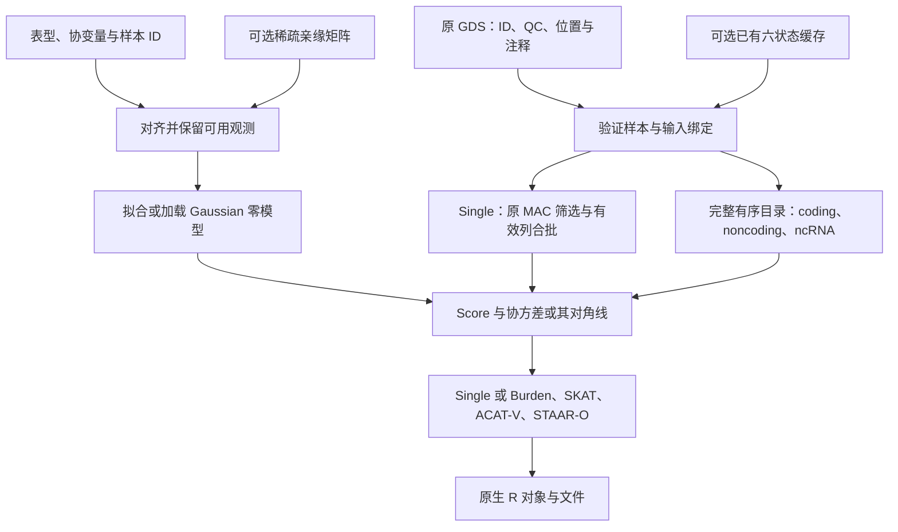

> 当前默认主入口为两份 CSV 加一个完整缓存目录，见[三输入指南](cache_only_run.md)。本页保留低级配置及原软件调用；兼容配置命令为 `torchstaar-config`，新的默认入口采用最多 8 GPU 和 40 GiB/worker。

# Torchstaar：STAAR 的 PyTorch GPU 流程

## 功能与流程

Torchstaar 在 GPU 上计算 STAAR 的 Single、coding、noncoding 与 ncRNA 关联检验，并由 Python 写出原生 R 文件。完整染色体入口使用一个连续 Gaussian 表型；支持普通模型与已拟合的稀疏混合模型。默认原生 TF32 矩阵乘法、FP32 累加和一个 GPU 串行执行，推荐显存预算 20 GiB。

各表型使用自己可用的观测，缺失表型和协变量在准备阶段剔除。缺失基因型按原规则处理。已有零模型可直接加载，不再次拟合或变换。固定窗口和滑动窗口分析不属于当前流程。



| 分析 | 完整 mask 范围 |
|---|---|
| Coding | `plof`、`plof_ds`、`missense`、`disruptive_missense`、`synonymous`、`ptv`、`ptv_ds` |
| Noncoding | `upstream`、`downstream`、`UTR`、`promoter_CAGE`、`promoter_DHS`、`enhancer_CAGE`、`enhancer_DHS` |
| ncRNA | 独立 ncRNA 目录及 `ncRNA` mask |
| Single | 原 QC、变异类型与 MAC 门槛下的所有有效变异 |

注释权重、Burden、SKAT、ACAT-V 及 STAAR-O 保留原公式。局部 mask 并集复用 Score/协方差，各权重在同一 mask 内批量处理；SKAT 使用完整加权谱。Single 只计算每列方差，避免完整变异×变异协方差。

## 安装与 Python 调用

安装命令见[主页](../README.md#安装)。CoreArray PyGDS 需要编译器、Python/NumPy 与 lzma headers；packed reader 的构建见[专门说明](gds_packed.md)。

完整配置从[通用模板](../examples/torchstaar-chromosome.json)填写，私有 `manifest` 必须提供完整有序目录。下面复用已有零模型并展开原生作业；不读取或重写个体表。

```python
import json
from pathlib import Path
from torchstaar.chromosome import chromosome_configuration, run_chromosome

# 私有配置使用下表所定义的输入；每个文件及模型均已对齐。
analysis_configuration = json.loads(Path("private/chromosome.json").read_text())
reference_manifest = json.loads(Path(analysis_configuration["manifest"]).read_text())
analysis_configuration.update(
    matmul_mode="tf32",
    resident_genotypes=True,
    statistics_execution="serial",
    single_batch_optimization=True,
    individual_effective_block_size=1024,
    individual_genotype_block_size=1024,
)
# 使用 model 路径时不再提供 input/transform/fit_options。
expanded_configuration = chromosome_configuration(analysis_configuration, reference_manifest)
Path("private/plan.json").write_text(json.dumps(expanded_configuration, indent=2))
# 此调用使用原 GDS 路线；已有六状态缓存见后面的显式 Python 入口。
analysis_report = run_chromosome(analysis_configuration, device="cuda:0")
Path("private/report.json").write_text(json.dumps(analysis_report, indent=2))
```

### 输入格式与含义

| 输入 | 格式、默认值与用途 |
|---|---|
| `chromosome` / `gds` | 必填染色体字符串与原生 SeqArray GDS 路径。GDS 包含样本 ID、变异位置、REF/ALT、QC 和功能注释；标记与 manifest 一致。 |
| `phenotypes` | 必填 JSON 数组；完整染色体入口恰好一项连续 Gaussian 模型，`name` 是私有运行标签。 |
| `phenotypes[].model` | 已拟合完整 `.npz` 零模型路径；与 `input` 二选一。保存模型身份、设计与残差/精度状态，加载不重新拟合。 |
| `phenotypes[].input` | 新拟合使用的 prepared `.npz` 路径；至少含有限 `y_raw[N]` 与唯一字符串 `ids[N]`。所有数组保持同一有效样本顺序。 |
| NPZ `covariates` | 可选有限、满秩 `N×C` 设计矩阵，显式包含所需截距。直接拟合省略时用截距；`prepare_input` 有协变量时会加截距。 |
| NPZ `grm_diagonal` 与 `grm_edge_row/col/value` | 可选稀疏亲缘输入：对角长 N，非对角三数组等长。索引是模型样本轴上的零基整数；不是 GDS 绝对行号。省略亲缘输入表示普通模型。 |
| NPZ `gds_sample_ids` / `sample_indices` | 可选实际 GDS ID 或对齐的零基整数行号，均长 N；用于模型绑定。跨染色体按实际 ID 重新查找。 |
| `phenotypes[].sample_indices_file` | 加载旧模型时可补充上述 N 长度整数轴的 `.npy` 路径，默认省略；要求唯一、有效并与模型行对应。 |
| `phenotypes[].sample_id_rule` | `auto`（默认）、`exact` 或 `last_underscore_token`。控制无 canonical ID 时的匹配；归一化重复 ID 拒绝。 |
| `phenotypes[].transform` | 新拟合时 `none`（默认）或 `rint`。先剔除缺失，再在实际有效样本上变换；已有 `model` 不重新变换。 |
| `phenotypes[].fit_options` | 新拟合的参数对象；常用 `tol=1e-5`、`maxiter=500`、`max_block_size=2048`。对照使用相同设计、亲缘矩阵和拟合规则。 |
| `phenotypes[].save_model/output_null` | 可选私有 NPZ cache / 原生零模型 R 文件路径；默认不另写模型。加载不自动覆盖原缓存。 |
| `manifest` | 必填私有 JSON 路径或对象：`genes_info` 是完整有序对象数组，各项含 `gene_name` 和一基闭区间 `start/end`；`ncRNA_genes` 各项含 `gene_name`。不能用注释候选索引替代完整目录。 |
| manifest `start_loc/end_loc` | 必填一基闭区间整数，定义完整 Single 范围，须覆盖目标 GDS 染色体的全部位置；最后右端点包含在计划中。 |
| manifest `array_offsets` | 必填对象，`coding/noncoding/ncrna/individual` 四个非负整数表示此前染色体占用批次数，延续原文件编号。 |
| manifest 批次参数 | `coding_genes_per_batch=50`、`ncrna_genes_per_batch=100`、`individual_region_size=10000000`，均为正整数。影响原生文件分组，真实对照固定原值。 |
| `annotation_catalog` | 注释名称到 GDS node 路径的字典或私有 JSON 路径，默认空；功能 mask 和权重需要对应的真实注释。 |
| `annotation_names` | 权重注释名称的有序字符串列表；完整 planner 默认使用原教程的 11 项。名称与 PHRED 矩阵列一一对应。 |
| `qc_path` | QC node 字符串。完整 planner 默认 `annotation/info/QC_label`，直接 job runner 默认 `annotation/filter`；显式填入基线节点。 |
| `promoter_intervals_file` | 完整 planner 必填私有 TSV 路径，前三列为 chromosome/start/end，使用原参考区间约定。 |
| `output_directory/output_prefix` | 必填输出目录字符串；前缀为非空字符串，planner 默认 `Imaging`，不能含目录部分。公开示例用通用标签，实际命名留在私有配置。 |

新输入对齐的 Python/CLI 及缺失规则见[输入准备](prepare.md)。本次性能对照加载既有模型和缓存；新拟合、首次转存不计入该对照。

### 运行与优化参数

| 参数 | 类型、默认值与作用 |
|---|---|
| `device` | 字符串，完整入口默认 `cuda`；示例 `cuda:0` 指定设备，TF32 要求 CUDA。 |
| `matmul_mode` | 生产默认 `tf32`：一次原生 TF32 MMA，FP32 累加/输出；向量运算走 FP32 GEMV/dot。无分量重建、FP64 矩阵回退或 FP16/BF16。 |
| `statistics_execution` | 字符串，默认 `serial`；按完整有序作业执行，不启动多个并行关联作业。 |
| `resident_genotypes` | JSON 布尔值，CUDA 配置默认开启；保留设备 uint8 剂量，随后形成 FP32 关联矩阵。 |
| `single_batch_optimization` | **新参数**，JSON 布尔值，默认 `true`。兼容 reader 的单 Gaussian 或非 SPA 二分类、单表型、TF32、驻留 CUDA 时累计有效列；`false` 使用原物理块路径。 |
| `individual_effective_block_size` | **新参数**，正整数，默认 `1024`。MAC 通过后的每个设备块最大列数；尾块可更小。不改变原统计分组。 |
| `individual_genotype_block_size` | 正整数，TF32 Single 默认 `8192`，示例设 `1024`。筛选前物理读取上限；缓存路线同时按压缩帧拆分，不是有效列数。 |
| `analysis_options.genotype_block_size` | 正整数，低级默认 `128`，完整模板设 `1024`；基因分析的物理读取上限。 |
| `analysis_options.annotation_block_size` | 正整数，默认 `250000`，注释读取与筛选块大小。 |
| `analysis_options.memory_limit_gib` | 正、有限数值，默认 `20` GiB；pipeline 和矩阵乘法工作区预检，同时检查实际峰值。不是共享设备的资源预留。 |
| `analysis_options.covariance_backend` | 默认 `cached`，另可用 `legacy`；长 mask 协方差后端。cached复用原始和加权剂量面板以及投影。 |
| `analysis_options.cached_variant_tile_size` | 默认 `4096`，正512倍数；请求的cached协方差产品块宽。自动面板按实时预算选择实际512倍数宽度，不超过请求值；Score与投影准备保持512列。 |
| `analysis_options.rare_maf_cutoff` | 数值，默认 `0.01`；基因检验保留严格 `0<MAF<cutoff`。 |
| `analysis_options.rv_num_cutoff` | 正整数，默认 `2`，集合检验所需最少变异数。 |
| `analysis_options.rv_num_cutoff_max` | 整数，默认 `10^9`；保留的稀有变异数必须严格小于该值。若只分析 `M<=5000`，用严格上界 `5001` 并检查跳过报告。 |
| `analysis_options.rv_num_cutoff_max_prefilter` | 正整数，默认 `10^9`；原 union 预筛计数的严格上界，与最终 rare M 不同。 |
| `analysis_options.variant_type` | 默认 `SNV`，可选 `SNV/Indel/variant`；基因 mask 的变异类型。完整 Single 作业使用 `variant`。 |
| `analysis_options.imputation` | 字符串，默认 `mean`，另可用 `minor`；原缺失基因型处理，不填补表型 NaN。 |
| `analysis_options.wrapper_semantics` | 低级默认 `phewas`，完整 planner 固定 `base`，复现原单表型频率/提取规则。 |
| `mac_cutoff/subset_variants_num` | 默认 `20/5000`；Single 初始 MAC 门槛与原统计分组规模。有效列合批不重置全局分组序号。 |
| `local_mask_reuse` | 布尔值，CLI 默认 `true`；兼容局部 mask 共享 Score/协方差，再按原索引选取。 |
| `weight_batch_optimization` | 布尔值，CLI 默认 `true`；批量计算同一 mask 的注释权重，不截断谱。 |
| `statistics_tail_optimization` | 布尔值，CLI 默认 `true`；原 Saddle/CCT 规则的批量与同步组织。 |
| `weighted_eigensolver` | `auto`（默认）、`torch` 或 `cusolver_batched`；auto 对满足条件的 33–512 维 FP32 矩阵使用完整小谱接口，其他维度保留 Torch。执行报告记录实际后端与错误。 |
| `stage_profile` | 布尔值，默认 `false`；记录 host/CUDA stream 阶段边界，会影响调度。计时不可直接相加。 |

Single 新版先复用已验证样本轴和解码行映射，利用完整缓存的 allele counts 作安全 MAC 上界预筛，再按原队列公式计算精确计数。在 CPU compact 层保留原顺序、方向、半缺失摘要，累计最多 1024 个有效变异后生成 GPU 剂量，不另建磁盘缓存。int32 几何、live 显存与原 pipeline 工作区保护继续执行。

汇总中的 `single_optimization_configuration` 分别记录 `requested_batch_optimization`（请求）、`configured_tf32_batch_optimization`（配置）、`activated`（实际启用）、`actual_effective_blocks/columns`（实际批次/列数）、`individual_effective_block_size` 和 `reduction_order`。是否执行以 `activated` 和实际计数为准；请求开启不代表 reader、模型或设备满足条件。

普通矩阵乘法的工作区预检沿用既有规则，每次读取当前设备的allocated/reserved。仅明确使用native allocator、已有空闲reserved足以覆盖新工作区和256 MiB保留量、且allocated加新工作区不超预算时，复用本进程缓存直接通过；其他情况查询实时CUDA free。cached大面板准入采用下面单独说明的保守预算，不复用旧free值；实际分配错误继续上报。

0.7.0的成熟cached协方差子函数在真实大样本验证中发现显存碎片预算bug。当前修复在计划前于同一device调用`empty_cache()`释放可回收闲块，再重新采样allocated、reserved与实时free；以清理后的`max(allocated,reserved)`保守扣除进程预算，不把unused reserved当作新连续面板的可用信用。面板H2D和加权面板分配前也回收已删除的准备、产品临时数组留下的闲块，保持live模型、基因型及结果张量。修复改变内存调度，不改变检验公式。

cached协方差将请求块宽与实际块宽分开。自动布局在完整存储或两个原始/加权面板间选择；请求宽度无法容纳时，可下降到较小512倍数，一次调用保持同一个实际产品宽度。原512列Score/投影准备、native TF32乘法和双向平均保持原规则，FP32关联状态不变。诊断`covariance_diagnostics`逐调用记录`requested_variant_tile_size/effective_variant_tile_size`；`variant_tile_size`等于实际值。PheWAS预算仍最多20 GiB。显式面板布局严格验算，最小自动布局也不能满足预算时报告错误，不通过跳过大mask继续。

报告`admission_budget_basis="remaining_cuda_allocator_reservations"`、`allocator_budget_basis_bytes`和`allocator_reservation_credit_bytes=0`说明保守准入依据。`allocated_before_bytes/reserved_before_bytes/free_before_bytes`保存初次清理后采样，`pre_cleanup_*`保存清理前采样；`allocator_cleanup_calls/allocator_cleanup_released_bytes/allocator_cleanup_host_wall_seconds`分别记录协方差后端调用内的回收次数、reserved实际下降字节数及回收调用host耗时。pipeline较早的cached工作区预检也执行同device回收后重采样，其开销计入作业和pipeline墙钟，不纳入这些后端聚合字段。

cached诊断的`wall_seconds`包含调用内的校验、闲块回收、重新采样、布局准备及计算，已经包含在gene作业时间和分析入口总时间中。回收host耗时是其中的子项；host墙钟与可选CUDA stream阶段重叠，不能把这些字段简单相加，独立CPU CSV阶段另计。

### 已有六状态缓存的 Python 入口

缓存必须已经完成，物理样本轴与 GDS 严格绑定。原 GDS 仍提供 ID、QC 和注释。下面的函数接收既有验证流程生成的 `CacheSpec`，不自动选择或重新创建缓存。

```python
from pathlib import Path
from torchstaar.cache_runtime import CacheSpec, run_cached_configuration


def analyze_existing_cache(expanded_configuration: dict, verified_cache_spec: CacheSpec):
    # 示例只处理一条染色体；cache spec 由实际 source proof 提供。
    if len(expanded_configuration["chromosomes"]) != 1:
        raise ValueError("示例要求一条染色体")
    source_gds = Path(expanded_configuration["chromosomes"][0]["gds"])
    return run_cached_configuration(
        expanded_configuration,
        cache_specs={source_gds: verified_cache_spec},
        device="cuda:0",
    )
```

`expanded_configuration` 为上面 planner 返回的 `dict`；`verified_cache_spec` 为必填 `CacheSpec`，其 `directory` 是完成缓存目录、`expected_binding` 是已核对绑定字典、`source_proof` 是每次重新检查源输入/软件的无参函数。`expected_samples=None` 为可选完整缓存样本轴；`compact_cache_bytes=64*2**20` 是 CPU 帧 LRU 字节上限。映射键为原 GDS 路径，未配置路径明确拒绝，无 genotype SDK 静默回退。完整构造与格式见[六状态缓存](sixstate_cache.md)。跨版本复用先做 producer/consumer 兼容性审查，不能修改旧 manifest 或返回固定字典伪造 proof。

## 输出

原生批次、文件编号、对象名、类型、空 `NULL`、factor 属性与行名沿用 STAAR。`layout=base` 用原单表型直接对象；`layout=phewas` 保留表型列表层。普通 job runner 的默认布局是 `phewas`，完整 planner 生成 `base`。

| 分析 | 默认 R 对象与结构 |
|---|---|
| Gaussian null | `obj_nullmodel`，原 `glmmkin` 列表与 Matrix 类型 |
| Coding | `results_coding`，类别命名列表；类别槽为混合 matrix 或 `NULL` |
| Noncoding | `results_noncoding`，同原类别槽及顺序 |
| ncRNA base | `results_ncRNA`，matrix 或 `NULL` |
| Single base | `results_individual_analysis`，data.frame 或 `NULL` |

普通 Single 保留 13 列：`CHR, POS, REF, ALT, ALT_AF, MAF, N, pvalue, pvalue_log10, Score, Score_se, Est, Est_se`。REF/ALT 为 factor，N 为 integer，其余数值保留原 R 类型。`pvalue_log10` 为正的 `−log10(P)`；微小 P 下溢时优先比较原 log 列，不把 P 人为放大。GPU 合批不改变原 `subset_variants_num` 分组、common/rare 提取顺序、factor levels、row names 或最终 POS 排序。

CLI 汇总包含运行标签和输入身份信息，应保留在私有目录。公开仅发布匿名计数、误差和计时汇总，不提交逐位点/逐基因表。序列化 API 与 R 回读见[原生输出](r_native_output.md)。

## 命令行与原 R

```bash
# 展开完整有序目录；只规划，不计算。
torchstaar-chromosome private/chromosome.json --plan-only --report private/plan.json
# 从原 GDS 执行全部四类分析。
torchstaar-chromosome private/chromosome.json --device cuda:0 --report private/report.json
# 对已展开作业执行；六状态缓存由显式 Python 包装接入。
torchstaar-config private/plan.json --device cuda:0 --report private/report.json
```

两个命令的 `config` 是私有 JSON 路径，`--device` 默认 `cuda`；完整入口的 `--report` 必填，普通入口可选。`--plan-only` 只用于完整入口。普通入口的 `--weighted-eigensolver auto|torch|cusolver_batched` 可覆盖配置后端。已有缓存的本次 benchmark 使用前面的 Python 包装；直接 CLI 读取原 GDS 的耗时不代表缓存路线。

原 R 仅用于独立对照。使用同一已拟合对象、实际 GDS、QC、样本及注释，不重拟合来改变比较输入；下列变量由私有对照准备流程提供。

```r
library(STAARpipeline)
library(SeqArray)
load("private/reference_null.Rdata")  # 原 fitted obj_nullmodel
genotype_file <- seqOpen("private/chromosome.gds")
results_individual_analysis <- Individual_Analysis(
  chr=21L, start_loc=region_start, end_loc=region_end,
  genofile=genotype_file, obj_nullmodel=obj_nullmodel,
  mac_cutoff=20, subset_variants_num=5000,
  QC_label=qc_node, variant_type="variant", geno_missing_imputation="mean")
results_coding <- Gene_Centric_Coding(
  chr=21L, gene_name=selected_gene, genofile=genotype_file,
  obj_nullmodel=obj_nullmodel, category="all_categories_incl_ptv",
  Annotation_dir="", Annotation_name_catalog=annotation_catalog,
  Annotation_name=annotation_names, QC_label=qc_node)
results_noncoding <- Gene_Centric_Noncoding(
  chr=21L, gene_name=selected_gene, genofile=genotype_file,
  obj_nullmodel=obj_nullmodel, category="all_categories",
  Annotation_dir="", Annotation_name_catalog=annotation_catalog,
  Annotation_name=annotation_names, QC_label=qc_node)
results_ncRNA <- ncRNA(
  chr=21L, gene_name=selected_ncrna, genofile=genotype_file,
  obj_nullmodel=obj_nullmodel, Annotation_dir="",
  Annotation_name_catalog=annotation_catalog, Annotation_name=annotation_names,
  QC_label=qc_node)
seqClose(genotype_file)
```

`region_start/end` 是原作业的一基闭区间；`selected_gene/selected_ncrna` 来自完整目录；`qc_node`、`annotation_catalog/names` 与 GPU 一致。原 R 签名与版本应固定并记录，不能以单个调用代表完整染色体。入口见[原 Single](https://github.com/li-lab-genetics/STAARpipeline/blob/main/R/Individual_Analysis.R)、[原 coding](https://github.com/li-lab-genetics/STAARpipeline/blob/main/R/Gene_Centric_Coding.R)和[原 pipeline](https://github.com/li-lab-genetics/STAARpipeline)。

## 真实验证与计时范围

本版 0.4.0 的匿名真实对照为 chr21 **完整 Single**：一个固定连续 Gaussian 模型，339,013 个有效样本，扫描 13,733,596 个物理输入，原四个区间和 4 个原生输出，共 1,065,735 行。输入、模型、缓存身份和作业范围核对一致，未重新转存。测量使用 A100-SXM4-80GB、PyTorch 2.5.1/CUDA 11.8，显存预算 20 GiB。

| 时间范围 | 上一接受的 TF32 | 本版 |
|---|---:|---:|
| 四个 Single 作业，含读取整理与计算 | 2331.276 s | 1125.923 s |
| 本版启动至四份原生文件输出 | — | 1183.551 s |
| 本版 CLI 墙钟 | — | 1150.933 s |
| 本版关联文件序列化 | — | 12.324 s |
| 本版模型加载/转换 | — | 1.226 s |
| 本版 GDS/pipeline 初始化 | — | 6.614 s |

Single 作业观测比值为 2.071。上一 Single 时间来自包含基因分析的完整运行，本版是独立 Single 启动；两次运行顺序和文件系统缓存状态不同，未作隔离重复测量。首次转存、新零模型拟合、独立 R 对照和零模型另行导出不在本版范围；1183.551 秒包含本次启动及关联文件写出。

| 本版阶段观测 | Host seconds |
|---|---:|
| 压缩帧读取、解压、校验与复制 | 262.658 |
| CPU compact 整理 | 631.517 |
| 其中有效列合批，已包含在 compact 中 | 110.944 |
| GPU uint8 materialize 的主机边界 | 92.985 |
| 跟踪的 reader wall | 1000.922 |
| 完整读取准备阶段 | 1043.103 |
| trait dense、频率与缺失处理 | 24.874 |
| Score/方差调用 | 14.874 |
| Single 尾概率调用 | 0.828 |
| 结果回传边界 | 15.651 |

这些是嵌套或异步的观测，不能直接相加。Score/方差的 CUDA stream elapsed 为 29.240 秒，包含流上的调度边界，不是隔离纯 kernel；结果回传的 host 时间包含上游等待。reader 读取计时包含 SHA、Zstd、CSR 校验和复制，不是纯磁盘时间。读取整理仍是本次主要开销。

| 本版验收 | 结果 |
|---|---|
| 与上一 TF32 的全部原生结构/元数据 | 4 个文件通过；键及行顺序、列类型、factor 属性、row names 一致，AF/MAF/N 精确一致 |
| 全量 P 有效性 | 1,065,735 个可比较 P；显著联合 55,377 项 |
| 全量 `abs(delta −log10(P))` | 最大 `7.0916163e-6`；显著最大同值，0 项跨越 0.05 |
| 官方 R 的同模型有界 Single | 28 个 P、2 个显著项；显著最大误差 `2.3897789e-6` |
| GPU allocated / reserved 峰值 | 5.137 / 8.287 GiB |
| 实际 Single 计算批次 | 13,413 → 1,042，输出行数不变 |
| 实际矩阵运算 | 2,084 次经 PTX 验证的 TF32 GEMM、1,042 次 FP32 GEMV；无分量重建或 FP64 GEMM 回退 |

显著联合定义为两版任一 `P<0.05`，比较现有 log 输出，目标误差小于 0.001。全量数值参考是上一接受的 TF32 结果；本版没有重算全染色体官方 R。上述 Single 耗时不覆盖 coding、noncoding 或 ncRNA，不能表述为四类完整 pipeline 的新耗时。回归与合成数据契约验证代码边界，不能替代真实 benchmark。 发布回归有 779 项测试与 162 项子测试通过、1 项跳过；另有 5 项公开入口测试、wheel 构建与安装检查通过。公开缓存入口在同一大样本模型的 400 kb 区域实际输出 13,126 行并启用 13 个有效批次。机器可读记录见[匿名汇总](../benchmarks/torchstaar_single_chr21_2026-10-09.json)。

## 近期版本记录

| 版本/范围 | 记录 |
|---|---|
| 上一接受的 TF32，固定模型的全量 Single | 同输入输出 1,065,735 行，Single 作业 2331.276 秒；作为本轮全量数值参考。 |
| 0.4.0 局部 400 kb，预热后的 Single | 339,013 个有效样本、13,126 行；上一 TF32 23.262 秒，本版 11.975 秒，715 个显著联合项的最大 log 误差 `2.91094e-6`。仅局部 job 观测。 |
| 0.4.0 全量 Single | 1125.923 秒作业墙钟、1183.551 秒本次端到端；严格原生对照及有界官方 R 通过，精度见上表。 |

自动展开的完整染色体入口仍使用单个连续 Gaussian 模型。0.5.0 的 [Torchstaar PheWAS](torchstaar_phewas.md) 接受已展开的多个独立配置，支持 Gaussian 与完整固定非 SPA 二分类状态，保留各表型自己的样本和原生文件。[联合模型](multi.md) 与二分类 SPA 仍使用各自显式对照接口。此页 0.4.0 的 Single benchmark 不覆盖这些新增入口；不同样本、注释、模型和读取路线分别验证。

## 参考

- [STAAR](https://github.com/li-lab-genetics/STAAR)：Score、Burden、SKAT、ACAT、Saddle 与注释权重。
- [STAARpipeline](https://github.com/li-lab-genetics/STAARpipeline)、[STAARpipelinePheWAS](https://github.com/li-lab-genetics/STAARpipelinePheWAS)：四类分析和逐表型样本提取；原软件包/参考版本在私有对照中固定。
- [GMMAT](https://github.com/hanchenphd/GMMAT)、[CoreArray PyGDS](https://github.com/CoreArray/pygds)、[SeqArray](https://github.com/zhengxwen/SeqArray)、[rdata](https://github.com/vnmabus/rdata)：零模型、输入与原生序列化。
- Li X et al. Dynamic incorporation of multiple in silico functional annotations empowers rare variant association analysis of large whole-genome sequencing studies at scale. *Nature Genetics* 52, 969–983 (2020). [DOI](https://doi.org/10.1038/s41588-020-0676-4)。
- Li Z et al. A framework for detecting noncoding rare-variant associations of large-scale whole-genome sequencing studies. *Nature Methods* 19, 1599–1611 (2022). [DOI](https://doi.org/10.1038/s41592-022-01640-x)。
- Liu Y, Xie J. Cauchy combination test: a powerful test with analytic p-value calculation under arbitrary dependency structures. *JASA* 115, 393–402 (2020). [DOI](https://doi.org/10.1080/01621459.2018.1554485)。

源码为 GPL-3.0-only。输入注释、目录与外部资源从原作者取得；包不附带研究数据或第三方数据库。专门 API：[准备](prepare.md)、[零模型](null_model.md)、[统计](statistics.md)、[GDS](gds.md)、[缓存](sixstate_cache.md)、[原生输出](r_native_output.md)。
