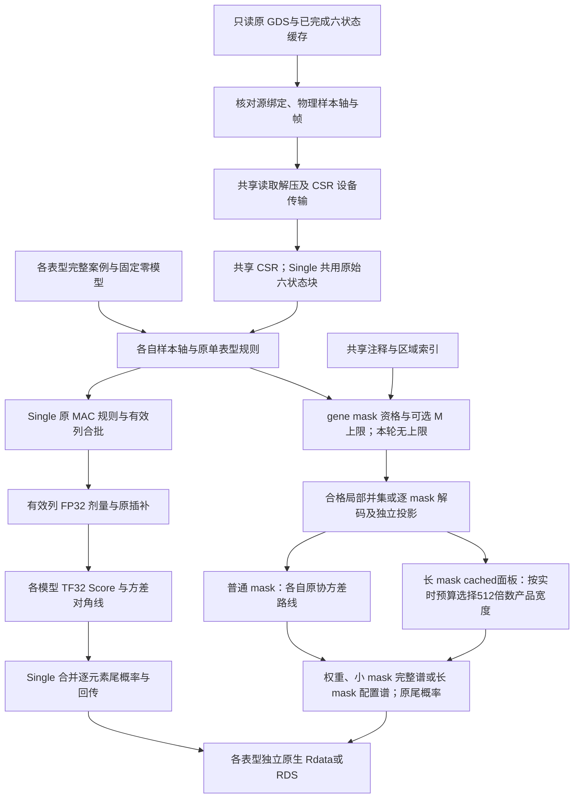

# Torchstaar PheWAS：0.7.0 全部 mask

`torchstaar_phewas` 在同一个 GPU 上执行多个独立表型的 Single、coding、noncoding 和 ncRNA 分析，共享既有六状态缓存的读取、解压、校验、CPU–GPU 传输和注释准备。每个表型保留自己的样本、零模型、频率、缺失基因型处理和关联结果，目标是与逐个运行单表型 Torchstaar 的原生输出一致，显著结果的 `−log10(P)` 误差不超过 0.001。

本轮关闭 M 上限，全部 mask 沿用独立单表型核心。关联使用原生 TF32 矩阵乘法与 FP32 状态，不使用分量重建；Single 尾概率与 SE 保留稳定分支。长 mask 使用配置的缓存协方差与 FastSKAT 路线，保留近似谱标记；新增非 SPA 长 mask 支持和全部 mask 精度见本版结果。固定窗口和滑动窗口不在本入口范围。

## 流程与独立样本



每个表型在准备 NPZ 或零模型前独立执行 complete-case：仅排除该表型或其协变量缺失的人，其他表型仍可使用这些人。不取全部表型的共同完整案例，也不填补缺失表型。运行入口要求输入已准备完成，不自动筛除输入 NaN。零模型已绑定自己的完整案例，关联数组严格保持原样本顺序。频率、方向、MAC 和基因型填补沿用各自原单表型配置；mask 资格与权重保留对应原规则。

匿名真实输入审计包含 13 个独立表型：12 个 Gaussian 和 1 个非 SPA 二分类，各有 35,364–340,795 个有效样本，均为原 345,967 人缓存的子集。13 个表型并集为 341,101、共同交集为 5,254；12 个 Gaussian 的共同交集仅 5,797，因此共同完整案例会丢掉大量可用观测。原目录中的重复零模型状态按同一独立表型处理。二分类原始 0/1 标签与工作响应分别保存，工作响应不能当作 Gaussian 表型。CSR 传输使用原 345,967 人物理样本轴；341,101 只是输入审计中的表型并集，不是统一计算样本轴。

## 输入格式

`analyses` 是已展开的单表型 Torchstaar 配置字典列表；每项 `phenotypes` 恰有一项。各配置的 GDS、染色体顺序、作业名称/类型/参数、注释、QC 和共享统计选项一致；模型、样本轴和输出路径可不同。

| 输入 | 格式与意义 |
|---|---|
| `analyses` | 非空 `list[dict]`，一项对应一个独立表型；不是联合多表型零模型 |
| `phenotypes[0].name` | 私有标签；示例使用匿名 `trait_01` |
| `phenotypes[0].model` | 已拟合、非 pickle NPZ；复用固定状态，不再拟合 |
| Gaussian 模型 | `model_kind="gaussian_single"`，保存 ID、`x[n,p]`、scaled residuals、原固定效应协方差与精度/亲缘结构，见[零模型](null_model.md) |
| 二分类模型 | `model_kind="binary_state"`、`use_spa=false`；含 `x[n,p]`、`scaled_residuals[n]`、`fitted_probability[n]`、原 `precision`、`precision_x[n,p]`、`fixed_effect_covariance[p,p]`、0/1 `phenotype[n]`；工作响应另存 `working_phenotype[n]`。`matmul_mode/source_matmul_mode` 区分执行与来源模式 |
| 二分类投影与来源 | 完整 NPZ 同时保留 `xw[p,n]`、`projection_left[n,p]`、可选 `coefficients[p]` 及收敛/拟合来源标记。混合固定状态的 `precision` 是原正对角 `[n]` 或已给定样本方阵；`precision_x` 和固定协方差直接使用原值，不重算投影或补 GRM |
| `sample_indices_file` | 可选 NPY，唯一、有界、零基整数物理行号 `[n]`，顺序与模型一致。仍核对原 GDS ID，不能跨染色体套用物理行号 |
| `sample_id_rule` | 默认 `auto`，可用 `auto/exact/last_underscore_token`，沿用原 ID 对齐规则 |
| `require_single_continuous` | 原独立配置可用的 Gaussian 限制标记；含二分类的独立对照应设为 `false`，模型类型仍由实际 NPZ 校验 |
| `phenotypes[0].input` | 替代 `model` 的私有准备 NPZ：`y_raw[n]`、`ids[n]`，可含 `covariates[n,p]`、原 GRM 与 `sample_indices[n]`；须已排除缺失。本入口仅原生拟合单 Gaussian，二分类提供完整固定状态 |
| `transform/fit_options` | 新 Gaussian 输入的 `none/rint` 与原拟合参数；已有模型不再变换 |
| `save_model` | 可选私有 NPZ 输出，保存实际执行的模型状态 |
| `output_null/covariate_names` | 可选 Gaussian 原生零模型输出及 `[p]` 原列名；二分类原生零模型导出尚不支持，使用 NPZ |
| `chromosomes` | 有序数组，各项含 `name`、`gds`、`jobs` 和可选 `annotation_index` |
| 原 GDS | 只读保留样本、位置、REF/ALT 和功能注释；基因型从既有缓存读取，不重新转存 |
| `cache_specs` | `{源 GDS 路径: CacheSpec}`，所有计划 GDS 均显式绑定，不回退到 SDK 读取基因型 |
| 六状态缓存 | 完成的 `data.bin/headers.bin/counts.bin/index.npy/samples.npy/manifest.json/COMPLETE`，保留物理变异轴及指定样本轴，见[缓存](sixstate_cache.md) |
| `CacheSpec.expected_binding` | 原容器完整输入与源码绑定字典，须与实时证明一致 |
| `CacheSpec.source_proof` | 无参函数，每次核对当前源、输入、SDK/源码和缓存证据后返回绑定；打开和结束均执行，不能返回常量绕过检查 |
| `CacheSpec.expected_samples` | 可选一维整数物理缓存轴，与 `samples.npy` 精确一致；不是某个表型的完整案例轴 |
| `qc_path` | 原 QC 节点，默认 `annotation/filter`；示例节点须替换为真实输入的节点 |
| `annotation_catalog` | 注释名到原 GDS 节点的字典或 JSON 路径 |
| `annotation_names` | 有序注释权重名列表，全部表型相同，保留原列顺序 |
| `packed_reader_directory` | 可选既有、绑定 SDK 的 packed reader 构建目录，不自动下载或编译 |

### 作业与 mask

| 参数 | 格式、默认及作用 |
|---|---|
| `jobs[].name/kind` | 原有序作业名称及 `individual/coding/noncoding/ncrna` 类型 |
| `jobs[].arguments` | 原单表型方法参数字典；`chromosome` 从外层 `name` 注入 |
| `jobs[].output` | 必填私有 `.Rdata/.rda/.rds` 路径，不同表型不能共用文件 |
| `jobs[].layout/object_name` | `layout` 必须为 `base`，省略默认 `base`；可选原 `.Rdata` 对象名 |
| `individual.start/end` | 一基闭区间，两者同时省略扫描全染色体，同时提供执行原区域 |
| `individual.mac_cutoff` | 默认 `20`，逐表型 Single MAC 门槛 |
| `individual.variant_type` | 默认 `variant`，可用 `SNV/Indel/variant` |
| `individual.subset_variants_num` | 默认 `5000`，原输出分组规模；内部合批不重置分组序号 |
| `coding.gene_name/start/end` | 必填私有原目录条目名及一基闭区间，来自完整原 coding 目录 |
| `coding.category/include_ptv` | 默认 `all_categories/false`，5 个基本 mask；完整 7 个 mask 显式设置 `include_ptv=true` 或 `category="all_categories_incl_ptv"` |
| `noncoding.gene_name/start/end/category` | 原目录名、可选区间及类别，默认 `all_categories`，全部 7 个 noncoding mask |
| `noncoding.promoter_intervals_file` | promoter 精确区间文件，格式 `chromosome,start,end`，保持原坐标定义 |
| `annotation_index.promoter_intervals_file` | 无坐标 promoter 作业准备索引时使用的同一区间文件 |
| `noncoding.include_ncrna` | 默认 `false`，也可单独安排 ncRNA 作业 |
| `ncrna.gene_name/start/end` | 原 ncRNA 目录条目与可选一基闭区间 |

包含 `plof/synonymous/missense/disruptive_missense/plof_ds/ptv/ptv_ds`、`upstream/downstream/UTR/promoter_CAGE/promoter_DHS/enhancer_CAGE/enhancer_DHS` 及 ncRNA，含义见[完整流程](torchstaar.md#功能与流程)。资格按原注释、QC 与逐表型频率判定。

### 运行参数

```python
def run_configuration(
    analyses, *, cache_specs, device="cuda:0",
    device_cache_bytes=512 * 2**20,
    compact_cache_bytes=64 * 2**20,
    metadata_cache_bytes=256 * 2**20,
    cpu_threads=2,  # PyTorch CPU intra-op；结束或异常后恢复原数量。
):
    ...
```

| 参数 | 默认及作用 |
|---|---|
| `device` | `cuda:0`；生产要求支持 TF32 的 GPU，同一次调用使用同一设备 |
| `cpu_threads` | `2`；严格正整数，控制 PyTorch CPU intra-op 数学线程。调用结束或异常时恢复之前值；报告 requested/effective |
| `device_cache_bytes` | `512 MiB`，共享设备 CSR 的 LRU 容量；非负整数，0 关闭驻留 LRU |
| `compact_cache_bytes` | `64 MiB`，共享 CPU compact CSR LRU；非负整数，0 关闭。本入口使用此 runtime 参数，不按各 `CacheSpec.compact_cache_bytes` 建立独立 LRU |
| `metadata_cache_bytes` | `256 MiB`，共享区域注释元数据 LRU；正整数字节。样本、int64 位置与 QC 作为固定只读主轴共享，另外报告 `structural_bytes`（ndarray buffer 字节，不含 object 字符串和 Python 对象） |
| `matmul_mode/precision_control` | `tf32/false`，本入口不接受 FP64 对照模式 |
| `statistics_execution` | `serial`，跨表型顺序执行核心，不并发保留多个巨大浮点基因型矩阵 |
| `resident_genotypes/single_batch_optimization` | 均须为 `true`，使用设备六状态与有效列合批 |
| `individual_genotype_block_size` | 默认 `1024`，共享 Single 物理读取上限；第一份配置决定扫描步长，建议各配置显式一致 |
| `individual_effective_block_size` | 默认 `1024`，各表型有效列合批大小及独立尾块 |
| `tf32_split_k` | 必须 `0`，保留原 K 轴顺序，不改归约结构 |
| `analysis_options.wrapper_semantics` | 必须 `base`，省略时补为 `base` |
| `analysis_options.memory_limit_gib` | 默认 `20`，broker 要求 `0<budget<=20`；包含模型与新工作区，不是设备资源预留 |
| `analysis_options.genotype_block_size` | 默认 `128`，gene 物理读取块上限，真实配置可显式设置 `1024` |
| `analysis_options.annotation_block_size` | 默认 `250000`，注释处理块大小 |
| `analysis_options.covariance_backend` | 默认 `cached`，另可用 `legacy`；长 mask 的协方差后端，独立与共享配置须一致 |
| `analysis_options.cached_variant_tile_size` | 默认 `4096`，正512倍数；cached协方差请求产品宽度。自动面板按实时预算选不超过该值的512倍数，实际值写入报告 |
| `analysis_options.rare_maf_cutoff` | 默认 `0.01`，逐表型严格 `0<MAF<cutoff` |
| `analysis_options.rv_num_cutoff` | 默认 `2`，集合检验最少变异数 |
| `analysis_options.rv_num_cutoff_max` | 默认 `10^9`，原资格要求 `M<上界`；本轮显式恢复 `1000000000`，移除旧配置的 `5001` 限制 |
| `analysis_options.rv_num_cutoff_max_prefilter` | 默认 `10^9`，候选预筛严格上界，不等同最终稀有变异数 |
| `analysis_options.variant_type/imputation` | 默认 `SNV/mean`，分别可用 `SNV/Indel/variant` 与 `mean/minor`；插补仅处理基因型 |
| `maximum_mask_variants` | 默认不设，本轮 `null`，全部 mask 均进入分析。可选整数上限包含端点；仅显式设置时跳过更大 mask。提前停止计数的报告是下界 |
| `local_mask_reuse` | 默认 `true`；Gaussian 在兼容条件下复用同一表型局部 mask 的 Score/协方差并集，二分类仍使用成熟逐 mask 路径。选项开启不代表实际复用 |
| `weight_batch_optimization` | 默认 `true`，同一 mask 的权重合并计算；权重按各表型 MAF 独立构建，不跨模型共享 |
| `statistics_tail_optimization` | 默认 `true`，原谱与 Saddle/CCT 的批量组织 |
| `weighted_eigensolver` | 默认 `auto`，可用 `torch/cusolver_batched`；普通 mask 保留完整谱，长 mask 按 `long_mask_*` 选择继承路线并报告实际后端和近似标记 |
| `stage_profile` | 默认 `false`，host 与 CUDA stream 阶段记录，计时存在嵌套 |
| `validation_reference` | 默认 `false`；原 R 二分类验算缓存必须显式设为 `true`，报告保留来源标记，正式模型不需要此标记 |
| SPA 字段 | 原 `spa_p_filter=true/p_filter_cutoff=0.05/spa_tol=2^-13/spa_max_iter=1000` 可保留；本入口要求 `use_spa=false`，不执行 SPA 分支 |

其余 `analysis_options` 后端参数沿用[单表型指南](torchstaar_configuration.md#运行与优化参数)：`variant_tile_size` 控制legacy变异分块，`sample_block_size` 控制样本分块；`long_mask_threshold/long_mask_method/long_mask_rank/long_mask_seed` 控制继承后端的大 mask 阈值、方法、秩与随机种子。本轮取消 `maximum_mask_variants` 跳过并将 `rv_num_cutoff_max` 恢复原默认 `10^9`，大 mask 沿用对应独立核心的缓存协方差及配置谱；新冻结来源的完整对照已验收。

成熟cached协方差子函数在真实大样本验证中发现显存碎片预算bug：unused reserved的总量不代表新的连续面板可用空间。修复在准入前于本调用的同一device执行`empty_cache()`，只释放可回收闲块，并重新采样allocated、reserved和设备free。以清理后剩余的`max(allocated,reserved)`扣除进程预算，再与实时free取较小值、扣除保留量；不给闲置reserved额外连续空间信用。

自动面板据此先尝试请求宽度，选择完整存储或两个原始/加权面板。不能容纳时，将产品宽度降至不超过请求值的512倍数；一次调用使用同一个实际宽度，尾块可更小。面板H2D前，以及有限值校验和512列Score/投影准备完成后、加权面板分配前，再释放已删除准备和产品临时数组留下的闲块；仍存活的模型、原始/加权基因型和结果张量保持有效。修复只影响内存调度，不改变检验公式、原512列准备顺序、两向native TF32产品平均、FP32关联状态或20 GiB预算。低级函数显式指定面板大小时严格检查给定布局，不自动缩小；最小512列布局也不能满足预算时明确报错，不增加M跳过。

Single 在同一物理块上共享原始 uint8 六状态块；gene 仍按表型独立解码 raw uint8 状态。compact/CSR LRU 命中时复用读取、解压与 H2D，淘汰后可能再次读取和上传。全染色体读取与传输次数以执行报告的实际计数为准。

LRU 大小不是进程总 RAM 或峰值显存保证，实时显存、矩阵与统计工作区预检继续执行。不同模型的协方差不能因为样本重叠就共用。

有界 resident Gaussian 的工作区按实际同时存活的阶段估算；无旋转块时，精度乘积与 Score 的潜在布局副本不同时计入大型矩阵数。小块解码工作区仍单独覆盖，且模型、设备缓存及整个区域的 uint8 状态均计入实时显存。该调整描述普通 resident mask；长 mask 使用独立核心对应的分块工作区。关联公式与矩阵精度沿用原实现。

同一基因的局部并集可能大于 5000，即使各 mask 都小于 5000。此时沿用单表型入口的并集主存恢复路径，再按每个 mask 计算原 TF32 协方差；每个小 mask 的 GPU 工作区仍按实际存活阶段预检。各表型仍保留原变异过滤与显著值比较；M 上限仅在显式设置时触发。

关联核心对 CUDA 基因型矩阵分块检查 NaN 和无穷值，最后汇总一次判断。检查保持原矩阵布局与全部元素，不创建整矩阵副本；FP32 检查块的临时数组上界约为 56 MiB。该变化仅减少输入校验的显存，不改变 Score、协方差或 mask 检验公式。

## Python 调用

下面的配置文件分别描述每个表型的原作业；路径均为分析者的私有本地输入。调用只读既有缓存。

```python
import json
from pathlib import Path
import numpy as np
from torchstaar_phewas import CacheSpec, run_configuration
from torchstaar.cache_runtime.binding import make_source_binding
from torchstaar.cache_runtime.state_reader import build_reader

source_gds = Path("private/chromosome.gds")
cache_directory = Path("private/sixstate_cache")
analyses = [json.loads(Path(filename).read_text()) for filename in (
    "private/trait_01_analysis.json", "private/trait_02_analysis.json"
)]
expected_binding = json.loads(
    (cache_directory / "manifest.json").read_text()
)["binding"]

def current_source_proof():
    # 每次检查真实源与源码；参数与原转换绑定须完全一致。
    binding = make_source_binding(
        source_gds,
        packed_directory="private/packed_reader_build",
        input_files={"samples": "private/physical_sample_axis.npy"},
    )
    binding["decoder_ast_sha256"] = build_reader().decoder_ast_sha256
    binding["sample_id_rule"] = "auto"
    return binding

cache_specs = {source_gds: CacheSpec(
    directory=cache_directory,
    expected_binding=expected_binding,
    source_proof=current_source_proof,
    # 完整物理缓存轴；各表型行号在各自的 analysis JSON 中。
    expected_samples=np.load(cache_directory / "samples.npy", allow_pickle=False),
)}
report = run_configuration(
    analyses=analyses, cache_specs=cache_specs, device="cuda:0",
    device_cache_bytes=512 * 2**20,
    compact_cache_bytes=64 * 2**20,
    metadata_cache_bytes=256 * 2**20,
    cpu_threads=2,  # PyTorch CPU intra-op；结束或异常后恢复原数量。
)
Path("private/phewas_report.json").write_text(
    json.dumps(report, indent=2, allow_nan=False) + "\n"
)
```

示例适用于相同 producer/consumer 绑定。若转换时还绑定配置、模型或源码清单，`input_files/source_manifest` 也须按原规则提供。旧 producer 容器需要已审计的兼容证明，现场核对原 GDS、容器/样本轴、SDK 和 producer 证据，以及当前 consumer 源码与解码语义。不能改写 manifest，不能用 `lambda: expected_binding` 跳过检查；本入口不自动迁移缓存。

一份单表型配置的简化示例：

```json
{
  "phenotypes": [{
    "name": "trait_01",
    "model": "private/trait_01_null.npz",
    "sample_indices_file": "private/trait_01_rows.npy",
    "sample_id_rule": "auto"
  }],
  "matmul_mode": "tf32",
  "precision_control": false,
  "statistics_execution": "serial",
  "resident_genotypes": true,
  "single_batch_optimization": true,
  "individual_genotype_block_size": 1024,
  "individual_effective_block_size": 1024,
  "maximum_mask_variants": null,
  "qc_path": "annotation/info/QC_label",
  "annotation_catalog": "private/annotation_catalog.json",
  "annotation_names": [],
  "analysis_options": {
    "wrapper_semantics": "base", "variant_type": "variant",
    "imputation": "mean", "memory_limit_gib": 20,
    "rv_num_cutoff_max": 1000000000,
    "genotype_block_size": 1024
  },
  "chromosomes": [{
    "name": "21", "gds": "private/chromosome.gds",
    "jobs": [{
      "name": "complete_single", "kind": "individual",
      "arguments": {"mac_cutoff": 20, "variant_type": "variant", "subset_variants_num": 5000},
      "layout": "base", "output": "private/trait_01_single.Rdata"
    }]
  }]
}
```

第二份配置使用自己的模型、行号和输出路径，复制相同科学计划。gene 作业从私有完整有序目录展开，不能用示例 Single 配置声称已覆盖完整四类分析。

## 命令行调用

安装当前包后提供 `torchstaar-phewas`。入口 JSON 的 `analyses` 可以是配置字典或保存字典的 JSON 路径；文件路径相对于进程当前工作目录。

```json
{
  "analyses": ["private/trait_01_analysis.json", "private/trait_02_analysis.json"],
  "caches": [{
    "gds": "private/chromosome.gds", "directory": "private/sixstate_cache",
    "expected_binding": "private/cache_binding.json",
    "source_proof": "cache_binding:current_source_proof",
    "expected_samples_file": "private/sixstate_cache/samples.npy"
  }],
  "shared_options": {
    "device_cache_bytes": 536870912,
    "compact_cache_bytes": 67108864,
    "metadata_cache_bytes": 268435456,
    "cpu_threads": 2
  }
}
```

`private/cache_binding.json` 保存原完整绑定字典，`private/cache_binding.py` 定义上面的实时证明函数。模块须可导入：

```bash
PYTHONPATH=private torchstaar-phewas private/phewas.json \
  --device cuda:0 --cpu-threads 2 --report private/phewas_report.json
```

| CLI 参数 | 意义 |
|---|---|
| `config` | 必填，私有入口 JSON |
| `--device` | 默认 `cuda:0` |
| `--cpu-threads` | 可选严格正整数，覆盖 `shared_options.cpu_threads`；省略时使用配置值或默认 2 |
| `--report` | 必填，私有报告 JSON；自动创建父目录 |
| `caches[].expected_binding` | 完整绑定字典或 JSON 路径 |
| `caches[].source_proof` | `模块:函数`，恰一个冒号，导入真实无参证明函数 |
| `caches[].expected_samples_file` | 可选 NPY，完整物理缓存轴 |
| `shared_options` | 接受上述三个共享 LRU 字节参数与 `cpu_threads`；未知字段拒绝 |

`cpu_threads` 不代表 GPU 并发数量，也不控制独立单表型 adapter 的 `prefetch_processes`。同一进程的一次调用独占该运行上下文，不与另一个同进程 PheWAS 或依赖全局统计状态的普通 CLI 并发执行。

## 输出与计算组织

输出是每个表型的原单表型文件。相同表型的 coding/noncoding job 可以按原 append 规则归入同一文件，保留重复类别名；不同表型路径独立。Single 每个 job 使用独立文件。

| 输出 | 结构与意义 |
|---|---|
| Single `.Rdata` | 默认对象 `results_individual_analysis`；原 data.frame 含 `CHR/POS/REF/ALT/ALT_AF/MAF/N/pvalue/pvalue_log10/Score/Score_se/Est/Est_se`，保留 factor levels、row names、位置与分组顺序 |
| coding `.Rdata` | 默认 `results_coding`，原类别 list 与 mask 统计列 |
| noncoding `.Rdata` | 默认 `results_noncoding`，原类别 list、权重与 STAAR 合并结果 |
| ncRNA `.Rdata` | 默认 `results_ncRNA`，原 base ncRNA 矩阵 |
| `.rds` | 保存同一对象，不增加 `.Rdata` 对象名外层 |
| 空集合 | 保留原空项规则，不为未达资格或跳过 mask 伪造 P 值 |
| 返回 `report` | 模型匿名索引、有效 n、family、作业、共享读写计数、时间、显存及跳过记录；作为私有产物保存 |

Single 的 `pvalue_log10` 本来就是 `−log10(P)`，比较小 P 时直接使用稳定输出。gene 文件继续保留原 P 格式，验证时计算 log 指标，不改原结果列。

| 报告字段 | 用途 |
|---|---|
| `models/jobs` | 表型序号、n/协变量数、family/use_spa 与逐作业有效检验数 |
| `cpu_thread_control.requested/effective/previous/restored/scope` | 请求值、实际和调用前 PyTorch intra-op 线程数，退出时恢复；`scope=pytorch_intraop` |
| `total_seconds` | 初始化、装载、共享准备、计算与关联文件输出总墙钟；首次转存和外部验证不在其中 |
| `model_seconds/setup_seconds/annotation_seconds/native_output_seconds` | 模型、reader/pipeline、共享索引与序列化边界 |
| `shared_readers[].broker` | 读帧、CSR 上传/命中/淘汰、H2D 字节、样本绑定及 materialize；SDK genotype fallback 须为 0 |
| `shared_readers[].metadata/stage_profiles` | 固定结构主轴字节数、元数据命中与各表型 host/CUDA stream 阶段；嵌套或异步计时不能直接相加 |
| `shared_readers[].covariance_diagnostics` | 按表型顺序的cached调用报告；`requested_variant_tile_size`是请求值，`effective_variant_tile_size`和`variant_tile_size`是实际值，`preparation_tile_size=512`、`symmetry="average"`；记录实际面板、预算、产品调用与allocated峰值 |
| cached预算与采样字段 | `admission_budget_basis="remaining_cuda_allocator_reservations"`；`allocator_budget_basis_bytes=max(allocated_before_bytes,reserved_before_bytes)`、`allocator_reservation_credit_bytes=0`。`allocated_before_bytes/reserved_before_bytes/free_before_bytes`为初次清理后的实时值，`pre_cleanup_*`保留清理前值 |
| cached回收字段 | `allocator_cleanup_calls/allocator_cleanup_released_bytes/allocator_cleanup_host_wall_seconds`汇总协方差后端调用内准入前、每次面板H2D前和加权面板分配前的回收次数、reserved实际下降字节数与`empty_cache()`的host耗时；不含pipeline较早的工作区预检回收，不代表回收了live张量 |
| `shared_readers[].skipped_masks` | 每表型 M 上限跳过及合格变异数下界 |
| `single_execution` | 独立 core 数、合并点运算/回传次数；`covariance_shared=false`、`union_sample_padding=false` |
| `tf32_execution/dense_product_audit` | 实际产品路由、PTX 与精度审计，不从配置推断执行 |
| `weighted_eigensolver_execution` | 完整谱实际后端与错误/重试记录 |
| `peak_gpu_mib/peak_gpu_reserved_mib/memory_limit_gib` | allocated/reserved 峰值与预算，allocated 超预算拒绝通过 |

物理帧与 CSR 设备传输复用是主要共享阶段。浮点关联矩阵和 gene dense 块逐表型生成并释放；Single 先合并各表型的整数频率摘要回传，再合并已经算好的 Score/方差向量，统一执行逐元素尾概率、SE 和一次回传。每个模型的 K 顺序、投影、协方差及 SKAT 谱仍独立，不按样本并集补零拼成一个 GEMM。

闲块回收、重新采样、预算选择、面板准备与协方差计算均计入对应gene作业及`total_seconds`。cached调用的`wall_seconds`覆盖该后端调用的校验、回收、布局准备和计算；`allocator_cleanup_host_wall_seconds`只记录其回收调用host耗时。pipeline较早的cached工作区预检也回收同device闲块并重采样，此开销在作业和pipeline墙钟内，不计入后端回收聚合。host计时与可选CUDA stream阶段存在嵌套和重叠，不能与总时间相加。CSV是后续独立CPU阶段，不进入关联分析计时。实际缩块和回收量以诊断报告为准，不根据样本数或参数推断。

对于带截距、对角精度的单 Gaussian 或非 SPA 二分类 Single，共享实现与独立入口都使用已验收的 TF32 投影消减修复。两类模型的 Score 保持 `G.T @ scaled_residuals`；方差先用当前表型自身样本的 `H = G - mean(G)` 计算同一投影，再加上有限固定状态的常数方向校正。该顺序减少截距与协变量大数相减，不重拟合模型，也不使用高精度矩阵重建。独立单表型和 PheWAS 调用同一修复后的子函数；gene 协方差实现保持原路径。


### 每个表型的私有结果目录

关联完成后再运行[原生结果转 CSV](torchstaar_phewas_export.md)。私有 manifest 的 `name` 使用输入清单核对出的原表型名称；每个 `native_files` 显式列出该表型的全部原生文件，包括 Single 的每一分段。导出器保留原生 basename，CSV 使用相同 stem；不以匿名模型序号替换正式输出名称。公开示例中的 `trait_01` 只是格式示意。

```text
private/results/
├── trait_01/
│   ├── single_segment_01.Rdata
│   ├── single_segment_01.csv
│   ├── coding_batch_01.Rdata
│   ├── coding_batch_01.csv
│   └── ...
└── trait_02/
    └── ...
```

CSV 的额外表型说明列由 `exclude_columns` 传入确切私有列名；它不会追加目录名、字段编号或表型类别。原生文件保持完整字节和 R 属性。普通 gene 表为 19 列，含 missense 附加结果的表为 25 列；同一原生文件允许两类表共存，CSV 按首次出现顺序扩展为联合列头。全 NULL 的 mixed coding 文件须显式提供 25 列 `empty_columns`，仍输出 0 行。Single 使用原 13 列，包含稳定的 `pvalue_log10`。

## 原 R 独立调用

PheWAS 等价性基准是相同模型、样本、GDS、注释与有序作业分别运行单表型 Torchstaar；原 R 用于单独核对统计精度。R 只用于开发对照，生产入口不启动 R；私有变量对应同一项原作业。

```r
library(STAARpipeline)
library(SeqArray)
genotype_file <- seqOpen("private/chromosome.gds")
for (trait_index in seq_along(null_model_files)) {
  null_model <- get(load(null_model_files[[trait_index]]))
  single_result <- Individual_Analysis(
    chr=21L, start_loc=region_start, end_loc=region_end,
    genofile=genotype_file, obj_nullmodel=null_model,
    mac_cutoff=20, subset_variants_num=5000,
    QC_label=qc_node, variant_type="variant", geno_missing_imputation="mean")
  coding_result <- Gene_Centric_Coding(
    chr=21L, gene_name=selected_gene, genofile=genotype_file,
    obj_nullmodel=null_model, category="all_categories_incl_ptv",
    QC_label=qc_node, variant_type="variant",
    geno_missing_imputation="mean", Use_annotation_weights=FALSE, Annotation_dir="",
    Annotation_name_catalog=annotation_catalog, Annotation_name=annotation_names)
  noncoding_result <- Gene_Centric_Noncoding(
    chr=21L, gene_name=selected_gene, genofile=genotype_file,
    obj_nullmodel=null_model, category="all_categories", QC_label=qc_node, variant_type="variant",
    geno_missing_imputation="mean", Use_annotation_weights=FALSE, Annotation_dir="", Annotation_name_catalog=annotation_catalog,
    Annotation_name=annotation_names)
  ncrna_result <- ncRNA(
    chr=21L, gene_name=selected_ncrna, genofile=genotype_file,
    obj_nullmodel=null_model, QC_label=qc_node, variant_type="variant",
    geno_missing_imputation="mean", Use_annotation_weights=FALSE, Annotation_dir="",
    Annotation_name_catalog=annotation_catalog, Annotation_name=annotation_names)
  # 每个表型分别保存，沿用原有序目录及对象格式。
}
seqClose(genotype_file)
```

`null_model_files` 是各自固定模型路径；区域、目录、注释、QC 和原包版本在私有清单中记录。显式 M 上限须在独立对照中一致。原 `STAARpipelinePheWAS` 的并集提取语义不是本入口的独立单表型验收基准，见[接口关系](phewas_multiple.md)。

## 验证与近期记录

本节保留已完成 M<5000 共享实现的真实结果。0.7.0 基于单表型主线 `dbda0dc` 合并独立 PheWAS 与 CPU CSV 导出，并关闭 M 上限覆盖全部 mask。新完整共享与历史组合参考、长 mask 控制、回归和安装见上述本版结果；旧有限 M 结果不作为新全 mask 的耗时或完整精度。

### 0.7.0 全部 mask 的本版结果

本版 13 个固定独立模型完成全部 mask，maximum_mask_variants=null，rv_num_cutoff_max 恢复原默认 10^9，跳过 0 个 mask；共 10,335 个表型作业，原生变异数（#SNV）列计数得到 39 个 M>5000 结果行，输出 234 native 和 8,803,427 行。共享入口 8,443.879 s、外层 driver 8,495.115 s。本轮复用保存的独立参考，共同 8,803,388 行、长 mask 对照补充 39 行、未覆盖 0 行；历史参考有 0 行未匹配。历史组合参考比较 9,143,830 个 P，不可比较 0 个（验收门控），显著联合 536,242 个，最大 logP 误差 1.76570982e-08，超标 0，阈值跨越 0；原生结构与非 P 诊断通过。allocated/reserved 峰值 14.430/19.811 GiB。CPU intra-op 请求/实际线程数为 8/8。历史有限 M 独立入口曾合计 16,772.722 s；其 CPU 线程数、源码及 mask 范围与当前运行不同，不据此计算本轮速度比。该时间来自既有缓存，OS page cache 和共享 GPU 负载未受控；首次转存、原 R 验算、回归、打包和 CSV 均另计。

长 mask 候选验证计划包含 91 个真实表型作业控制，覆盖 Gaussian 与非 SPA 二分类；参考为同模型同配置的独立单表型核心，显著联合最大 logP 误差 4.11766399e-10。长谱的近似标记保留，保存的独立长 mask 对照不将近似谱标作原 R 完整谱。

本版冻结来源的有界原 R 对照使用 STAAR 0.9.8.2、SeqArray 1.48.0，包含 13 模型，117 个 gene 调用、78 文件、206 行和 3,118 个 P，显著联合 130 个、最大误差 0.000901410848；Single 104 个位置、110 个 P，显著联合 78 个、最大误差 5.91581405e-05。这属于选定原 R 作业对照，原 R 未完成整条染色体。

有界原 R 与选定长 mask 资格对照使用同一冻结来源的 2 个 CPU intra-op 线程；本次全量共享使用 8 个 CPU intra-op 线程，按要求复用历史独立结果，未重新启动全量独立分析。旧有限 M 独立参考来自较早源码，补充长 mask 参考来自本版源码；二者均为 2 线程。资格和历史计时分别保留，不作为本次 8 线程同范围速度基准。

本版新冻结来源的CUDA 可见完整回归：1,595 passed、213 subtests passed、1 skipped，93.260 s；0.7.0 wheel 353,253 字节、117 个包源码文件及安装后的 namespace、PheWAS CLI、export CLI 通过。

全部 native 完成后，独立 CPU 阶段验收已激活的新输出：保留 234 native 与 234 CSV（52 Single），共 8,803,427 行；当前生产者绑定、SHA/列头/格式和逐标量读回核验 1,319.498 s。114,671,291 个标量、96,988,035 个数值读回通过，P 与已有 logP 序列化误差为 0；这项计时不含先前 CSV 初次写盘、关联、回归执行或打包构建，不重新计算关联、不启用 GPU。

| 本版共享阶段 | 秒 |
|---|---:|
| Single 作业，含触发的 native 写出 | 1,372.762 |
| coding 作业，含触发的 native 写出 | 1,141.041 |
| noncoding 作业，含触发的 native 写出 | 4,916.520 |
| ncRNA 作业，含触发的 native 写出 | 966.886 |
| 注释准备 | 29.979 |
| 模型加载 | 5.657 |
| 原来源与注释设置 | 9.020 |
| 原生序列化 | 124.357 |

读取 17,060 帧、上传 17,060 个 CSR，H2D 116,410,732,731 字节，SDK 基因型回退 0 次。各作业计时含 append/native，准备及原生分项存在嵌套，不相加得到端到端；旧独立作业在序列化前截止，阶段速度不能直接相除。

### 已完成的 13 表型有限 M 历史分析

原有序 chr21 计划包含 10,335 个表型作业，覆盖 Single、coding、noncoding 和 ncRNA。12 个 Gaussian 与 1 个非 SPA 二分类模型保留各自有效样本，完成 234 个原生文件、8,803,388 行输出；按各表型 `M<5000` 分析，跳过更大的 mask。该历史配置显式使用 `variant_type=variant`，纳入 SNV 与 Indel，权重为 Beta(1,25) 和 Beta(1,1) 两组。功能注释用于 mask 分类，实际 PHRED 注释权重数为 0；SNV PHRED 加权配置另行验证。

| 13 固定模型的记录 | 已完成旧来源（M<5000） | 0.7.0 全部 mask 版本 |
|---|---:|---:|
| 独立单表型分析入口合计 | 16,772.722 s | 复用保存的参考；本轮未重跑 |
| 共享 PheWAS 分析入口 | 6,091.267 s | 8,443.879 s |
| 外层独立 / 共享 driver | 16,798.258 / 6,118.004 s | 本轮未重跑独立 / 8,495.115 s |
| 原生文件 / 输出行 | 234 / 8,803,388 | 234 / 8,803,427 |
| 显著联合最大 `\|Δ(-log10 P)\|` | 0 | 1.76570982e-08 |
| 显著阈值跨越 | 0 | 0 |
| 独立 CPU CSV 后处理 | 544.193 s | 1,319.498 s |

旧来源分析入口时间比为 **2.754**。入口从模型加载计时至全部原生关联文件写出，含 reader、注释准备、计算与原生序列化；不含首次转存、外部 R 验算、CPU 回归、wheel 构建或 CSV 导出。外层 driver 还包含前后实时输入与源码证明核验。两次运行按顺序复用既有缓存，OS page cache 与共享 GPU 负载未受控，数值是该条件下的实际观测。

完整原生对照覆盖对象名、列/类型、行顺序、factor levels、row names、空项、AF/MAF/N 及 mask 策略。共比较 9,143,284 个 P，其中两版任一 `P<0.05` 的联合集合为 536,166 个；最大 `−log10(P)` 误差为 0，非 P 数值诊断也通过。峰值 allocated/reserved 为 14.413/19.791 GiB，预算 20 GiB。

下面两个作业阶段的边界不同：独立作业记录读取、准备与计算，截止于原生序列化前；共享作业包含该作业触发的 append 和原生写出。二者各自属于完整分析入口，阶段存在嵌套，因此不相加得到端到端时间，也不从此表计算阶段倍速。

| 作业阶段 | 独立合计，不含原生序列化（s） | 共享，含 append/原生序列化（s） |
|---|---:|---:|
| Single | 8,898.049 | 1,378.303 |
| coding | 1,807.692 | 1,155.046 |
| noncoding | 4,779.200 | 3,187.039 |
| ncRNA | 724.518 | 322.053 |

独立注释索引准备合计 341.679 s，共享注释准备 29.725 s；独立/共享原生序列化分别为 120.214/122.974 s，均已计入对应分析入口。共享读取 17,060 帧、上传 17,060 个 CSR，H2D 为 116,447,858,771 字节，SDK 基因型回退次数为 0。计数是执行报告的实际值，不假定每个帧只读一次。

### 固定模型的有界原 R 精度

原 STAARpipeline 与 STAAR 版本均为 0.9.8.2，SeqArray 为 1.48.0。每个表型选 3 个 coding、3 个 noncoding、3 个 ncRNA 原函数作业及 8 个 Single 位置，复用相同固定模型和样本，不重新拟合或改写保存的原 R 结果。原 R 并未完成本轮整条染色体的全部作业。

| 原 R 对照范围 | 数量 | 显著联合最大 `\|Δ(-log10 P)\|` |
|---|---:|---:|
| gene：117 个调用、78 原生文件、206 行 | 3,118 个 P；显著联合 130 个 | 0.000901411 |
| Single：104 个位置 | 110 个 P；显著联合 78 个 | 0.0000591581 |

上述旧来源两类最大误差均低于 0.001。此前有限 M 集成候选重新完成了独立有界原 R 验算：13 模型、117 gene 调用、78 gene 文件、206 行及 3,118 个 P，显著联合 130 个，最大误差 0.000901411；104 个 Single 位置、110 个 P，显著联合 78 个，最大误差 0.0000591581。两类均通过 0.001 标准。计数和误差与旧来源相同，来源与调用分别核验；这仍是选定普通 mask 与位置的原 R 对照。新增全 mask 支持后的普通及长 mask 控制见上述当前来源；选定原 R 作业不代表全部原 R 作业完成。

### CSV 与发布回归

关联和原生对照结束后，CPU 单独保留 234 个原生文件、另写 234 个 CSV，其中 52 个 Single。按原表型名称分别存放，每个目录有 18 个原生文件和 18 个 CSV。复制、CSV 写出、逐标量读回与 SHA 核对实测 544.193 s；原 114,670,550 个标量及 96,987,394 个数值读回通过，最大 P 和已有 logP 序列化误差均为 0。Single 全部保留 `pvalue_log10`，私有额外表型元数据列按清单排除。

该已完成来源的组合 CPU 回归为 1,249 passed、59 skipped、184 subtests passed，用时 59.37 s；0.5.0 wheel 安装后的 namespace、关联 CLI 与导出 CLI 均通过。此前有限 M 集成候选在 `CUDA_VISIBLE_DEVICES=0` 的完整回归完成 1,443 passed、213 subtests passed、1 skipped，59.23 s；该候选 0.7.0 wheel 为 348,863 字节，117 个包源码文件及安装后的 namespace、PheWAS CLI、export CLI 核对通过。新增全部 mask 路线后的源码、完整回归、安装、普通及长 mask精度、完整共享对照和独立 CPU CSV见上述当前来源。

匿名机器记录：[已完成旧来源](../benchmarks/torchstaar_phewas_chr21_previous_source.json)、[0.7.0 合并候选状态](../benchmarks/torchstaar_phewas_chr21_merged_0_7_0.json)。

逐表型核对原生对象、列名/类型、行顺序、factor levels、row names、AF/MAF/N、空项及 mask 策略，再比较 `−log10(P)`。显著联合定义为两版任一 `P<0.05`，目标最大绝对误差不超过 0.001；同时报告可比较项、无效项和显著阈值跨越数。全量独立 Torchstaar 对照与有界官方 R 对照分别记录，不以局部 R 结果声称全染色体 R 验证。

| 版本 | 功能与 benchmark 范围 |
|---|---|
| 0.4.0 | 单 Gaussian 的缓存解码与 Single 有效列优化；已公开一个表型完整 chr21 Single，见[原记录](torchstaar_configuration.md#真实验证与计时范围) |
| 0.5.0 验证来源 | 13 固定独立表型 chr21 四类计划完成；234 native、8,803,388 行；共享 6,091.267 s，独立合计 16,772.722 s；显著联合 logP 误差 0；有界原 R 达标 |
| 0.6.0 单表型主线 | 三输入、compact 复用与 CPU 准备改进，见[运行指南](cache_only_run.md)；其多 GPU/大 mask 验证范围单独记录 |
| 0.7.0 全 mask 集成版本 | 合并上述单表型主线、独立PheWAS与CSV后处理；本轮关闭M上限，普通与长mask保留独立核心的方法及近似标记；CPU准备池健康状态/异常传播、cached wrapper预取及索引恢复hook修复属于生命周期与输入准备；成熟cached显存碎片预算bug修复采用同device回收后重测、保守扣除剩余reserved，并记录实际回收开销；统计公式、512列准备与native TF32双向平均不变；新源码完整回归、安装、长 mask 控制及历史组合参考比较通过 |

## 参考

- [STAAR](https://github.com/li-lab-genetics/STAAR)：原 Score、Burden、SKAT、ACAT 及尾概率。
- [STAARpipeline](https://github.com/li-lab-genetics/STAARpipeline)：独立单表型输出基准；[Single](https://github.com/li-lab-genetics/STAARpipeline/blob/main/R/Individual_Analysis.R)、[coding](https://github.com/li-lab-genetics/STAARpipeline/blob/main/R/Gene_Centric_Coding.R) 原代码。
- [STAARpipelinePheWAS](https://github.com/li-lab-genetics/STAARpipelinePheWAS)：多表型接口与提取流程。
- Li X et al. *Nature Genetics* 52, 969–983 (2020). [DOI](https://doi.org/10.1038/s41588-020-0676-4)。
- Li Z et al. *Nature Methods* 19, 1599–1611 (2022). [DOI](https://doi.org/10.1038/s41592-022-01640-x)。
- [GMMAT](https://github.com/hanchenphd/GMMAT)、[SeqArray](https://github.com/zhengxwen/SeqArray)、[CoreArray PyGDS](https://github.com/CoreArray/pygds)、[rdata](https://github.com/vnmabus/rdata)：零模型、GDS 与原生文件读写。

源码采用 GPL-3.0-only。个体数据、零模型、真实表型标签、实际位点/基因结果与运行配置保留私有，公开仅提供通用接口及匿名计数。
